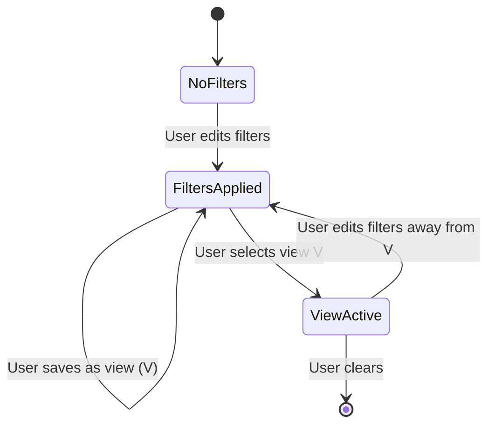

# Saved Views (Smart Filters)

## Summary

Users frequently re-run the same filter combinations — "Tax-deductible 2025", "Subscriptions", "Uncategorised". Saved views let the user name and persist a filter combo, then open it in one click from the sidebar of the Account Detail page (per-account views) or the global Search page (cross-account views). A saved view is a stored set of filter parameters; opening it restores the filter form with those values applied.

## Requirements

- Per-account and global (cross-account) saved views
- Save the current filter set with a name; rename and delete saved views
- Pin views to a sidebar/dropdown next to the filter drawer
- One view per account (per scope) can be marked as the **default** — applied automatically on page load
- Saved views are included in backup/restore
- Reuse the `TransactionFilters` shape from feature 01 so any future filter is automatically saveable

## Detailed description

### Schema

```sql
CREATE TABLE IF NOT EXISTS saved_views (
    id          INTEGER PRIMARY KEY AUTOINCREMENT,
    scope       TEXT NOT NULL CHECK(scope IN ('account', 'global')),
    account_id  INTEGER REFERENCES accounts(id),   -- NULL for global views
    name        TEXT NOT NULL,
    filters     TEXT NOT NULL,                     -- JSON-encoded TransactionFilters
    is_default  INTEGER NOT NULL DEFAULT 0,
    position    INTEGER NOT NULL DEFAULT 0,
    created_at  DATETIME NOT NULL DEFAULT (datetime('now')),
    deleted_at  DATETIME
);
CREATE UNIQUE INDEX IF NOT EXISTS saved_views_one_default_per_scope
    ON saved_views(scope, COALESCE(account_id, -1))
    WHERE is_default = 1 AND deleted_at IS NULL;
```

`filters` is the JSON-serialised `TransactionFilters` object plus a `sort` field (`'date_desc' | 'date_asc' | 'amount_desc' | 'amount_asc'`).

### UI — saved views menu

On the Account Detail page, a **Views** dropdown appears next to the Filter button. It lists:

- "All transactions" (built-in, clears filters)
- Each saved view for this account, ordered by `position`
- Each global view (rendered under a "Global views" heading)
- "+ Save current filters…" — opens a modal to name and save the current filter state

Each row in the dropdown has a kebab menu with Rename, Set as default, and Delete.

On the global Search page, the same dropdown lists only `scope = 'global'` views.

### Default view behaviour

When the user lands on an account page, if a default view exists for that account it's applied automatically. A small "Default: <name>" chip is shown above the list with a × to clear it for this session.

### Filters payload

A view's `filters` blob is the same shape sent to the repository plus a `sort` field. Unknown keys are ignored on load (forward-compatibility with future filter additions). The form merges the loaded filters into its state and triggers a refetch.

### Backup/restore

Add `saved_views` array to the backup payload; restore by name within scope. Merge mode upserts by `(scope, account_id, name)`; wipe mode replaces.

## User stories

- As a user, I want to save a filter combo I use often, so that I don't re-enter it every visit.
- As a user, I want a default view per account, so that opening the account jumps straight to the rows I care about.
- As a user, I want global saved views, so that "All uncategorised across all accounts" is one click away.
- As a user, I want my saved views to survive backup/restore, so that I keep my organisation across devices.

## Key decisions

| Decision | Outcome |
|----------|---------|
| Storage | One `saved_views` table; filters stored as JSON text |
| Scope | `account` (with `account_id`) or `global` (`account_id IS NULL`) |
| Default view | At most one default per scope (account or global); enforced by a partial unique index |
| Visibility | Account views appear only on their account; global views appear on Search and (optionally) on every account page |
| Sort persistence | `sort` is part of the filters blob, not a separate column — keeps the schema stable as we add filter types |
| Forward-compat | Unknown JSON keys ignored on load — new filter types in feature 01 are saveable without a migration |

## Validation

| Rule | Error message |
|------|---------------|
| `name` must be 1–60 characters | "Name must be 1–60 characters" |
| `name` must be unique within scope (case-insensitive) | "A view with this name already exists" |
| `scope` must be `account` or `global` | (enum, not surfaced) |
| When `scope = 'account'`, `account_id` is required | "Account is required for account-scoped views" |

## Diagrams



## Acceptance criteria

```gherkin
Feature: Saved views

  Scenario: Save the current filter combo
    Given I have set amount min=50, category="Groceries"
    When I open the Views dropdown and choose "Save current filters"
    And I enter the name "Big grocery runs" and save
    Then "Big grocery runs" appears in the Views dropdown

  Scenario: Apply a saved view
    Given I have a saved view "Subscriptions" with type=expense and a category filter
    When I click "Subscriptions" in the Views dropdown
    Then the filter form populates with those values and the list refetches

  Scenario: Set as default
    Given a saved view "Recent" exists for the current account
    When I open its menu and choose "Set as default"
    Then a "Default: Recent" chip appears above the list
    And reloading the page reapplies the view automatically

  Scenario: One default per scope
    Given a saved view "A" is the default for the current account
    When I set saved view "B" as the default for the same account
    Then "A" is no longer the default and "B" is

  Scenario: Global view available on Search page
    Given a global view "Uncategorised"
    When I open the Search page
    Then "Uncategorised" appears in the Views dropdown

  Scenario: Duplicate name rejected
    Given a saved view "X" exists for this account
    When I try to save another account view named "x" on the same account
    Then I see "A view with this name already exists"

  Scenario: Saved views included in backup
    When I export a backup and import it on a fresh database
    Then my saved views and default flags are restored

  Scenario: Unknown filter keys ignored
    Given a saved view contains a filter key the current client doesn't recognise
    When I apply the view
    Then the recognised keys are applied and the unknown key is silently ignored
```

## Manual test steps

1. On Account Detail, open the filter drawer and set 2–3 filters. Confirm the new **Views** dropdown is visible.
2. Choose "Save current filters", name it "Test", save. Confirm "Test" appears in the dropdown.
3. Clear the filters; open the dropdown; click "Test"; confirm filters reapply.
4. Open Test's kebab menu → Set as default. Reload the page; confirm Test is auto-applied and a "Default: Test" chip appears.
5. Save a second view, set it as default; confirm the first is no longer default.
6. Open the Search page; create a global view; confirm it appears under "Global views" on the dropdown.
7. Rename and delete a view; confirm it disappears.
8. Try to create a view with a duplicate name; confirm the error.
9. Export a backup, drop the local DB, import the backup; confirm saved views and defaults restore correctly.

## Implementation tasks

1. **Schema**
   - [server/src/db.ts](server/src/db.ts) — add `saved_views` table and the partial unique index.
2. **Repository**
   - New file: [server/src/saved-views/repository.ts](server/src/saved-views/repository.ts) — CRUD plus `setDefault(id)` that unsets the previous default in the same scope inside a transaction.
3. **Routes**
   - New file: [server/src/saved-views/routes.ts](server/src/saved-views/routes.ts) — `GET /api/saved-views?scope=&account_id=`, `POST`, `PUT /:id`, `PUT /:id/default`, `DELETE /:id`.
   - Mount in [server/src/index.ts](server/src/index.ts).
4. **Client API**
   - New file: [client/src/api/savedViews.ts](client/src/api/savedViews.ts).
5. **Views dropdown component**
   - New file: [client/src/components/ViewsDropdown.tsx](client/src/components/ViewsDropdown.tsx) — shared by Account Detail and Search; takes a `scope` prop and an `accountId?`.
6. **Wire into Account Detail and Search**
   - [client/src/pages/AccountDetail.tsx](client/src/pages/AccountDetail.tsx) and [client/src/pages/Search.tsx](client/src/pages/Search.tsx) — render the dropdown; load default view on mount; show "Default: …" chip.
7. **Backup**
   - [server/src/backup](server/src/backup) — include `saved_views` in export and import (merge upserts by `(scope, COALESCE(account_id,-1), name)`).
8. **Tests**
   - Repository: default uniqueness, scope filtering.
   - Client: forward-compat — apply view with unknown keys, confirm recognised keys still apply.
