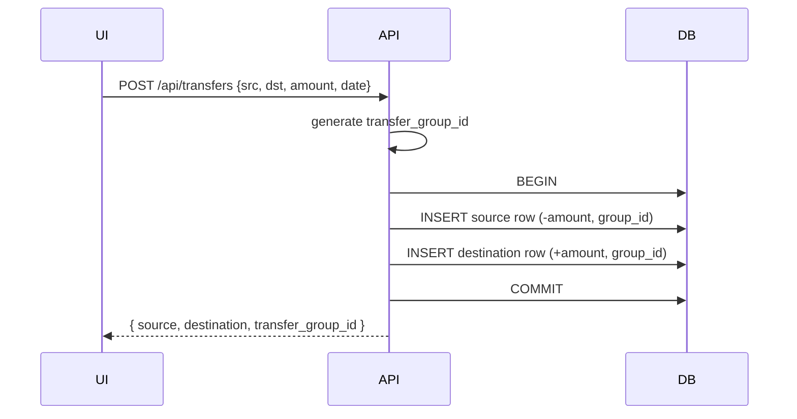

# Transfers Between Accounts

## Summary

Moving money between accounts is currently modelled as two unrelated transactions — an expense in account A and an income in account B. They look like a real expense and a real income in every report and chart, double-counting the user's net position. This feature introduces transfers as a first-class concept: a single user action creates a *paired* transaction with shared identifier and direction, and reports/charts exclude transfers from income/expense totals by default.

## Requirements

- New transaction `type` value: `'transfer'` (in addition to `'income'` and `'expense'`)
- A transfer is two paired transactions linked by a shared `transfer_group_id`
- Single-form UX: "New transfer" picker chooses source + destination accounts, amount, date, optional description/notes
- Editing or deleting one side of the pair updates both
- Charts and totals exclude transfers from income/expense; a separate "Transfers" total is available
- Transfers participate in account balance (source decreases, destination increases) just like real transactions
- Backup/restore preserves pairing

## Detailed description

### Schema

```sql
ALTER TABLE transactions ADD COLUMN transfer_group_id TEXT;
-- nullable; both rows of a pair share the same UUID-like string
CREATE INDEX IF NOT EXISTS transactions_transfer_group_id
    ON transactions(transfer_group_id) WHERE transfer_group_id IS NOT NULL;
```

The existing `type CHECK(type IN ('income','expense'))` is widened to allow `'transfer'`. Because SQLite does not support modifying CHECK constraints, do this via the standard table-rename migration: rename the existing `transactions` table, create the new one, copy rows, drop the old table. Surround in a transaction; guard with a one-shot migration flag so it only runs once.

`transfer_group_id` is a server-generated short ID (e.g. `nanoid` or `crypto.randomUUID().slice(0,8)`). Both rows of a pair share the same value. Existing `amount_cents` semantics remain: source is negative, destination is positive.

### Creating a transfer

`POST /api/transfers`:

```json
{
  "source_account_id": 1,
  "destination_account_id": 2,
  "amount": 250.00,
  "date": "2026-05-28",
  "description": "Pay credit card",
  "notes": null
}
```

Server:
1. Validates accounts exist, are not the same, and are not soft-deleted.
2. Generates a new `transfer_group_id`.
3. Inside one DB transaction inserts two rows: source with `amount_cents = -25000, type='transfer'` and destination with `amount_cents = +25000, type='transfer'`, both with the same `transfer_group_id`, `date`, `description`, `notes`.
4. Returns `{ source: Transaction, destination: Transaction, transfer_group_id }`.

### Editing a transfer

`PUT /api/transfers/:group_id` — accepts the same payload as create; applies the change to both rows inside a single DB transaction. Date, description, amount, notes can all change. Changing accounts re-points the appropriate row.

### Deleting a transfer

`DELETE /api/transfers/:group_id` — soft-deletes both rows atomically.

Soft-deleting a single side via the standard `DELETE /api/transactions/:id` is **rejected** with a 409 if the row is part of a non-deleted pair; the user is redirected to "Delete transfer pair" via the UI. (Cascade behaviour is explicit, not silent.)

### UI

**New Transfer button** lives next to "New Transaction" on the dashboard and Account Detail headers. Clicking it opens a `TransferForm` modal with: source account select, destination account select (excludes the source), amount, date, description, notes.

**Visual indicator**: transfer rows show a distinct ↔ icon and a chip "Transfer to <Account>" or "Transfer from <Account>" (depending on which side the user is viewing). The expanded detail panel shows a link to the paired side.

**Editing a transfer row** opens `TransferForm` pre-filled, not the regular `TransactionForm`.

### Reports and charts

Existing tiles and aggregates change:

| Tile / metric | New behaviour |
|---------------|---------------|
| Account balance | Unchanged — transfers count as cents in/out |
| Income vs Expense chart | Excludes `type='transfer'` |
| Category chart | Excludes `type='transfer'` (transfers do not have a meaningful category) |
| Balance over time chart | Unchanged — uses signed cents directly |
| Budget progress | Excludes transfers |
| CSV export | Includes a `transfer_group_id` column |
| Spend by tag | Excludes transfers |

A new optional **Transfers** tile (future work) can aggregate transfer volume; out of scope for this spec.

### Backup

`BackupTransaction` gains `transfer_group_id`. Merge-mode import preserves pairing because the group id is a string carried verbatim.

### Recurrence interaction

A transfer can be recurring: the template is the source row; the cron job creates *both* rows of each paired occurrence with a fresh group id. The `recurrence_source_id` on the destination row points to the same template (the source). Detail: when generating, query templates of type `'transfer'` and for each generate both sides in the same transaction.

## User stories

- As a user, I want to record moving money between my own accounts in one step, so that I don't have to create two opposing transactions.
- As a user, I want my income vs expense chart to ignore transfers, so that they don't inflate both sides of my reporting.
- As a user, I want to edit or delete a transfer as a unit, so that the two sides can't drift apart.
- As a user, I want recurring transfers (e.g. salary sweep), so that I don't enter them manually each fortnight.

## Key decisions

| Decision | Outcome |
|----------|---------|
| Modelling | Two `transactions` rows linked by a shared `transfer_group_id` (string) |
| Type | New `type` value `'transfer'`; existing CHECK constraint migrated via table-rename |
| Editing one side | Disallowed — must edit via the transfer endpoint, which updates both sides |
| Deleting one side | Rejected with 409; UI offers "Delete transfer pair" |
| Reports | Income/Expense/Category/Budget all exclude transfers; balance includes them (real money moved) |
| Category | Transfers ignore the `category` column (always null) — they are not categorical spend |
| Recurrence | A transfer template generates both sides per occurrence under the same fresh group id |

## Validation

| Rule | Error message |
|------|---------------|
| Source and destination must differ | "Source and destination accounts must be different" |
| Both accounts must be non-deleted | "Account not found" |
| Amount must be > 0 | "Amount must be greater than zero" |
| Date is required | "Date is required" |

## Diagrams



## Acceptance criteria

```gherkin
Feature: Transfers

  Scenario: Create a transfer
    Given I have two accounts "Cash" and "Savings"
    When I create a transfer from Cash to Savings of $200 dated today
    Then two transactions exist with the same transfer_group_id
    And Cash's balance decreases by $200 and Savings' increases by $200
    And both rows have type='transfer'

  Scenario: Transfer excluded from income/expense chart
    Given the only transaction this month is a $200 transfer
    When I view the Income vs Expense chart
    Then both income and expense show $0

  Scenario: Edit a transfer
    Given an existing transfer of $200 dated yesterday
    When I open it and change the amount to $250
    Then both rows update to $250 in a single operation
    And both retain the same transfer_group_id

  Scenario: Cannot delete one side via transactions endpoint
    Given a transfer pair exists
    When I call DELETE /api/transactions/:id for one side
    Then the response is 409 Conflict
    And neither row is deleted

  Scenario: Delete a transfer pair
    Given a transfer pair exists
    When I delete the transfer
    Then both rows are soft-deleted in one transaction

  Scenario: Recurring transfer
    Given a fortnightly recurring transfer from Cash to Savings
    When the cron job runs after a fortnight
    Then both new rows are inserted under one new transfer_group_id

  Scenario: Source equals destination is rejected
    When I attempt to create a transfer from Cash to Cash
    Then I see "Source and destination accounts must be different"

  Scenario: Backup round-trips transfers
    When I export a backup and import it on a fresh DB
    Then transfer pairs remain paired (same group id on both rows)
```

## Manual test steps

1. From the dashboard, click **New Transfer**. Confirm source & destination selectors, amount, date, description, notes are present.
2. Pick the same account for source and destination; submit; confirm an error toast.
3. Pick two different accounts, $200, today; submit. Confirm balances change accordingly on both account tiles.
4. Open each account; confirm a transfer row with a ↔ icon on both, linked by visible "Paired with…" text or link.
5. Edit the transfer; change the amount; confirm both rows update.
6. Try deleting one side via the row's delete button; confirm the UI offers "Delete transfer pair" instead.
7. Open the Income vs Expense chart for the month containing the transfer; confirm the transfer does not contribute.
8. Mark the transfer as recurring (fortnightly); on the next cron run confirm two new rows appear sharing a fresh group id.
9. Export a backup; restore to a fresh DB; confirm both sides remain paired.

## Implementation tasks

1. **Schema migration**
   - [server/src/db.ts](server/src/db.ts) — table-rename migration that widens the `type` CHECK to include `'transfer'` and adds `transfer_group_id`; one-shot guard to avoid re-running.
2. **Transfer repository / service**
   - New file: [server/src/transfers/repository.ts](server/src/transfers/repository.ts) — `createTransfer`, `updateTransfer`, `softDeleteTransfer`, `findByGroupId`.
3. **Transfer routes**
   - New file: [server/src/transfers/routes.ts](server/src/transfers/routes.ts) — `POST`, `PUT /:groupId`, `DELETE /:groupId`.
   - Mount in [server/src/index.ts](server/src/index.ts).
4. **Guard existing transaction routes**
   - [server/src/transactions/routes.ts](server/src/transactions/routes.ts) — `DELETE /:id` returns 409 if `transfer_group_id IS NOT NULL`; `PUT` returns 409 if attempting to mutate a transfer row directly (or the route silently routes to the transfer endpoint — pick 409 for explicitness).
5. **Reports/charts exclusion**
   - [server/src/chart/repository.ts](server/src/chart/repository.ts), [server/src/dashboard/routes.ts](server/src/dashboard/routes.ts), [server/src/budgets/repository.ts](server/src/budgets/repository.ts) — add `type != 'transfer'` to income/expense/category/budget queries.
6. **Recurrence**
   - [server/src/recurrence/service.ts](server/src/recurrence/service.ts) — when template's type is `'transfer'`, insert both rows with a fresh group id; both rows get `recurrence_source_id = template.id`.
7. **CSV import/export**
   - [server/src/export/csv.ts](server/src/export/csv.ts) — emit `transfer_group_id` column.
   - [server/src/import/csv.ts](server/src/import/csv.ts) — recognise `type='transfer'` and require `transfer_group_id` to be supplied to maintain pairing; pair rows by group id.
8. **Backup**
   - Include `transfer_group_id` in `BackupTransaction`.
9. **Client**
   - New file: [client/src/components/TransferForm.tsx](client/src/components/TransferForm.tsx).
   - New file: [client/src/api/transfers.ts](client/src/api/transfers.ts).
   - [client/src/pages/Dashboard.tsx](client/src/pages/Dashboard.tsx) — add **New Transfer** button next to New Transaction.
   - [client/src/pages/AccountDetail.tsx](client/src/pages/AccountDetail.tsx) — render transfer rows with the ↔ icon; route edit/delete through `TransferForm` / pair-delete confirmation.
   - [client/src/components/TransactionRow.tsx](client/src/components/TransactionRow.tsx) — render transfer indicator and paired-side link.
10. **Tests**
    - Pair creation atomicity, single-side delete blocked, recurrence pairing, report exclusions.
