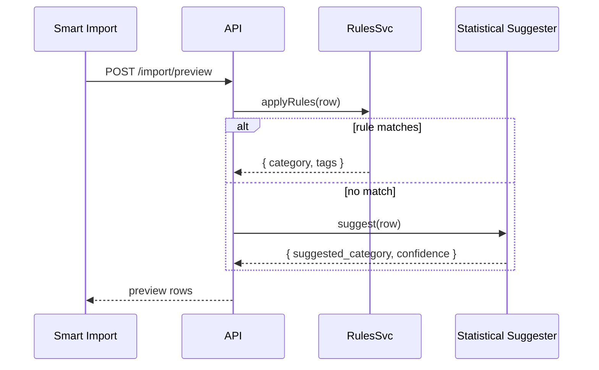

# Rules Engine for Auto-Categorisation

## Summary

Feature 06 suggests categories implicitly from history. This feature complements that with **explicit user-defined rules** the user can read, edit, audit, and re-run. A rule has conditions (e.g. description contains "uber") and actions (set category to "Transport", add tag "work"). Rules apply automatically at import time and can be re-applied to historical transactions on demand. Where feature 06's suggester is a probabilistic helper, the rules engine is deterministic and transparent.

## Requirements

- New `rules` table with priority ordering
- Conditions: description matches (substring or regex), amount range, type, account scope
- Actions: set category, add tags, set notes prefix
- Apply automatically at: CSV import (Smart Import), manual transaction create, manual edit (optional)
- Manual "Apply rules" run on a date range / account scope
- Per-rule run statistics: matches count, last-applied
- Rules surface in Settings; import/export with backup

## Detailed description

### Schema

```sql
CREATE TABLE IF NOT EXISTS rules (
    id              INTEGER PRIMARY KEY AUTOINCREMENT,
    name            TEXT NOT NULL,
    priority        INTEGER NOT NULL DEFAULT 100,    -- lower = runs earlier
    enabled         INTEGER NOT NULL DEFAULT 1,
    account_id      INTEGER REFERENCES accounts(id), -- NULL = all accounts
    match_type      TEXT NOT NULL DEFAULT 'substring' CHECK(match_type IN ('substring','regex')),
    description_pattern TEXT,                        -- nullable; absent = matches anything
    amount_min_cents INTEGER,
    amount_max_cents INTEGER,
    tx_type         TEXT CHECK(tx_type IN ('income','expense','transfer') OR tx_type IS NULL),
    set_category    TEXT,
    add_tag_ids     TEXT,                            -- JSON array of tag ids
    notes_prefix    TEXT,
    last_run_at     DATETIME,
    last_match_count INTEGER NOT NULL DEFAULT 0,
    created_at      DATETIME NOT NULL DEFAULT (datetime('now')),
    deleted_at      DATETIME
);
```

### Matching

A transaction matches a rule iff **every** non-null condition matches:

- `description_pattern` matches the transaction's description (substring case-insensitive, or `RegExp` when `match_type='regex'`)
- `amount_min_cents ≤ ABS(amount_cents) ≤ amount_max_cents` if either is set
- `tx_type` equals the transaction's type if set
- `account_id` equals the transaction's account if set

A null condition is "any". A rule with all-null conditions matches every transaction; the UI warns the user when creating one.

### Application

Rules apply in `priority ASC, id ASC` order. The first matching rule with `set_category` wins for category; subsequent matching rules can still add tags or prefix notes (they're additive). This gives predictable layering: more specific (lower priority number) rules take category precedence, while general "always tag X" rules still apply.

A `dryRun` flag returns matches without writing.

### Entry points

| Where | When applied |
|-------|-------------|
| Smart Import preview (feature 06) | Server applies rules during preview; the suggested category from rules takes precedence over the statistical suggester |
| Quick CSV import | Server applies rules during insert |
| Manual create transaction | Server applies rules immediately after insert (if `set_category` is empty in the request) |
| Manual edit transaction | **Not** auto-applied — user has expressed intent |
| Manual "Apply rules" run | Settings → Rules → Run on (date range, account scope, dry-run toggle) |

### Settings UI

A new "Rules" section in Settings:

- Table of rules ordered by priority: name, conditions summary, actions summary, last match count, enabled toggle, edit/delete.
- "+ New rule" form with all condition and action fields and a live preview pane: "This rule would match N existing transactions" (uses the dry-run endpoint).
- "Run rules now" button: opens a dialog choosing date range + account; shows a confirmation summary ("Will affect X transactions") before running.

### Regex safety

User-supplied regex is compiled in a try/catch; invalid regex shows a validation error. Execution is wrapped in a [safe-regex2](https://www.npmjs.com/package/safe-regex2)-style check, or — simpler — a 50ms execution timeout per match attempt at server side (not feasible in pure Node without a worker). MVP: bound the input string to first 500 chars and reject patterns over 200 chars; this is sufficient for a single-user app where the user owns the regexes.

### Audit

Each rule's `last_run_at` and `last_match_count` are updated after each application (whether at import or via manual run). A toast on the import preview lists "Rules applied: X (Y matches)". For one-off manual runs the response includes per-rule counts.

## User stories

- As a user, I want to write a rule "description contains 'uber' → category Transport, tag commute", so that I don't categorise rides manually.
- As a user, I want to re-run rules over last year's transactions, so that I can backfill categories after creating new rules.
- As a user, I want a dry-run preview, so that I know what a new rule will affect before I save it.
- As a user, I want rules to apply at import time, so that imported transactions land already categorised.

## Key decisions

| Decision | Outcome |
|----------|---------|
| Storage | One `rules` table; `add_tag_ids` is JSON text to keep the schema simple |
| Priority | Integer; lower runs first; ties broken by id |
| Action layering | First matching rule sets category; tags/notes prefix from all matching rules accumulate |
| Manual edit | Does **not** trigger rules — preserves user intent |
| Regex safety | Bound input/pattern length; no worker isolation in MVP |
| Audit | Per-rule `last_run_at` and `last_match_count` only — not a full match log |
| Account scope | Rules can be global (`account_id IS NULL`) or account-pinned |

## Validation

| Rule | Error message |
|------|---------------|
| `name` 1–60 chars | "Name must be 1–60 characters" |
| At least one condition set | "Specify at least one condition" |
| If `match_type='regex'`, `description_pattern` must compile | "Invalid regex: <message>" |
| `description_pattern` ≤ 200 chars | "Pattern too long" |
| `amount_min_cents ≤ amount_max_cents` if both set | "Min must be ≤ max" |
| At least one action set | "Specify at least one action" |
| `add_tag_ids` must reference existing tags | "Tag not found" |

## Diagrams



## Acceptance criteria

```gherkin
Feature: Rules engine

  Scenario: Create a rule and dry-run preview
    Given I am creating a rule with substring "uber" → category Transport
    When I view the dry-run preview
    Then it reports the number of existing transactions that would match

  Scenario: Rule applies at import
    Given a rule "uber → Transport"
    When I import a CSV row with description "UBER *TRIP HELP.UBER.COM"
    Then the imported transaction has category Transport

  Scenario: First match wins for category, others accumulate tags
    Given rule A (priority 10): "uber → Transport"
    And rule B (priority 50): "uber → +tag commute"
    When importing a matching row
    Then category is Transport (from A) and the row has tag commute (from B)

  Scenario: Disabled rule does not apply
    Given a disabled rule "uber → Transport"
    When importing a matching row
    Then category is unset (no rule applied)

  Scenario: Manual edit does not trigger rules
    Given a transaction with description "uber" and category Dining
    And a rule "uber → Transport"
    When I edit the description (unchanged) and save
    Then the category remains Dining

  Scenario: Re-run on date range updates last_match_count
    Given 12 historical transactions match a rule
    When I run the rule across the last year
    Then 12 transactions are updated
    And the rule's last_match_count = 12 and last_run_at = now

  Scenario: Regex compile error
    When I try to save a rule with pattern "(unclosed" and match_type regex
    Then I see "Invalid regex: …"

  Scenario: All-null conditions warns user
    When I attempt to save a rule with no conditions
    Then I see "Specify at least one condition"
```

## Manual test steps

1. Settings → Rules. Add rule "uber → Transport, tag commute". Save.
2. Confirm a dry-run preview number appears in the form before saving.
3. Run a Smart Import CSV containing UBER lines. Confirm category Transport pre-fills and the commute tag is suggested.
4. Disable the rule; re-import; confirm no rule action applies.
5. Create rule A (priority 10) "coffee → Cafés" and rule B (priority 50) "coffee → tag treats". Import a "STARBUCKS COFFEE" row; confirm category Cafés and tag treats.
6. Add a regex rule with an obviously bad pattern; confirm validation message.
7. Edit an existing transaction (no description change); confirm category does *not* change.
8. Run "Apply rules now" across the last year; confirm response summary and rule `last_match_count` updates.

## Implementation tasks

1. **Schema**
   - [server/src/db.ts](server/src/db.ts) — add `rules` table.
2. **Rules service**
   - New file: [server/src/rules/service.ts](server/src/rules/service.ts) — `matchTransaction(tx, rules)`, `applyRules(tx, rules, mode: 'dry'|'apply')`, `runAcross(rangeFilter, dry)`.
   - Compile regex via `new RegExp(pattern, 'i')` inside try/catch.
3. **Repository**
   - New file: [server/src/rules/repository.ts](server/src/rules/repository.ts) — CRUD; `updateAudit(id, matchCount)`.
4. **Routes**
   - New file: [server/src/rules/routes.ts](server/src/rules/routes.ts) — list, create, update, delete, dry-run, run-across.
   - Mount in [server/src/index.ts](server/src/index.ts).
5. **Hook into import**
   - [server/src/import/previewRoutes.ts](server/src/import/previewRoutes.ts) (feature 06) and [server/src/import/csv.ts](server/src/import/csv.ts) — apply rules before falling back to the suggester.
6. **Hook into manual create**
   - [server/src/transactions/routes.ts](server/src/transactions/routes.ts) — after insert, run rules if no category set in the request; update the row with rule outputs.
7. **Client**
   - New file: [client/src/api/rules.ts](client/src/api/rules.ts).
   - New file: [client/src/components/settings/RulesSection.tsx](client/src/components/settings/RulesSection.tsx) with rule list and rule-edit form.
   - New file: [client/src/components/RuleEditor.tsx](client/src/components/RuleEditor.tsx) — conditions, actions, dry-run preview.
8. **Backup**
   - Include `rules` array; merge by name. `add_tag_ids` is remapped via the tag id mapping (feature 03).
9. **Tests**
   - Service: precedence ordering, action layering, regex compile errors, account scoping.
   - Routes: dry-run does not write; run-across updates audit fields.
