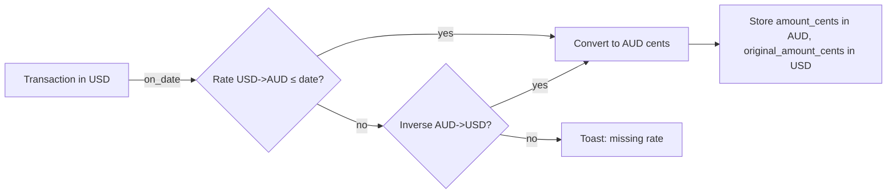

# Multi-Currency Support

## Summary

Today every account and transaction is implicitly in one currency. For users tracking travel expenses, foreign-currency accounts, or simply living in countries where they hold accounts in multiple currencies, this is a problem. This feature adds a currency code to accounts and transactions, an exchange-rate table for conversion, and a single user-chosen **display currency** used for cross-account totals and charts.

## Requirements

- Per-account currency (ISO 4217 code, default `AUD`)
- Transactions inherit their account's currency at creation; an override field permits foreign-currency transactions within an account (e.g. spending USD from an AUD card)
- User-configurable display currency in Settings
- Exchange-rate table — manually entered rates with effective date; latest rate used unless a specific transaction date applies
- Conversion at query time for dashboard/net-worth and reports; each account's own page stays in the account's native currency
- Optional automatic rate refresh via a configurable provider URL (off by default)
- Backup/restore for currencies, account currency, rates, and per-transaction currency

## Detailed description

### Schema

```sql
ALTER TABLE accounts ADD COLUMN currency TEXT NOT NULL DEFAULT 'AUD';
ALTER TABLE transactions ADD COLUMN currency TEXT;           -- NULL = inherit from account
ALTER TABLE transactions ADD COLUMN original_amount_cents INTEGER; -- NULL = same as amount_cents
-- amount_cents is always in the account's currency; original_* stores the foreign amount for audit

CREATE TABLE IF NOT EXISTS currencies (
    code     TEXT PRIMARY KEY,          -- ISO 4217 e.g. 'USD', 'AUD'
    symbol   TEXT NOT NULL,             -- '$', '€', etc
    decimals INTEGER NOT NULL DEFAULT 2
);

CREATE TABLE IF NOT EXISTS exchange_rates (
    id              INTEGER PRIMARY KEY AUTOINCREMENT,
    from_code       TEXT NOT NULL REFERENCES currencies(code),
    to_code         TEXT NOT NULL REFERENCES currencies(code),
    rate            REAL NOT NULL,
    effective_date  DATE NOT NULL,
    source          TEXT,                              -- 'manual' | 'auto:<provider>'
    UNIQUE(from_code, to_code, effective_date)
);

CREATE TABLE IF NOT EXISTS app_settings (
    key   TEXT PRIMARY KEY,
    value TEXT NOT NULL
);
-- 'display_currency' = 'AUD'
-- 'rate_provider_url' = '' (off) | 'https://api.frankfurter.app/latest?from={from}&to={to}'
```

Seed `currencies` with common codes (AUD, USD, EUR, GBP, NZD, JPY, CAD, CHF…) — users can extend later.

### Native and converted amounts

- `amount_cents` is always in the account's currency (the **native** currency for that ledger). This means account balance math is pure integer addition — no rounding drift.
- `original_amount_cents` + `currency` records the **foreign** amount when the user spent in a different currency. The native amount is computed at create time using the day's rate (user-confirmable in the form).

### Display currency

A single `display_currency` setting. Used for:

- Dashboard cross-account totals
- Net-worth tile (feature 09)
- Cross-currency reports (Spend by tag, Spend by category aggregated across accounts)

Single-account views (Account Detail, that account's charts) always display in the account's native currency. A small "Account in USD" chip shows on Account Detail when the account isn't in the user's display currency.

### Conversion

`convert(amount_cents, from, to, on_date)`:

1. If `from == to`, return as-is.
2. Look up the most recent `exchange_rates` row with `effective_date ≤ on_date` for `from → to`. If found, apply.
3. Otherwise look up the inverse (`to → from`) and use `1/rate`.
4. Otherwise return null and surface "Missing rate USD→AUD on 2026-05-12" as a toast/banner.

Cents are reconverted as integer rounding (banker's rounding optional, half-up acceptable for MVP).

### Settings UI

A new "Currencies" section in Settings:

- **Display currency** — select.
- **Account currencies** — table of accounts with currency editable (warn before changing an account whose history is non-empty: balances are *not* retroactively converted).
- **Exchange rates** — table grouped by pair: from, to, effective date, rate, source. Add / edit / delete.
- **Auto-refresh** — toggle + URL template. When enabled, a daily cron job fetches the rate for each (from, to) pair where `from` differs from `to` and stores them. Failure logs a toast on next dashboard load.

### Transaction form changes

A "Currency" select appears next to Amount, defaulting to the account's currency. If the user picks a different currency, an additional **Rate** field appears with the day's looked-up rate pre-filled; the user can override. The form shows both amounts: `USD 50.00 ≈ AUD 75.20`. On save the server stores `original_amount_cents=5000, currency='USD'`, `amount_cents=7520` (in the account's native AUD).

### Backup

Backup payload gains `currencies`, `exchange_rates`, `app_settings`. Account rows gain `currency`. Transaction rows gain `currency` and `original_amount_cents`. Older backups (no currency keys) restore assuming AUD.

## User stories

- As a user, I want to set the currency of each account, so that an account holding euros isn't reported as dollars.
- As a user, I want to enter a foreign-currency transaction, so that "USD 50 spent from my AUD card" records the exact amount the bank charged me.
- As a user, I want a single display currency, so that cross-account totals add up to a number I can interpret.
- As a user, I want to enter exchange rates manually, so that I don't depend on a third party for conversion.

## Key decisions

| Decision | Outcome |
|----------|---------|
| Native storage | `amount_cents` is in the account's native currency (no FX rounding in account balance) |
| Foreign transactions | `original_amount_cents` + `currency` records the foreign side; `amount_cents` is converted at create time |
| Display currency | Single global preference; per-account views stay native |
| Rate lookup | Latest effective rate ≤ transaction date; inverse fallback |
| Auto-refresh | Off by default; user supplies a URL template; daily cron |
| Account currency change | Allowed but does **not** retroactively reconvert balances; user is warned |
| Currency reference data | `currencies` table seeded; users can add codes |

## Validation

| Rule | Error message |
|------|---------------|
| `currency` must be a known code in `currencies` | "Unknown currency code" |
| Exchange rate `rate > 0` | "Rate must be greater than zero" |
| `effective_date` not in the future | "Effective date cannot be in the future" |
| Duplicate (from, to, date) rejected | "Rate already exists for this date" |
| Foreign tx without a usable rate | "No exchange rate for USD→AUD on 2026-05-12 — please enter one" |

## Diagrams



## Acceptance criteria

```gherkin
Feature: Multi-currency

  Scenario: Set an account's currency
    Given I create a new account
    When I select currency USD
    Then the account is stored with currency USD
    And amounts on its detail page render with the $ symbol from USD

  Scenario: Native transaction
    Given an AUD account
    When I create a transaction of $50 with no currency override
    Then amount_cents = -5000 AUD, currency is NULL, original_amount_cents is NULL

  Scenario: Foreign transaction
    Given an AUD account
    And a USD→AUD rate of 1.50 effective today
    When I create a transaction with currency USD, amount 50
    Then amount_cents = -7500 AUD, currency = 'USD', original_amount_cents = -5000

  Scenario: Foreign transaction without a rate
    Given no USD→AUD rate exists
    When I attempt to create a USD transaction in an AUD account
    Then the form prompts me to enter a rate or aborts

  Scenario: Display currency conversion on dashboard
    Given display currency = AUD
    And accounts in AUD and USD with non-zero balances
    When I load the dashboard
    Then the cross-account total is rendered in AUD using the latest rates

  Scenario: Account in foreign currency
    Given an account in USD with display currency AUD
    When I open Account Detail
    Then amounts render in USD and a small chip indicates "Account in USD"

  Scenario: Auto-refresh writes a rate
    Given auto-refresh is configured for USD→AUD
    When the daily cron runs
    Then a new exchange_rates row appears with source='auto:<provider>'

  Scenario: Backup round-trips currencies
    When I export and re-import a backup
    Then currencies, rates, account currency, and per-transaction currency all restore
```

## Manual test steps

1. Settings → Currencies. Set display currency to AUD. Confirm AUD, USD, EUR appear in the currencies table.
2. Add a USD→AUD rate of 1.50 effective today.
3. Edit an existing account; change currency to USD; confirm the warning dialog; confirm the change.
4. Create a transaction in the USD account in native USD — confirm AUD chip on Account Detail header but amounts in USD.
5. In an AUD account, create a new transaction; select currency USD; confirm the rate field pre-fills 1.50 and the converted AUD amount displays.
6. On the dashboard, confirm the cross-account total is rendered in AUD and aggregates the USD account at the current rate.
7. Configure an auto-refresh URL (placeholder) and confirm the form accepts it; manually trigger via dev console or wait for cron.
8. Export a backup; restore to clean DB; confirm all of the above persists.

## Implementation tasks

1. **Schema and seed**
   - [server/src/db.ts](server/src/db.ts) — add columns and tables; seed `currencies` with common codes.
2. **Conversion utility**
   - New file: [server/src/currency/service.ts](server/src/currency/service.ts) — `convert(cents, from, to, date) → cents | null`; `getDisplayCurrency()`.
3. **Repository**
   - New file: [server/src/currency/repository.ts](server/src/currency/repository.ts) — CRUD for rates and currencies; `getDisplaySetting()`, `setDisplaySetting()`.
4. **Routes**
   - New file: [server/src/currency/routes.ts](server/src/currency/routes.ts) — list rates, CRUD, display currency get/set, auto-refresh toggle.
5. **Account & transaction integration**
   - [server/src/accounts/repository.ts](server/src/accounts/repository.ts) — include `currency`; accept on create/update.
   - [server/src/transactions/repository.ts](server/src/transactions/repository.ts) — accept `currency` and `original_amount_cents`; on create with a foreign currency, look up the rate and convert.
6. **Reports/dashboard conversion**
   - [server/src/dashboard/routes.ts](server/src/dashboard/routes.ts) — convert per-account balances to display currency for cross-account totals; surface conversion failures.
7. **Auto-refresh cron**
   - [server/src/currency/refresh.ts](server/src/currency/refresh.ts) — daily cron when URL template is set; persist rates with source `auto:<host>`.
8. **Client**
   - New file: [client/src/api/currency.ts](client/src/api/currency.ts).
   - [client/src/components/AccountForm.tsx](client/src/components/AccountForm.tsx) — currency select.
   - [client/src/components/TransactionForm.tsx](client/src/components/TransactionForm.tsx) — currency override + rate field with live conversion preview.
   - New file: [client/src/components/settings/CurrenciesSection.tsx](client/src/components/settings/CurrenciesSection.tsx).
9. **Display formatting**
   - New util: [client/src/utils/money.ts](client/src/utils/money.ts) — `formatMoney(cents, currency)` using `Intl.NumberFormat`.
10. **Backup**
    - Include `currencies`, `exchange_rates`, `app_settings`; new fields on account/transaction rows. Older payloads default to AUD.
11. **Tests**
    - Conversion: missing rate, inverse fallback, rounding stability.
    - Form: foreign-amount round trip in/out of the form.
