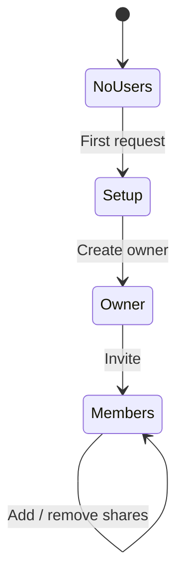

# Multi-User / Household Mode

## Summary

Sid is single-user by design today (the API has no auth and the README/AGENTS.md call this out explicitly). This feature adds an optional multi-user mode: an auth layer, a `users` table, per-user identity on transactions, and a "household" view that merges accounts owned by different users. Multi-user mode is opt-in via an env var; existing single-user installs are not affected by the schema or runtime changes. This is the largest scope jump in the feature set and is intentionally framed as an additive feature flag.

## Requirements

- Opt-in mode via `MULTI_USER=true`. When false, Sid behaves exactly as today (no auth, no user concept).
- New `users` table with `id`, `email` (or `username`), `password_hash`, `display_name`, `role` (`'owner' | 'member'`)
- Session-based auth (HTTP-only cookie); login + logout endpoints; signup gated by first-run or owner invitation
- Accounts gain `owner_user_id` and an explicit `shared_with` (many-to-many) list
- Transactions gain `created_by_user_id`
- Per-user dashboards (each user's `dashboard_config` is private); a Household dashboard sums across shared accounts
- Backup includes users and ACL; password hashes are exported in `argon2` form
- Existing data on upgrade: all accounts assigned to the owner user; all transactions created_by the owner

## Detailed description

### Mode switch

`MULTI_USER` env var:

- Unset / false → server boots in single-user mode. Auth middleware is a no-op. All routes behave as today.
- `true` → auth middleware mounted. First request to a fresh DB redirects to `/setup` to create the owner.

Mode cannot be toggled at runtime; it requires a restart.

### Schema

```sql
CREATE TABLE IF NOT EXISTS users (
    id            INTEGER PRIMARY KEY AUTOINCREMENT,
    email         TEXT NOT NULL,
    password_hash TEXT NOT NULL,
    display_name  TEXT NOT NULL,
    role          TEXT NOT NULL CHECK(role IN ('owner','member')),
    created_at    DATETIME NOT NULL DEFAULT (datetime('now')),
    deleted_at    DATETIME
);
CREATE UNIQUE INDEX IF NOT EXISTS users_email_lower
    ON users(LOWER(email)) WHERE deleted_at IS NULL;

CREATE TABLE IF NOT EXISTS sessions (
    id          TEXT PRIMARY KEY,             -- random 32-byte token
    user_id     INTEGER NOT NULL REFERENCES users(id),
    created_at  DATETIME NOT NULL DEFAULT (datetime('now')),
    expires_at  DATETIME NOT NULL,
    last_seen_at DATETIME NOT NULL DEFAULT (datetime('now'))
);

CREATE TABLE IF NOT EXISTS account_shares (
    account_id INTEGER NOT NULL REFERENCES accounts(id),
    user_id    INTEGER NOT NULL REFERENCES users(id),
    permission TEXT NOT NULL DEFAULT 'read_write' CHECK(permission IN ('read','read_write')),
    PRIMARY KEY (account_id, user_id)
);

ALTER TABLE accounts ADD COLUMN owner_user_id INTEGER REFERENCES users(id);
ALTER TABLE transactions ADD COLUMN created_by_user_id INTEGER REFERENCES users(id);
```

On upgrade in single-user mode, the new columns stay NULL (no `users` row exists). On the first start with `MULTI_USER=true` on an existing DB, a one-time migration creates the owner user, assigns `owner_user_id = owner.id` to every account, and `created_by_user_id = owner.id` to every transaction.

### Auth

- **Hashing**: `argon2` (existing Node-compatible package).
- **Sessions**: opaque random 256-bit tokens stored in `sessions`; cookie `Sid-Session`, `HttpOnly; SameSite=Lax; Secure` (Secure in production via `NODE_ENV`).
- **Expiry**: 30 days; sliding (renewed on `last_seen_at` update).
- **CSRF**: same-site cookie + a `X-Sid-Csrf` token returned from `/me` and required on state-changing requests.
- **Login lockout**: 5 failed attempts in 10 minutes locks an account for 10 min (in-memory counter; acceptable at single-server scale).

### Endpoints

- `POST /api/auth/login` `{ email, password }` → sets cookie
- `POST /api/auth/logout`
- `GET /api/me` → user, csrf token
- `POST /api/auth/setup` → first-run, creates the owner
- `POST /api/users` (owner only) → invite a member
- `PUT /api/users/:id/password` (self) → change password
- `DELETE /api/users/:id` (owner) → soft-delete a member

### Authorisation

Permission rules:

| Action | Owner | Member |
|--------|-------|--------|
| Create / delete accounts | ✓ | ✗ (member can create accounts but only their own) |
| Edit any account | ✓ | Only owned or shared (`read_write`) |
| Read any account | ✓ | Only owned or shared |
| Invite users | ✓ | ✗ |
| Change app settings (display currency, scheduled backup config) | ✓ | ✗ |
| Create / edit / delete transactions | Both | Both for accounts they can write to |

The repository layer gains a `currentUserId` parameter on every query that touches accounts or transactions. The route layer extracts the user from the session and passes it through. Queries add `WHERE accounts.owner_user_id = ? OR accounts.id IN (SELECT account_id FROM account_shares WHERE user_id = ?)` (read scope) / `permission = 'read_write'` (write scope) to all listings.

### Account sharing UI

- Settings → Accounts → each account row gains a "Share" action (owner-only and account-owner-only). The dialog lists current members with permission toggles (read / read+write).
- Members can leave a shared account (revokes the share for themselves only).

### Household dashboard

A new dashboard tab "Household" beside "My dashboard". Aggregates across:

- Accounts the current user owns
- Accounts shared with the current user

Net worth (feature 09) becomes a Household-by-default view in multi-user mode (with an "Only mine" filter).

### Transaction attribution

Every transaction stores `created_by_user_id`. The transaction row shows a small avatar/initials chip when not created by the current user. Filter "Created by" added in the filter drawer (feature 01).

### Backup

`BackupPayload` gains `users`, `sessions` (optional — usually excluded), `account_shares`. `BackupAccount.owner_user_id`, `BackupTransaction.created_by_user_id` are included. Restoring on a single-user instance ignores these. Restoring on a multi-user instance remaps user ids by email (case-insensitive).

### Migration safety

- Single-user → multi-user migration runs once with idempotency guard. Owner user is created via the `/setup` flow before any existing data is bound.
- Multi-user → single-user is **not** supported automatically; the docs explain that single-user mode will ignore the user columns, which is safe but means data created by deleted users still references the missing row (foreign keys are unconstrained in this direction).

## User stories

- As a household, we want to share a joint account so that we both see the same transactions.
- As an owner, I want private accounts that my partner can't see, so that surprise-gift purchases stay hidden.
- As an owner, I want to invite a member, so that they can log in without me sharing my credentials.
- As a member, I want my own dashboard tile arrangement, so that my view reflects my priorities.
- As a household, we want a combined Household dashboard, so that we see our shared net worth.

## Key decisions

| Decision | Outcome |
|----------|---------|
| Opt-in via `MULTI_USER=true` | Single-user installs unaffected; multi-user is intentional |
| Sessions | Server-side `sessions` table; HTTP-only same-site cookie; 30-day sliding expiry |
| Hashing | `argon2id` |
| Sharing model | Account-level shares with `read` or `read_write` |
| First-run setup | `/setup` page creates the owner before any other route accepts traffic |
| Per-user dashboards | `dashboard_config` gains `user_id`; existing rows assigned to owner on migration |
| Household view | A second dashboard tab; aggregates across owned + shared |
| Privacy | Members can't see owner's non-shared accounts or transactions |
| Backup | Users and shares included; restore ignores users in single-user mode |

## Permissions matrix

| Resource | Owner | Member (own) | Member (shared rw) | Member (shared ro) | Member (not shared) |
|----------|-------|--------------|--------------------|--------------------|---------------------|
| Read accounts | ✓ | ✓ | ✓ | ✓ | ✗ |
| Write accounts | ✓ | ✓ | ✓ | ✗ | ✗ |
| Delete accounts | ✓ | own only | ✗ | ✗ | ✗ |
| Read transactions | ✓ | ✓ | ✓ | ✓ | ✗ |
| Write transactions | ✓ | ✓ | ✓ | ✗ | ✗ |
| Manage users | ✓ | ✗ | ✗ | ✗ | ✗ |
| App settings | ✓ | ✗ | ✗ | ✗ | ✗ |

## Validation

| Rule | Error message |
|------|---------------|
| Email valid format | "Enter a valid email" |
| Email unique (case-insensitive) | "A user with this email already exists" |
| Password ≥ 10 characters | "Password must be at least 10 characters" |
| Cannot delete the last owner | "At least one owner is required" |
| Cannot remove your own owner role if you're the last owner | "Promote another owner first" |
| Login: missing or wrong credentials | "Invalid email or password" |
| Locked out | "Too many failed attempts. Try again in N minutes." |

## Diagrams

```mermaid
sequenceDiagram
    participant Browser
    participant API
    participant DB
    Browser->>API: POST /auth/login {email, password}
    API->>DB: SELECT user by email
    DB-->>API: user row
    API->>API: argon2.verify
    API->>DB: INSERT session
    API-->>Browser: Set-Cookie Sid-Session=...; HttpOnly; SameSite=Lax
    Browser->>API: GET /api/accounts (Cookie)
    API->>DB: SELECT session, user
    API->>DB: SELECT accounts WHERE owner_user_id=? OR shared with ?
    DB-->>API: accounts
    API-->>Browser: JSON
```



## Acceptance criteria

```gherkin
Feature: Multi-user mode

  Scenario: Single-user mode unaffected
    Given MULTI_USER is unset
    When I make requests as today
    Then no authentication is required and behaviour is identical

  Scenario: First-run setup
    Given MULTI_USER=true and no users exist
    When I open the app
    Then I am redirected to /setup to create the owner

  Scenario: Login required
    Given MULTI_USER=true
    When I make a request without a session cookie
    Then I receive 401 Unauthorized

  Scenario: Owner invites a member
    When the owner invites alice@example.com with a temporary password
    Then a new user is created with role='member'
    And alice can log in and is forced to change her password on first login

  Scenario: Share an account
    Given owner has an account "Joint"
    When the owner shares "Joint" with alice as read_write
    Then alice sees the account in her account list and can add transactions

  Scenario: Member cannot see unshared accounts
    Given a private account belonging to the owner
    When alice lists accounts
    Then the private account is not in the list

  Scenario: Household dashboard
    Given alice has an own account and is shared on one of owner's accounts
    When she opens the Household dashboard
    Then balances and net worth aggregate across her own and shared accounts only

  Scenario: Lockout
    Given alice tries 5 wrong passwords in 10 minutes
    Then her next correct attempt is rejected with "Too many failed attempts"

  Scenario: Existing data upgraded
    Given an existing single-user install
    When MULTI_USER=true is set and the owner is created via /setup
    Then all existing accounts have owner_user_id = owner.id
    And all transactions have created_by_user_id = owner.id

  Scenario: Last owner cannot be deleted
    Given there is exactly one owner
    When I attempt to delete that user
    Then I see "At least one owner is required"

  Scenario: Backup restore on a single-user instance
    Given a multi-user backup
    When I import it on a single-user instance
    Then accounts and transactions restore
    And user-related fields are ignored
```

## Manual test steps

1. With existing data, set `MULTI_USER=true` and restart. Confirm /setup appears.
2. Create owner; log in; confirm dashboard renders existing accounts and transactions.
3. From Settings → Users, invite a member. Log out and log in as the member. Confirm no accounts are visible.
4. As the owner, share one account with the member as read+write. Log out; log in as the member; confirm the account is visible and a transaction can be added.
5. As the owner, create a private account; confirm the member cannot see it.
6. Open the Household dashboard as the member; confirm it shows only their own + shared accounts.
7. As an authenticated user, attempt to call an API without the CSRF token on a POST; confirm 403.
8. Try 5 wrong passwords; confirm lockout message.
9. Export a backup; restore on a fresh single-user instance (`MULTI_USER` unset); confirm accounts and transactions restore.
10. Restart with `MULTI_USER` removed; confirm the app reverts to no-auth and treats all existing user_id columns as harmless metadata.

## Implementation tasks

1. **Schema migration**
   - [server/src/db.ts](server/src/db.ts) — `users`, `sessions`, `account_shares`, columns on `accounts` and `transactions`. Idempotent.
2. **Auth middleware**
   - New file: [server/src/auth/middleware.ts](server/src/auth/middleware.ts) — reads cookie, loads session+user, attaches `req.user`. No-op when `MULTI_USER` falsey.
3. **Auth routes**
   - New file: [server/src/auth/routes.ts](server/src/auth/routes.ts) — `login`, `logout`, `setup`, `me`. Uses `argon2`.
4. **Users routes**
   - New file: [server/src/users/routes.ts](server/src/users/routes.ts) — owner-gated CRUD.
5. **Authorisation in repositories**
   - [server/src/accounts/repository.ts](server/src/accounts/repository.ts), [server/src/transactions/repository.ts](server/src/transactions/repository.ts) — accept `currentUserId` and scope queries accordingly.
6. **Sharing**
   - New file: [server/src/account-shares/routes.ts](server/src/account-shares/routes.ts).
7. **Dashboard scoping**
   - [server/src/dashboard-config/repository.ts](server/src/dashboard-config/repository.ts) — add `user_id`; default rows for new users on first login.
   - Household endpoint: `GET /api/dashboard/household` aggregates owned + shared.
8. **Client**
   - New file: [client/src/api/auth.ts](client/src/api/auth.ts).
   - New file: [client/src/pages/Login.tsx](client/src/pages/Login.tsx), [client/src/pages/Setup.tsx](client/src/pages/Setup.tsx).
   - [client/src/App.tsx](client/src/App.tsx) — bootstrap probes `/api/me`; redirects to login when 401 and `MULTI_USER` is on.
   - New file: [client/src/components/settings/UsersSection.tsx](client/src/components/settings/UsersSection.tsx).
   - Account row gains a "Share" action when current user is the owner.
   - New file: [client/src/pages/HouseholdDashboard.tsx](client/src/pages/HouseholdDashboard.tsx) or a tab on existing Dashboard.
9. **CSRF**
   - Server: returns a CSRF token from `/me`; middleware enforces on POST/PUT/DELETE/PATCH.
   - Client: shared axios interceptor injects `X-Sid-Csrf` from cached `/me` state.
10. **Backup**
    - Include `users`, `account_shares`, owner ids and created_by ids. Restore remaps by email; ignores user data in single-user mode.
11. **Docs**
    - [README.md](README.md) and [AGENTS.md](AGENTS.md) — explain `MULTI_USER` flag and migration semantics (the AGENTS.md "single-user" line gets a footnote pointing at this feature).
12. **Tests**
    - Auth: login, lockout, session expiry, CSRF rejection.
    - Authorisation: member cannot see unshared accounts; owner can see all; shared read-only blocks writes.
    - Migration: existing single-user data is preserved when `MULTI_USER` is enabled.
    - Backup round-trip on multi-user → multi-user and multi-user → single-user.
