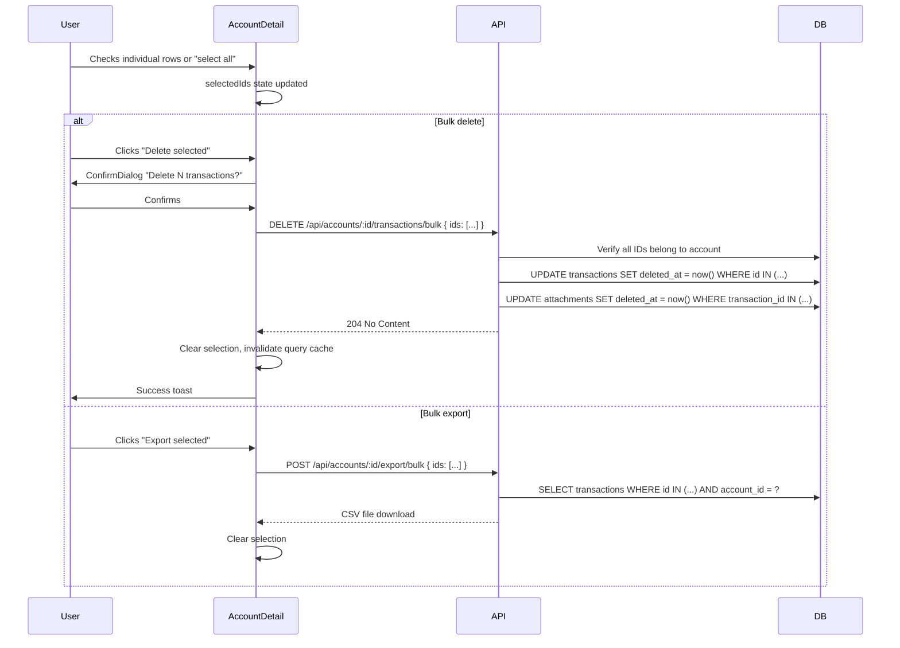

# Bulk Transaction Operations

## Summary

Add multi-select to the transaction list so users can delete or export several transactions at once. A checkbox column and header "select all" checkbox enable row selection. When one or more rows are selected, a contextual action bar appears offering bulk delete (with confirmation) and bulk CSV export. This addresses cleanup after CSV imports that introduce duplicates and enables ad-hoc filtered exports.

## Requirements

- Checkbox column in the transaction list with a "select all" checkbox in the header
- Contextual action bar appears when one or more rows are selected, offering:
  - Delete selected (with confirmation dialog)
  - Export selected to CSV
- Bulk delete uses the existing soft-delete mechanism
- Bulk CSV export passes selected IDs to the server (consistent with the existing server-side export)

## Detailed description

### Checkbox column

A checkbox column is added as the leftmost column of the transaction list grid on desktop. The header row contains a "select all" checkbox with three visual states:

- **Unchecked** — no transactions selected
- **Checked** — all transactions in the current filtered view are selected
- **Indeterminate** — some but not all transactions selected

Clicking the header checkbox when unchecked or indeterminate selects all; clicking when checked deselects all.

Individual row checkboxes toggle selection for that transaction.

**Desktop only.** The mobile card layout is unchanged in this iteration.

### Selection state

Selected IDs are held in a `Set<number>` in local component state. When the user changes any filter, the selection is updated to retain only IDs that are still present in the new result set; IDs no longer visible are silently dropped.

Selection is cleared after any successful bulk action (delete or export).

### Contextual action bar

When `selectedIds.size > 0`, a contextual action bar becomes visible. It displays:

- The count of selected transactions (e.g. "3 selected")
- **Export selected** button
- **Delete selected** button (danger style)
- An **×** / clear button to deselect all

The bar is positioned above the transaction list rows, below the existing filter/action bar.

### Bulk delete

1. User clicks "Delete selected".
2. A `ConfirmDialog` appears with the message "Delete {n} transaction{s}?" and a "Delete" confirm button.
3. On confirm, a `DELETE /api/accounts/:accountId/transactions/bulk` request is sent with the array of selected IDs in the request body.
4. The server verifies all IDs belong to the given account, then soft-deletes each transaction and its attachments (identical behaviour to single-transaction delete).
5. On success: selection is cleared, the transaction query cache is invalidated, and a success toast is shown.

### Bulk CSV export

1. User clicks "Export selected".
2. The client POSTs selected IDs to `POST /api/accounts/:accountId/export/bulk`.
3. The server fetches those transactions (verifying ownership), generates a CSV using the same format and columns as the existing export endpoint, and returns it as a file download.
4. On success: the file is downloaded and selection is cleared.

The CSV format matches the existing export: `Date, Category, Description, Type, Amount, Notes`.

## User stories

- As a user, I want to select multiple transactions and delete them all at once, so that I can quickly clean up duplicates after a CSV import.
- As a user, I want to select a specific subset of transactions and export them to CSV, so that I can produce targeted reports without exporting my entire transaction history.

## Key decisions

| Decision | Outcome |
|----------|---------|
| Mobile support | Desktop only in this iteration; mobile card layout is unchanged |
| Bulk export generation | Server-side via POST with selected IDs — consistent with existing export behaviour |
| Selection on filter change | Preserve IDs still in the filtered results; silently drop IDs no longer visible |
| Soft-delete attachments | Bulk delete soft-deletes attachments for each transaction, same as single delete |
| Select-all scope | All transactions in the current filtered view (no pagination exists) |
| Action bar placement | Above the transaction rows, below the filter/action bar |

## Diagrams



## Acceptance criteria

```gherkin
Feature: Bulk transaction operations

  Scenario: Checkbox column appears on desktop
    Given I am viewing the transaction list on a desktop browser
    Then I see a checkbox column as the leftmost column
    And the header row contains a "select all" checkbox

  Scenario: No checkbox column on mobile
    Given I am viewing the transaction list on a mobile browser
    Then I do not see a checkbox column
    And the mobile card layout is unchanged

  Scenario: Selecting an individual transaction
    Given I am viewing the transaction list
    When I check the checkbox on a transaction row
    Then that row appears selected (visually distinguished)
    And the contextual action bar appears showing "1 selected"

  Scenario: Select all transactions
    Given I am viewing the transaction list with multiple transactions
    When I check the "select all" header checkbox
    Then all visible transactions are selected
    And the action bar shows the total count selected
    And the header checkbox is in the checked state

  Scenario: Deselect all via header checkbox
    Given all transactions are selected
    When I click the "select all" header checkbox
    Then all transactions are deselected
    And the contextual action bar disappears

  Scenario: Header checkbox indeterminate state
    Given some but not all transactions are selected
    Then the header checkbox is in an indeterminate state

  Scenario: Action bar disappears when nothing selected
    Given I have selected some transactions
    When I click the clear (×) button in the action bar
    Then all transactions are deselected
    And the contextual action bar disappears

  Scenario: Filter change preserves visible selections
    Given I have selected 3 transactions
    When I apply a filter that removes 1 of the selected transactions from the list
    Then the 2 remaining selected transactions stay selected
    And the action bar shows "2 selected"

  Scenario: Bulk delete with confirmation
    Given I have selected 3 transactions
    When I click "Delete selected"
    Then a confirmation dialog appears with the message "Delete 3 transactions?"
    When I click "Delete" in the dialog
    Then all 3 transactions are removed from the list
    And the selection is cleared
    And the action bar disappears
    And a success toast is shown

  Scenario: Bulk delete cancelled
    Given I have selected 2 transactions
    When I click "Delete selected"
    And I click "Cancel" in the confirmation dialog
    Then no transactions are deleted
    And the selection is unchanged

  Scenario: Bulk CSV export
    Given I have selected 2 transactions
    When I click "Export selected"
    Then a CSV file is downloaded containing exactly those 2 transactions
    And the CSV has columns: Date, Category, Description, Type, Amount, Notes
    And the selection is cleared after the download

  Scenario: Selection cleared after bulk delete
    Given I have successfully bulk-deleted 4 transactions
    Then the selection is empty
    And the action bar is no longer visible

  Scenario: Selection cleared after bulk export
    Given I have successfully bulk-exported 3 transactions
    Then the selection is empty
    And the action bar is no longer visible
```

## Manual test steps

1. Open any account's transaction list on a desktop browser.
2. Confirm a checkbox column appears as the leftmost column, with a checkbox in the header row.
3. Check one transaction's checkbox. Confirm the row is visually highlighted and the action bar appears below the filter bar showing "1 selected".
4. Check a second transaction. Confirm the count updates to "2 selected".
5. Click the header "select all" checkbox. Confirm all transactions are selected and the header checkbox is fully checked.
6. Uncheck one transaction. Confirm the header checkbox changes to the indeterminate state.
7. Click the header checkbox again (indeterminate → should select all). Confirm all transactions become selected.
8. Click the × button in the action bar. Confirm all selections are cleared and the action bar disappears.
9. Select 2 transactions. Apply a keyword filter that hides one of them. Confirm the remaining selected transaction stays checked and the action bar shows "1 selected".
10. Clear the filter. Confirm the previously-hidden transaction is unselected (since it was dropped when the filter was applied).
11. Select 2 transactions. Click "Delete selected". Confirm the confirmation dialog appears with "Delete 2 transactions?". Click "Cancel" — confirm nothing changes.
12. Click "Delete selected" again and this time confirm. Verify both transactions disappear from the list, the action bar disappears, and a success toast appears.
13. Select 3 transactions. Click "Export selected". Confirm a CSV file downloads. Open it and verify it contains exactly those 3 transactions with the correct columns.
14. After the export, confirm the selection is cleared and the action bar disappears.
15. Switch to a mobile browser (or narrow the viewport to mobile width). Confirm no checkbox column is visible and the layout is unchanged.

## Implementation tasks

1. **Add bulk delete endpoint**
   - [server/src/transactions/repository.ts](server/src/transactions/repository.ts) — add `bulkSoftDelete(ids: number[], accountId: number)`: verify all IDs belong to `accountId`, then in a single transaction soft-delete matching rows in `transactions` and their `attachments` (same logic as existing `softDelete`, applied to multiple IDs using `WHERE id IN (...)`)
   - [server/src/transactions/routes.ts](server/src/transactions/routes.ts) — add `DELETE /api/accounts/:accountId/transactions/bulk` route, accepting `{ ids: number[] }` in the request body, returning 204

2. **Add bulk export endpoint**
   - [server/src/export/routes.ts](server/src/export/routes.ts) — add `POST /api/accounts/:accountId/export/bulk` route, accepting `{ ids: number[] }` in the request body
   - Fetch the specified transactions (`WHERE id IN (...) AND account_id = ? AND deleted_at IS NULL`), verify the result set matches the requested IDs, then pipe through the existing CSV generation in [server/src/export/csv.ts](server/src/export/csv.ts)
   - Return the CSV with identical headers and filename format as the existing export endpoint

3. **Add client API functions**
   - Wherever `deleteTransaction` is defined (likely [client/src/api/transactions.ts](client/src/api/transactions.ts) or inline in `AccountDetail`) — add `bulkDeleteTransactions(accountId: number, ids: number[]): Promise<void>`
   - Wherever export is initiated (see `AccountDetail.tsx` lines 221–236) — add `bulkExportTransactions(accountId: number, ids: number[]): Promise<void>` that POSTs the IDs and triggers the file download (same pattern as the existing export link click)

4. **Add `selectedIds` state and selection logic to `AccountDetail`**
   - [client/src/pages/AccountDetail.tsx](client/src/pages/AccountDetail.tsx) — add `const [selectedIds, setSelectedIds] = useState<Set<number>>(new Set())`
   - After the transactions query resolves, derive `visibleIds` from the result; add a `useEffect` that runs when the transactions result changes and calls `setSelectedIds(prev => new Set([...prev].filter(id => visibleIds.has(id))))` to drop IDs no longer visible
   - Add handlers: `handleSelectRow(id)`, `handleSelectAll()`, `handleClearSelection()`
   - Update grid template columns to add a `32px` checkbox column at the start (desktop only — wrap in a responsive class or conditional)

5. **Add checkbox to `TransactionRow`**
   - [client/src/components/TransactionRow.tsx](client/src/components/TransactionRow.tsx) — add props `isSelected: boolean`, `onSelect: (id: number) => void`
   - Render a `<input type="checkbox">` as the first cell, desktop only (hide on mobile via CSS)
   - Visually distinguish selected rows (e.g. light background tint)

6. **Create `BulkActionBar` component**
   - New file: [client/src/components/BulkActionBar.tsx](client/src/components/BulkActionBar.tsx)
   - Props: `selectedCount: number`, `onDelete: () => void`, `onExport: () => void`, `onClear: () => void`
   - Renders only when `selectedCount > 0`
   - Shows "{n} selected", an "Export selected" button, a "Delete selected" danger button, and a × clear button
   - Follow existing button and bar styling patterns in `AccountDetail`

7. **Wire up bulk actions in `AccountDetail`**
   - [client/src/pages/AccountDetail.tsx](client/src/pages/AccountDetail.tsx) — render `<BulkActionBar>` between the filter bar and the transaction list, passing `selectedIds.size` and handlers
   - Add `bulkDeleteMutation` using `useMutation`: on success, call `setSelectedIds(new Set())`, invalidate `['transactions', accountId]`, show success toast
   - For delete: show existing `ConfirmDialog` with message `Delete ${selectedIds.size} transaction${selectedIds.size !== 1 ? 's' : ''}?`; on confirm call `bulkDeleteMutation.mutate([...selectedIds])`
   - For export: call `bulkExportTransactions`, then clear selection on completion

8. **Add select-all checkbox to transaction list header**
   - [client/src/pages/AccountDetail.tsx](client/src/pages/AccountDetail.tsx) — in the header row, add a checkbox in the new first column
   - Derive `allSelected = selectedIds.size === transactions.length && transactions.length > 0`
   - Derive `someSelected = selectedIds.size > 0 && !allSelected`
   - Set the checkbox's `checked` to `allSelected` and `indeterminate` (via `ref`) to `someSelected`
   - `onChange` calls `handleSelectAll()` / deselect all depending on current state
