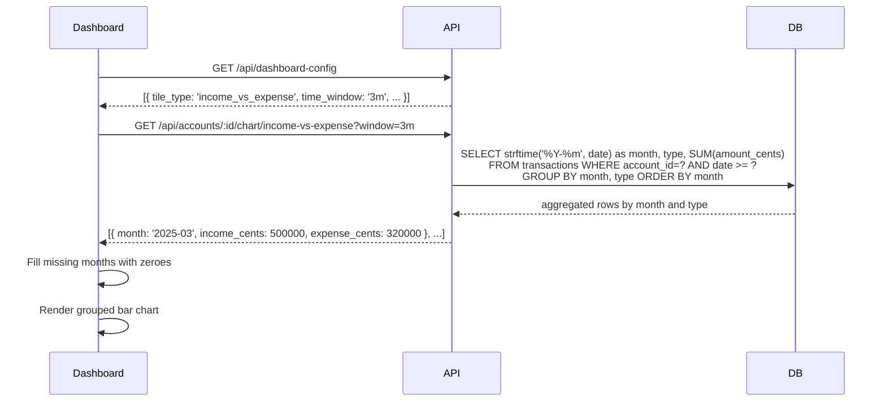

# Income vs Expense Chart Tile

## Summary

A new dashboard tile type called "Income vs Expense" that displays income and expenses as a grouped bar chart, grouped by calendar month. Each month shows two side-by-side bars — one for total income (green) and one for total expenses (red) — making it easy to visualise cashflow month by month.

## Requirements

- Date range selection with month-aligned window options (3 months, 6 months, 12 months, all time)

## Detailed description

The tile renders a grouped bar chart where each group on the X-axis represents a calendar month. Within each group, two bars appear side by side:

- **Income bar** (green): sum of all income transactions for that month
- **Expense bar** (red): sum of all expense transactions for that month

All calendar months within the selected window are shown on the X-axis, even if no transactions occurred in that month (both bars render at zero height).

The X-axis labels show abbreviated month and year (e.g. "Jan 25"). The Y-axis shows formatted dollar amounts. A tooltip appears on hover showing the exact income and expense amounts for the hovered month group.

The tile header shows the account name and the configured window label (e.g. "Last 3 months"), consistent with other chart tiles.

The window can be configured when adding the tile to the dashboard, with options: 3 months, 6 months, 12 months, and all time. The selected window is persisted in the `time_window` column of `dashboard_config`. The default window when adding a new tile is 3 months.

## User stories

- As a user, I want to see my income and expenses side by side for each month, so that I can quickly identify months where I overspent or had a surplus.
- As a user, I want to configure the date range for the chart, so that I can focus on a recent period or view my entire history.

## Key decisions

| Decision | Outcome |
|----------|---------|
| Grouping granularity | Always by calendar month |
| Window options | 3m, 6m, 12m, all time — no 30d or custom weeks |
| Empty months | All months in the window are shown; months with no transactions render zero-height bars |
| Bar colours | Income: green; Expense: red — consistent with existing positive/negative balance colour conventions |
| Default window | 3 months (`3m`) |
| New `6m` window value | Must be added to server validation and date parsing — it does not currently exist |

## Diagrams



## Acceptance criteria

```gherkin
Feature: Income vs Expense chart tile

  Scenario: Tile renders grouped bars for each month
    Given a dashboard with an Income vs Expense tile configured with a 3-month window
    And the account has income and expense transactions across multiple months in that window
    When I view the dashboard
    Then I see a grouped bar chart
    And each month in the 3-month window appears on the X-axis
    And each month group has a green bar for income and a red bar for expenses
    And bar heights are proportional to the total amounts for that month

  Scenario: Empty months show zero-height bars
    Given a dashboard with an Income vs Expense tile
    And one of the months in the selected window has no transactions
    When I view the dashboard
    Then that month still appears on the X-axis
    And both the income and expense bars for that month are at zero height

  Scenario: Tooltip shows formatted amounts on hover
    Given I am viewing an Income vs Expense chart tile
    When I hover over a month group
    Then a tooltip appears
    And the tooltip shows the total income and total expense for that month formatted as currency

  Scenario: Tile can be added with window selection
    Given I am in the Dashboard settings
    When I add a new tile of type "Income vs Expense"
    Then the window options available are: 3 months, 6 months, 12 months, All time
    And the 30-day and custom weeks options are not shown
    And the tile is added to the dashboard with the selected window

  Scenario: Window defaults to 3 months
    Given I add an Income vs Expense tile without specifying a window
    When the tile renders
    Then it shows the last 3 months of data

  Scenario: All time window shows full history
    Given an Income vs Expense tile configured with "all time"
    And the account has transactions spanning multiple years
    When I view the dashboard
    Then the chart shows all calendar months from the month of the first transaction to the current month

  Scenario: No data in selected window
    Given a dashboard with an Income vs Expense tile
    And the account has no transactions in the selected window
    When I view the dashboard
    Then the tile displays an appropriate empty state message
```

## Manual test steps

1. Open the app and navigate to Dashboard settings.
2. Click to add a new tile, select an account, and choose tile type "Income vs Expense".
3. Confirm the window options available are: Last 3 months, Last 6 months, Last 12 months, All time. Confirm "Last 30 days" and "Custom weeks" are not shown.
4. Select "Last 3 months" and save. Confirm the tile appears on the dashboard.
5. Confirm the tile shows a grouped bar chart with months on the X-axis.
6. Confirm each month has two bars: one green (labelled or coloured as income) and one red (expense).
7. Confirm X-axis labels show abbreviated month and year (e.g. "Jan 25").
8. Hover over a bar group and confirm the tooltip shows formatted income and expense amounts for that month.
9. Confirm that all months in the 3-month window appear on the X-axis, including any with no transactions (zero-height bars).
10. Go to settings and change the tile's window to "Last 6 months". Confirm the chart updates to show 6 months.
11. Change the window to "All time". Confirm the chart extends back to the earliest transaction month.
12. Add a new income transaction for the current month and reload the dashboard. Confirm the income bar for the current month increases accordingly.
13. Test with an account that has no transactions in the selected window. Confirm the tile shows an empty state rather than a broken or blank chart.

## Implementation tasks

1. **Add `6m` window support to server** (no existing tile uses this value)
   - [server/src/dashboard-config/routes.ts](server/src/dashboard-config/routes.ts) — add `'6m'` to `isValidWindow()`
   - [server/src/chart/repository.ts](server/src/chart/repository.ts) — add `'6m'` case in `parseWindowToFromDate()`, subtracting 6 months from today

2. **Register new tile type**
   - [server/src/dashboard-config/repository.ts](server/src/dashboard-config/repository.ts) — add `'income_vs_expense'` to the `TileType` union
   - [client/src/api/dashboardConfig.ts](client/src/api/dashboardConfig.ts) — add `'income_vs_expense'` to the client-side `TileType`

3. **Add backend chart query** — follow the pattern of `getBalanceOverTime` in [server/src/chart/repository.ts](server/src/chart/repository.ts)
   - Add `getIncomeVsExpenseByMonth(accountId: number, fromDate: string | null)`:
     - Query: `SELECT strftime('%Y-%m', date) as month, type, SUM(amount_cents) as total_cents FROM transactions WHERE account_id = ? AND (? IS NULL OR date >= ?) AND deleted_at IS NULL GROUP BY month, type ORDER BY month`
     - Post-process: enumerate all calendar months in the window and fill missing income or expense entries with zero, returning `Array<{ month: string, income_cents: number, expense_cents: number }>`

4. **Add server route** — follow pattern of existing chart routes in [server/src/chart/routes.ts](server/src/chart/routes.ts)
   - `GET /api/accounts/:accountId/chart/income-vs-expense?window=...`
   - Use `parseWindowToFromDate` and call `getIncomeVsExpenseByMonth`

5. **Add client API function** — add to [client/src/api/charts.ts](client/src/api/charts.ts)
   - `getIncomeVsExpenseChart(accountId: number, window: string): Promise<IncomeVsExpenseDataPoint[]>`
   - Type: `interface IncomeVsExpenseDataPoint { month: string; income_cents: number; expense_cents: number }`

6. **Create `IncomeVsExpenseChartTile` component**
   - New file: [client/src/components/IncomeVsExpenseChartTile.tsx](client/src/components/IncomeVsExpenseChartTile.tsx)
   - Follow [client/src/components/BalanceChartTile.tsx](client/src/components/BalanceChartTile.tsx) for the query/window/tile-header pattern
   - Use Recharts `BarChart` (follow [client/src/components/CategoryChartTile.tsx](client/src/components/CategoryChartTile.tsx) for bar chart setup)
   - Two `Bar` components: income (green, matching existing positive balance CSS variable) and expense (red, matching negative balance CSS variable)
   - `ResponsiveContainer` with fixed height (match `BalanceChartTile`'s 160px or adjust as needed)
   - X-axis: `tickFormatter` formatting `"YYYY-MM"` strings to `"Mon YY"` (e.g. `"Jan 25"`)
   - Y-axis: reuse existing `formatYAxis` pattern for currency
   - Custom tooltip showing income and expense amounts formatted with `formatCents`
   - Empty state when the data array is empty (no transactions in window)

7. **Register tile in Dashboard render** — add to [client/src/pages/Dashboard.tsx](client/src/pages/Dashboard.tsx)
   - Add a branch for `tile.tile_type === 'income_vs_expense'` rendering `<IncomeVsExpenseChartTile accountId={tile.account_id} window={tile.time_window ?? '3m'} />`

8. **Add tile type and window options to Dashboard settings** — update [client/src/components/settings/DashboardSection.tsx](client/src/components/settings/DashboardSection.tsx)
   - Add `'income_vs_expense'` to the tile type selector with label "Income vs Expense"
   - When this tile type is selected, show window options: `[{ value: '3m', label: 'Last 3 months' }, { value: '6m', label: 'Last 6 months' }, { value: '12m', label: 'Last 12 months' }, { value: 'all', label: 'All time' }]` — not the full set used by other chart tiles

9. **Update `chartWindow.ts` label utility** — update [client/src/utils/chartWindow.ts](client/src/utils/chartWindow.ts)
   - Ensure `'6m'` maps to the readable label "Last 6 months"
