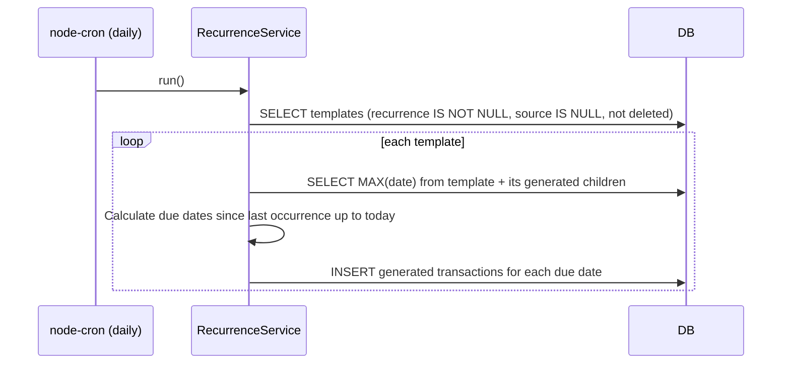
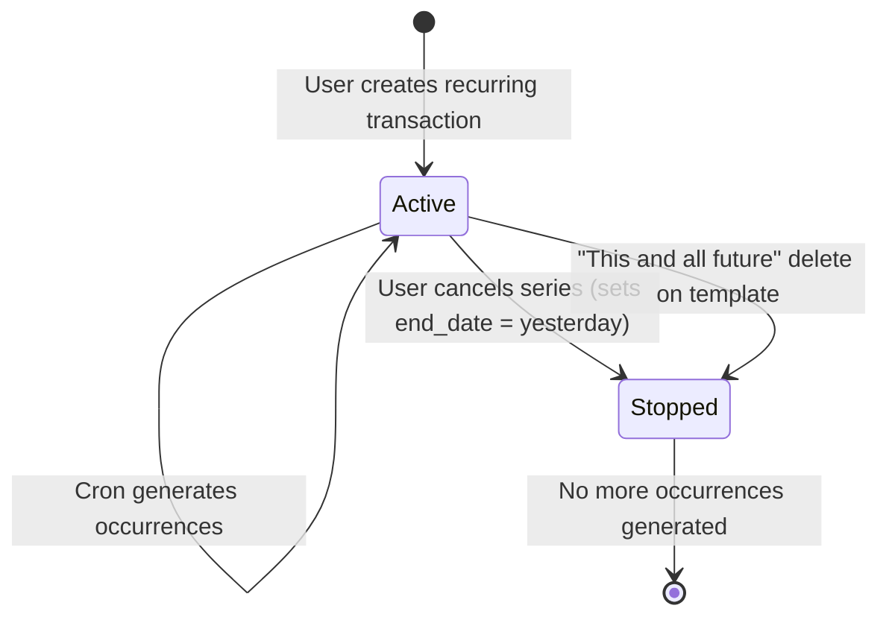

# Recurring Transactions

## Summary

Fixed periodic expenses and income (rent, subscriptions, salary) currently require manual entry every period. This feature adds a recurrence option to the transaction form. The original transaction acts as the first occurrence and as the template for future generations. A `node-cron` daily job generates due occurrences automatically. When editing or deleting a recurring transaction, the user is prompted to apply the change to just that occurrence or to that occurrence and all future ones.

## Requirements

- Recurrence option on the transaction form: frequency (daily / weekly / fortnightly / monthly / yearly) and optional end date
- Daily cron job generates due recurring transactions; catches up all missed occurrences after downtime
- Visual indicator on recurring and auto-generated transactions in the list
- Edit and delete prompt the user to choose scope: "Just this one" or "This and all future"
- Users can cancel (stop) a recurring series without deleting past occurrences

## Detailed description

### Data model

Three new nullable columns are added to the `transactions` table:

```sql
ALTER TABLE transactions ADD COLUMN recurrence TEXT
    CHECK(recurrence IN ('daily','weekly','fortnightly','monthly','yearly') OR recurrence IS NULL);
ALTER TABLE transactions ADD COLUMN recurrence_end_date DATE;
ALTER TABLE transactions ADD COLUMN recurrence_source_id INTEGER REFERENCES transactions(id);
```

**Template transaction** — the transaction the user creates with a recurrence set:
- `recurrence` = frequency string (non-null)
- `recurrence_end_date` = optional stop date
- `recurrence_source_id` = NULL

**Generated transaction** — each subsequent auto-created occurrence:
- `recurrence` = NULL
- `recurrence_end_date` = NULL
- `recurrence_source_id` = the template's `id`

The template transaction is the first occurrence and appears in the transaction list like any other transaction.

### Transaction form — recurrence fields

The `TransactionForm` gains a "Repeat" toggle below the date field (off by default). When enabled:

- **Frequency** select: Daily, Weekly, Fortnightly, Monthly, Yearly
- **End date** date picker (optional): stop generating after this date

These fields are only relevant on create, and on edit of a **template** transaction. Editing a generated transaction shows the recurrence badge but not the recurrence configuration fields.

### Visual indicator

`TransactionRow` shows a small repeat icon (↻) beside the type badge for:
- Template transactions (`recurrence IS NOT NULL`)
- Generated transactions (`recurrence_source_id IS NOT NULL`)

The expanded detail panel of a generated transaction shows: "Auto-generated from recurring transaction" with a link/reference to the template.

### Daily cron job

`node-cron` is added to the server. A job runs once daily at midnight (server local time).

**Generation algorithm:**

1. Find all non-deleted template transactions: `WHERE recurrence IS NOT NULL AND recurrence_source_id IS NULL AND deleted_at IS NULL`
2. For each template:
   a. Find the latest existing occurrence date: `MAX(date)` across the template itself and all non-deleted generated transactions with `recurrence_source_id = template.id`
   b. Calculate all due dates from `(latest_date + 1 period)` up to and including `MIN(today, recurrence_end_date)` using the template's frequency
   c. Insert a new transaction for each due date, copying `account_id`, `category`, `description`, `amount_cents`, `type`, `notes` from the template, with `recurrence_source_id = template.id` and `recurrence = NULL`
3. After insertion, invalidate no client cache (server-side only; clients refetch on next load)

The same algorithm runs on server startup to catch up any occurrences missed during downtime. All missed dates are generated with no cap.

**Frequency date arithmetic:**

| Frequency | Next date calculation |
|-----------|----------------------|
| daily | +1 day |
| weekly | +7 days |
| fortnightly | +14 days |
| monthly | Same day-of-month, next month (clamped to last day if month is shorter) |
| yearly | Same day-of-month, same month, next year |

### Edit scope dialog

When the user clicks Edit on a **generated** transaction (one with `recurrence_source_id`), a scope dialog appears before the form opens:

> **Edit recurring transaction**
> "Just this one" — Edit only this occurrence. Future occurrences are unchanged.
> "This and all future" — Update this occurrence and all future occurrences. Past occurrences are unchanged.

**"Just this one":** Opens the transaction form normally. On save, updates only that transaction. The template and other generated transactions are unaffected.

**"This and all future":**
1. Updates the selected transaction with the new values.
2. Updates the template transaction's editable fields (description, amount, category, type, notes, frequency, end date) to match.
3. Soft-deletes all generated transactions with `date > selected.date` (not including the selected one); they will be regenerated from the updated template on the next cron run.

Editing the **template** transaction directly (the original, first occurrence) always shows the scope dialog with the same two options.

### Delete scope dialog

When the user clicks Delete on a generated or template transaction:

> **Delete recurring transaction**
> "Just this one" — Delete only this occurrence.
> "This and all future" — Delete this and all future occurrences and stop the series.

**"Just this one":** Soft-deletes only the selected transaction (and its attachments), same as a normal delete.

**"This and all future":**
1. Soft-deletes the selected transaction and all generated transactions with `date >= selected.date`.
2. If the selected transaction is **not** the template: sets `recurrence_end_date` on the template to `selected.date - 1 day`, preventing future generation beyond that point.
3. If the selected transaction **is** the template: soft-deletes the template. Existing past generated transactions remain intact.

### Cancel a recurring series

On the template transaction's expanded detail panel (and on the edit form when editing a template), a "Stop recurring series" action is available. It:
1. Sets `recurrence_end_date` to yesterday on the template (halts future generation).
2. Does **not** delete any existing transactions.

This is distinct from "delete this and all future" — it preserves the template and all generated history but stops new ones from being created.

### Backup/restore

Generated transactions are regular rows in `transactions` and are automatically included in backups. The new columns (`recurrence`, `recurrence_end_date`, `recurrence_source_id`) are included in `BackupTransaction`. Import restores them verbatim; the `recurrence_source_id` foreign key resolves correctly because IDs are preserved in wipe-mode restore, and merge-mode restore must remap `recurrence_source_id` using the same ID-mapping used for other foreign keys.

## User stories

- As a user, I want to mark a transaction as recurring so that I don't have to manually enter it every month.
- As a user, I want auto-generated transactions to appear in my transaction list on their due date, so that my balance reflects regular income and expenses without manual effort.
- As a user, I want to edit just one occurrence of a recurring transaction (e.g. a one-off change to the amount), so that the rest of the series is not affected.
- As a user, I want to stop a recurring series from generating new transactions, so that I can reflect a cancelled subscription or salary change going forward.

## Key decisions

| Decision | Outcome |
|----------|---------|
| Generation trigger | `node-cron` daily job at midnight + server startup catch-up |
| Catch-up behaviour | All missed occurrences generated with no cap |
| Template visibility | Template is the first occurrence and visible in the transaction list |
| Edit/delete scope | User prompted: "Just this one" or "This and all future" |
| "This and all future" edit | Updates selected + template; soft-deletes future generated instances for regeneration |
| Cancel series | Sets `recurrence_end_date = yesterday` on template; no deletions |
| Schema | Three nullable columns on `transactions`; no separate recurrence config table |

## Validation

| Rule | Error message |
|------|---------------|
| `recurrence` must be one of the valid enum values | (enforced by select, not shown as inline error) |
| `recurrence_end_date` must be after the transaction `date` | "End date must be after the transaction date" |
| End date must be after today if set | "End date must be in the future" |

## Diagrams





## Acceptance criteria

```gherkin
Feature: Recurring transactions

  Scenario: Create a recurring transaction
    Given I am creating a new transaction
    When I enable the "Repeat" toggle and set frequency to "Monthly"
    And I save the transaction
    Then the transaction appears in the list with a repeat icon (↻)
    And it has recurrence = 'monthly' in the database

  Scenario: End date is optional
    Given I am creating a recurring transaction
    When I leave the end date blank
    Then the transaction is saved with no recurrence_end_date
    And occurrences continue to be generated indefinitely

  Scenario: End date must be after the transaction date
    Given I am creating a recurring transaction dated today
    When I set the end date to yesterday
    Then I see the error "End date must be after the transaction date"

  Scenario: Cron job generates next occurrence
    Given a monthly recurring transaction dated the 1st of last month
    When the cron job runs on the 1st of this month
    Then a new transaction is created for the 1st of this month
    And it has recurrence_source_id pointing to the template
    And a repeat icon (↻) appears on the generated row

  Scenario: Catch-up after downtime
    Given a weekly recurring transaction that last generated 3 weeks ago
    When the server restarts
    Then 3 missed weekly transactions are generated (one per missed week)

  Scenario: No duplicate generation
    Given a monthly recurring transaction that was already generated for this month
    When the cron job runs again today
    Then no additional transaction is created for this month

  Scenario: Respects end date
    Given a monthly recurring transaction with recurrence_end_date = last month
    When the cron job runs today
    Then no new transaction is generated

  Scenario: Edit — just this one
    Given a generated recurring transaction
    When I click Edit and choose "Just this one"
    And I change the amount and save
    Then only that occurrence has the new amount
    And the template transaction is unchanged
    And future generated transactions will use the original amount

  Scenario: Edit — this and all future
    Given a generated recurring transaction that is the 3rd in a series
    When I click Edit and choose "This and all future"
    And I change the description and save
    Then the selected occurrence has the new description
    And the template transaction's description is updated
    And future generated transactions (regenerated by cron) will use the new description
    And past occurrences (before selected) are unchanged

  Scenario: Delete — just this one
    Given a generated recurring transaction
    When I click Delete, choose "Just this one", and confirm
    Then only that occurrence is removed from the list
    And the series continues generating future occurrences

  Scenario: Delete — this and all future
    Given a generated recurring transaction that is the 4th in a series
    When I click Delete, choose "This and all future", and confirm
    Then the selected occurrence and all future generated occurrences are removed
    And the template's recurrence_end_date is set to the day before the deleted occurrence
    And past occurrences remain in the list

  Scenario: Delete template — this and all future
    Given the template (first) transaction of a recurring series
    When I click Delete, choose "This and all future", and confirm
    Then the template is soft-deleted
    And all generated occurrences are soft-deleted
    And no further occurrences are generated

  Scenario: Cancel a recurring series
    Given a recurring transaction with no end date
    When I expand the detail panel and click "Stop recurring series"
    Then the template's recurrence_end_date is set to yesterday
    And existing past transactions remain in the list
    And no further occurrences are generated

  Scenario: Backup includes recurrence fields
    Given a recurring transaction and its generated occurrences
    When I export a backup
    Then the backup includes the recurrence, recurrence_end_date, and recurrence_source_id fields for all relevant rows
```

## Manual test steps

1. Create a new transaction. Confirm the form has a "Repeat" toggle below the date field, defaulting to off.
2. Enable Repeat, set frequency to "Monthly", leave end date blank, and save. Confirm the transaction appears in the list with a repeat icon (↻).
3. Try setting an end date to yesterday — confirm the validation error appears.
4. Set the end date to a future date and save. Confirm it's accepted.
5. Restart the server (or wait for the daily cron). Confirm that if today is past the transaction date + one month, a new generated transaction appears in the list with the repeat icon.
6. Confirm the generated transaction's expanded detail panel shows "Auto-generated from recurring transaction".
7. Click Edit on a generated transaction. Confirm a scope dialog appears with "Just this one" and "This and all future" options.
8. Choose "Just this one", change the amount, and save. Confirm only that row changed. Open the template transaction and confirm its amount is unchanged.
9. Click Edit on a generated transaction again, choose "This and all future", change the description, and save. Confirm the selected and template transactions show the new description.
10. Click Delete on a generated transaction. Confirm a scope dialog appears. Choose "Just this one" and confirm. Confirm only that row is removed; the template and other occurrences are still present.
11. Click Delete on a generated transaction, choose "This and all future", and confirm. Confirm that occurrence and all future ones are removed. Confirm past ones remain. Confirm the template's end date is set (no new occurrences will be generated past that point).
12. Open the template transaction's detail panel. Confirm a "Stop recurring series" action is available. Click it. Confirm no deletions occur but future occurrences stop being generated.
13. Export a backup and open the file. Confirm the transactions array includes the `recurrence`, `recurrence_end_date`, and `recurrence_source_id` fields.

## Implementation tasks

1. **Add new columns via migration**
   - [server/src/db.ts](server/src/db.ts) — add three `ALTER TABLE transactions ADD COLUMN` statements with `IF NOT EXISTS`-style guard (check existing migration pattern): `recurrence TEXT`, `recurrence_end_date DATE`, `recurrence_source_id INTEGER REFERENCES transactions(id)`

2. **Add `node-cron` dependency**
   - Run `npm install node-cron` and `npm install --save-dev @types/node-cron` in the `server/` directory
   - [server/package.json](server/package.json) will be updated automatically

3. **Create recurrence generation service**
   - New file: [server/src/recurrence/service.ts](server/src/recurrence/service.ts)
   - `generateDueOccurrences()`:
     - Queries all non-deleted templates (`recurrence IS NOT NULL AND recurrence_source_id IS NULL AND deleted_at IS NULL`)
     - For each template, queries `MAX(date)` from the template and its children (`recurrence_source_id = id`)
     - Computes due dates from `(last_date + 1 period)` up to `MIN(today, recurrence_end_date)` using frequency arithmetic; handles month-end clamping for monthly/yearly
     - Bulk-inserts generated transactions (copy `account_id`, `category`, `description`, `amount_cents`, `type`, `notes`; set `date`, `recurrence_source_id = template.id`, `recurrence = NULL`)
   - `getNextDate(date: string, frequency: string): string` — pure date arithmetic helper; no external library, use JS `Date` carefully to avoid timezone issues (work in local date components)

4. **Register cron job and startup catch-up**
   - [server/src/index.ts](server/src/index.ts) — import `node-cron` and `generateDueOccurrences`; schedule daily job at midnight: `cron.schedule('0 0 * * *', generateDueOccurrences)`; also call `generateDueOccurrences()` immediately on startup for catch-up

5. **Update transaction routes for recurrence columns**
   - [server/src/transactions/routes.ts](server/src/transactions/routes.ts) — accept `recurrence`, `recurrence_end_date` in POST and PUT request bodies; validate `recurrence_end_date > date` when both are present
   - [server/src/transactions/repository.ts](server/src/transactions/repository.ts) — include new columns in INSERT and UPDATE statements; include them in the SELECT return from `findById` and `findAll`

6. **Add bulk soft-delete with scope to transaction repository**
   - [server/src/transactions/repository.ts](server/src/transactions/repository.ts) — add `softDeleteFutureOccurrences(templateId: number, fromDate: string)`: soft-deletes generated transactions with `recurrence_source_id = templateId AND date >= fromDate AND deleted_at IS NULL`
   - Add `updateTemplateEndDate(templateId: number, endDate: string)`: sets `recurrence_end_date` on the template

7. **Update transaction routes for edit/delete scope**
   - [server/src/transactions/routes.ts](server/src/transactions/routes.ts) — PUT route: accept optional `scope: 'one' | 'future'` in body; when `scope = 'future'`, update the selected transaction, update the template's fields, and call `softDeleteFutureOccurrences` for dates after the selected one
   - DELETE route: accept optional `scope: 'one' | 'future'`; when `scope = 'future'`, call `softDeleteFutureOccurrences` and `updateTemplateEndDate` (or soft-delete the template if the selected IS the template)

8. **Update `TransactionForm` with recurrence fields**
   - [client/src/components/TransactionForm.tsx](client/src/components/TransactionForm.tsx) — add "Repeat" toggle below the date field; when enabled, show a frequency `<select>` (Daily, Weekly, Fortnightly, Monthly, Yearly) and an optional end date picker; add `recurrence` and `recurrence_end_date` to `TransactionData`; include validation for end date > date; hide recurrence config fields when editing a generated transaction (i.e., when `initial.recurrence_source_id` is set)

9. **Add scope dialog component**
   - New file: [client/src/components/RecurrenceScopeDialog.tsx](client/src/components/RecurrenceScopeDialog.tsx)
   - Props: `action: 'edit' | 'delete'`, `onSelectScope: (scope: 'one' | 'future') => void`, `onCancel: () => void`
   - Modal overlay (follow `ConfirmDialog` pattern) with two radio/button options and a Cancel button
   - "Just this one" and "This and all future" with brief descriptions

10. **Wire scope dialog into `AccountDetail`**
    - [client/src/pages/AccountDetail.tsx](client/src/pages/AccountDetail.tsx) — when the user triggers edit or delete on a recurring transaction (`recurrence_source_id IS NOT NULL` or `recurrence IS NOT NULL`), show `RecurrenceScopeDialog` first; pass the chosen scope to the edit mutation or delete mutation accordingly
    - Add "Stop recurring series" action in the transaction detail panel for template transactions; calls PUT with `recurrence_end_date = yesterday` and `scope = 'one'`

11. **Update `TransactionRow` with recurring indicator**
    - [client/src/components/TransactionRow.tsx](client/src/components/TransactionRow.tsx) — render a small repeat icon (↻) beside the type badge when `transaction.recurrence` or `transaction.recurrence_source_id` is set; in the expanded detail panel, show "Auto-generated from recurring transaction" for generated ones

12. **Update backup types for new columns**
    - [server/src/backup/types.ts](server/src/backup/types.ts) — add `recurrence`, `recurrence_end_date`, `recurrence_source_id` to `BackupTransaction`; these are exported/restored verbatim; merge-mode import must remap `recurrence_source_id` using the same account/transaction ID-mapping logic applied to other foreign keys
