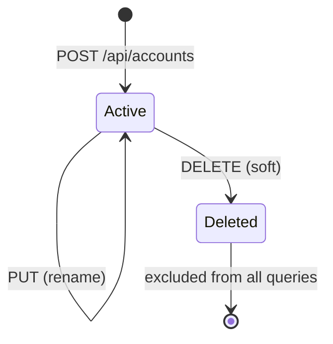

# SID-002 — Account management

## Summary

Users can create, rename, and delete named accounts. Deleting an account soft-deletes the account, all its transactions, and all their attachments. Accounts are listed on the dashboard and in the navigation.

## User story

As a user, I want to create and manage named accounts so that I can track separate budgets (e.g. "Office expenses", "Training expenses") independently.

## Data model

```sql
CREATE TABLE IF NOT EXISTS accounts (
  id         INTEGER PRIMARY KEY AUTOINCREMENT,
  name       TEXT NOT NULL,
  created_at DATETIME NOT NULL DEFAULT (datetime('now')),
  deleted_at DATETIME
);
```

## REST API

| Method | Path | Description |
|--------|------|-------------|
| GET | `/api/accounts` | List all non-deleted accounts |
| POST | `/api/accounts` | Create account |
| GET | `/api/accounts/:id` | Get single account |
| PUT | `/api/accounts/:id` | Rename account |
| DELETE | `/api/accounts/:id` | Soft-delete account + cascade |

**DELETE cascade:** sets `deleted_at = now` on the account, then on all transactions belonging to it, then on all attachments belonging to those transactions — in a single SQLite transaction.

## State diagram: account lifecycle



## UI flows

**Create:** "New account" button on dashboard → inline form or modal → name input → submit → account appears in list.

**Rename:** Edit icon on account card → name input pre-filled → submit → name updates in place.

**Delete:** Delete icon on account card → confirmation dialog ("Delete [name]? This will also delete all transactions and attachments.") → confirm → account removed from list.

## Implementation tasks

1. **DB schema** — add accounts table to `db.ts` init SQL (depends on SID-001).

2. **Account repository** — `server/src/accounts/repository.ts`: `findAll()`, `findById()`, `create(name)`, `update(id, name)`, `softDelete(id)`. The `softDelete` method runs a single DB transaction setting `deleted_at` on accounts, transactions, and attachments.

3. **Account routes** — `server/src/accounts/routes.ts`: implement the 5 REST endpoints; mount at `/api/accounts` in `index.ts`; validate that name is non-empty on create/update; return 404 when account not found or already deleted.

4. **API client** — `client/src/api/accounts.ts`: typed fetch helpers for all 5 endpoints using shared `Account` type.

5. **Account list component** — `client/src/components/AccountCard.tsx`: displays name, balance placeholder (wired in SID-005), edit and delete buttons.

6. **Create/edit form** — modal or inline form with a single name field; client-side validation (non-empty); calls create or update API; closes and refreshes list on success.

7. **Delete confirmation dialog** — reusable `ConfirmDialog` component; shown before delete; calls delete API on confirm; removes card from list on success.

8. **Routing** — add route `/accounts/:id` as placeholder (implemented in SID-006); dashboard links each card to it.
