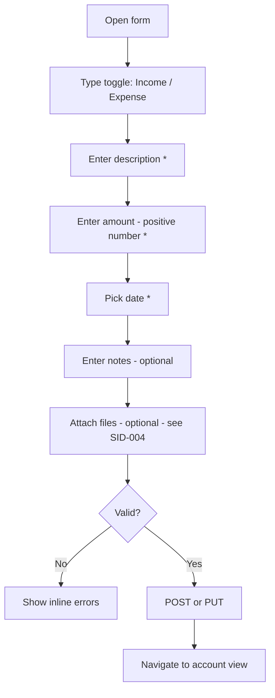

# SID-003 — Transaction management

## Summary

Users can create, edit, and soft-delete transactions within an account. Transactions have a description, a positive amount, an income/expense type, a date, and optional notes. Amounts are stored as signed integers in cents.

## User story

As a user, I want to record income and expense transactions in an account so that I can track where money comes from and where it goes.

## Data model

```sql
CREATE TABLE IF NOT EXISTS transactions (
  id           INTEGER PRIMARY KEY AUTOINCREMENT,
  account_id   INTEGER NOT NULL REFERENCES accounts(id),
  description  TEXT NOT NULL,
  amount_cents INTEGER NOT NULL,  -- positive = income, negative = expense
  type         TEXT NOT NULL CHECK(type IN ('income', 'expense')),
  date         DATE NOT NULL,
  notes        TEXT,
  created_at   DATETIME NOT NULL DEFAULT (datetime('now')),
  updated_at   DATETIME NOT NULL DEFAULT (datetime('now')),
  deleted_at   DATETIME
);
```

**Sign rule:** `amount_cents = type === 'income' ? +abs(amount) : -abs(amount)`. The `type` column is stored redundantly for convenient display without re-deriving from sign.

## REST API

| Method | Path | Description |
|--------|------|-------------|
| GET | `/api/accounts/:accountId/transactions` | List all non-deleted transactions for account (newest first) |
| POST | `/api/accounts/:accountId/transactions` | Create transaction |
| GET | `/api/accounts/:accountId/transactions/:id` | Get single transaction |
| PUT | `/api/accounts/:accountId/transactions/:id` | Update transaction (any field, including account_id) |
| DELETE | `/api/accounts/:accountId/transactions/:id` | Soft-delete transaction + its attachments |

**Account transfer (edit account_id):** PUT accepts an optional `account_id` in the body; if it differs from the URL param, the transaction moves to the new account. The URL param is used only for lookup/auth, not enforced post-update.

## Transaction form



## Display rules

- Income: `+$50.00` in green
- Expense: `−$50.00` in red
- Amount input always accepts a positive number; sign is derived from type
- Date displayed as `DD MMM YYYY` (e.g. `17 Apr 2026`)

## Implementation tasks

1. **DB schema** — add transactions table to `db.ts` init SQL (depends on SID-001).

2. **Transaction repository** — `server/src/transactions/repository.ts`: `findByAccount(accountId)`, `findById(id)`, `create(data)`, `update(id, data)`, `softDelete(id)`. `softDelete` sets `deleted_at` on the transaction and all its attachments in one DB transaction. `create`/`update` derive `amount_cents` from `amount` + `type`.

3. **Account balance query** — add `getBalance(accountId): number` to the repository: `SELECT COALESCE(SUM(amount_cents), 0) FROM transactions WHERE account_id = ? AND deleted_at IS NULL`.

4. **Transaction routes** — `server/src/transactions/routes.ts`: implement 5 endpoints; validate required fields (description, amount > 0, type, date); return 404 for unknown/deleted transactions; mount under `/api/accounts`.

5. **API client** — `client/src/api/transactions.ts`: typed fetch helpers + shared `Transaction` type.

6. **Transaction form component** — `client/src/components/TransactionForm.tsx`: income/expense toggle (styled button pair), amount input (positive numbers only, 2 decimal places), date picker, description, notes. Works for both create and edit. On edit, pre-populates all fields.

7. **Transaction row component** — `client/src/components/TransactionRow.tsx`: displays date, description, type badge, signed amount (colour-coded), edit and delete icons.

8. **Delete confirmation** — reuse `ConfirmDialog` from SID-002; on confirm, calls DELETE and removes row.

9. **Edit routing** — clicking edit on a transaction opens the form pre-populated; PUT on submit.
