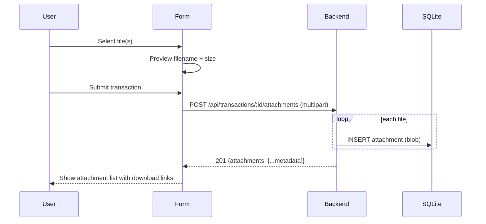

# SID-004 — Attachments

## Summary

Multiple files can be attached to a transaction. Files are stored as blobs in SQLite. Users can upload files when creating or editing a transaction, download them, and delete individual attachments.

## User story

As a user, I want to attach receipts or supporting documents to a transaction so that I have a record of the evidence alongside the transaction.

## Data model

```sql
CREATE TABLE IF NOT EXISTS attachments (
  id             INTEGER PRIMARY KEY AUTOINCREMENT,
  transaction_id INTEGER NOT NULL REFERENCES transactions(id),
  filename       TEXT NOT NULL,
  mime_type      TEXT NOT NULL,
  size_bytes     INTEGER NOT NULL,
  data           BLOB NOT NULL,
  created_at     DATETIME NOT NULL DEFAULT (datetime('now')),
  deleted_at     DATETIME
);
```

## REST API

| Method | Path | Description |
|--------|------|-------------|
| GET | `/api/transactions/:txId/attachments` | List attachment metadata (no blob) |
| POST | `/api/transactions/:txId/attachments` | Upload one or more files (multipart/form-data) |
| GET | `/api/attachments/:id/download` | Stream blob as file download |
| DELETE | `/api/attachments/:id` | Soft-delete attachment |

The list endpoint returns `id`, `filename`, `mime_type`, `size_bytes`, `created_at` — never the blob. The download endpoint sets `Content-Disposition: attachment; filename="<filename>"` and the correct `Content-Type`.

## Upload flow



## UI behaviour

- File input accepts any file type; no size limit enforced in MVP.
- On the transaction form, attachments are managed in a sub-section below notes.
- When creating a transaction, files are uploaded **after** the transaction is created (POST transaction → POST attachments with new transaction ID).
- When editing, existing attachments are listed with a delete button; new files can be added.
- Deleted attachments disappear from the list immediately (optimistic UI).
- Download link opens the file in a new tab or triggers browser download depending on MIME type.

## Implementation tasks

1. **DB schema** — add attachments table to `db.ts` init SQL (depends on SID-001).

2. **Attachment repository** — `server/src/attachments/repository.ts`: `findByTransaction(txId)` (metadata only, exclude blob), `create(txId, filename, mimeType, data)`, `findBlobById(id)` (full row), `softDelete(id)`.

3. **Multer middleware** — install `multer` with `memoryStorage()`; configure on the upload route so file buffers are available in `req.files`.

4. **Attachment routes** — `server/src/attachments/routes.ts`: implement 4 endpoints; mount list+upload under `/api/transactions/:txId/attachments`, download+delete under `/api/attachments/:id`; wire into `index.ts`.

5. **API client** — `client/src/api/attachments.ts`: `listAttachments(txId)`, `uploadAttachments(txId, files: File[])`, `downloadUrl(id)` (returns URL string), `deleteAttachment(id)`.

6. **Attachment manager component** — `client/src/components/AttachmentManager.tsx`: file input (`multiple`), pending file list (pre-upload), existing attachment list (post-save) with filename, size, download link, and delete button.

7. **Integration into TransactionForm** — after a successful create/update, call `uploadAttachments` for any pending files; handle upload errors without rolling back the transaction (show warning).

8. **Soft-delete cascade** — confirm that `softDelete` in the transaction repository (SID-003 task 2) correctly sets `deleted_at` on all child attachments.
