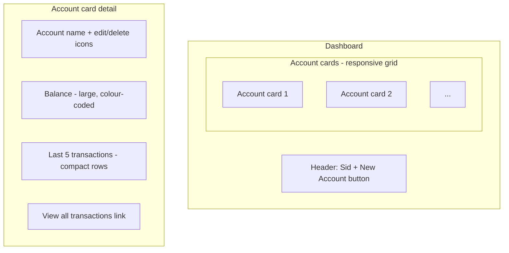

# SID-005 — Dashboard

## Summary

The dashboard is the app's home screen. It displays all active accounts as cards, each showing the account balance, the last 5 transactions, and a link to the full account view.

## User story

As a user, I want to see all my account balances and recent activity at a glance so that I know the current state of my budgets without navigating into each account.

## REST API

A single dedicated endpoint loads everything needed for the dashboard in one request:

**GET `/api/dashboard`**

```jsonc
{
  "accounts": [
    {
      "id": 1,
      "name": "Office expenses",
      "balance_cents": -15000,
      "recent_transactions": [
        {
          "id": 42,
          "description": "Stationery",
          "amount_cents": -2500,
          "type": "expense",
          "date": "2026-04-15"
        }
        // ... up to 5
      ]
    }
  ]
}
```

The backend computes `balance_cents` via `SUM(amount_cents)` and fetches the last 5 transactions ordered by `date DESC, id DESC` per account, all in a single query pass.

## Page layout



**Balance colour coding:**
- Positive balance: green
- Zero balance: neutral
- Negative balance: red

**Compact transaction row** (within card): `{date} · {description} · {signed amount}`

## States

| State | Display |
|-------|---------|
| Loading | Skeleton cards |
| No accounts | Empty state with prompt and "New account" button |
| Account has no transactions | Balance = $0.00, "No transactions yet" |
| Account with transactions | Balance + up to 5 recent rows |

## Implementation tasks

1. **Dashboard endpoint** — `server/src/dashboard/routes.ts`: `GET /api/dashboard`; single query joining accounts with a subquery for balance and a subquery for last-5 transactions per account; exclude soft-deleted records throughout; mount in `index.ts`.

2. **API client** — `client/src/api/dashboard.ts`: `getDashboard()` returning typed `DashboardAccount[]`.

3. **Dashboard page** — `client/src/pages/Dashboard.tsx`: fetches on mount; renders responsive CSS grid of `AccountCard` components; shows empty state when no accounts.

4. **AccountCard component** — `client/src/components/AccountCard.tsx` (extend from SID-002): add balance display and recent transaction list; link account name / "View all" to `/accounts/:id`; include edit and delete affordances (wired to SID-002 handlers).

5. **Balance formatter** — shared utility `client/src/utils/currency.ts`: converts cents to `$0.00` string; accepts negative values and returns signed display string.

6. **Skeleton loader** — simple placeholder cards shown while `getDashboard()` is in-flight.

7. **App routing** — set up React Router (`react-router-dom`) with `/` → Dashboard and `/accounts/:id` → AccountView (SID-006); add router to `main.tsx`.
