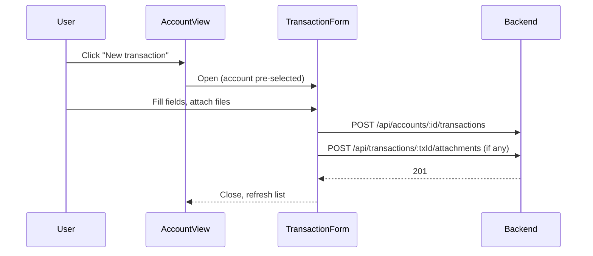

# SID-006 — Account view

## Summary

Navigating into an account displays the full transaction list in reverse-chronological order, the account balance in the header, and actions to create a new transaction, edit/delete existing ones, and export to CSV.

## User story

As a user, I want to see all transactions in an account in one place so that I can review history and manage individual records.

## REST API

Relies on existing endpoints from SID-002 and SID-003:

- `GET /api/accounts/:id` — account name
- `GET /api/accounts/:id/transactions` — all non-deleted transactions, `date DESC, id DESC`
- Balance computed client-side from transactions, or use `GET /api/dashboard` response if already cached

Alternatively, add a `?includeBalance=true` query param to the accounts endpoint to return balance alongside the account record, to avoid a full transaction fetch just for the header. (Simpler: fetch transactions, sum client-side.)

## Page layout

```
┌─────────────────────────────────────────────────────┐
│ ← Back to dashboard                                  │
│                                                      │
│ Office expenses                          Balance     │
│                                          −$150.00    │
│                              [New transaction] [Export CSV] │
├──────────┬────────────────────┬──────────┬───────────┤
│ Date     │ Description        │ Type     │ Amount    │
├──────────┼────────────────────┼──────────┼───────────┤
│ 15 Apr   │ Stationery         │ Expense  │ −$25.00   │
│ 10 Apr   │ Client reimbursement│ Income  │ +$100.00  │
│ ...      │                    │          │           │
└──────────┴────────────────────┴──────────┴───────────┘
```

Each transaction row has inline edit (pencil icon) and delete (trash icon) affordances.

## Flow: create transaction



## States

| State | Display |
|-------|---------|
| Loading | Table skeleton |
| No transactions | Empty state: "No transactions yet. Add one to get started." |
| Account not found / deleted | 404 message + link back to dashboard |

## Implementation tasks

1. **Account view page** — `client/src/pages/AccountView.tsx`: reads `:id` from route params; fetches account + transactions on mount; computes balance from transaction list; renders header, table, and action buttons. (Depends on SID-003 API client.)

2. **Transaction table** — render `TransactionRow` (SID-003) for each transaction; empty state when list is empty.

3. **Inline edit** — clicking edit icon opens `TransactionForm` in edit mode (modal or route `/accounts/:id/transactions/:txId/edit`); on save, refreshes transaction list.

4. **Inline delete** — opens `ConfirmDialog` (SID-002); on confirm, calls DELETE and removes row; recalculates displayed balance.

5. **New transaction button** — opens `TransactionForm` in create mode with `account_id` pre-set; on save, prepends new transaction to list and recalculates balance.

6. **Export CSV button** — opens the export dialog (SID-007); placed in the page header next to "New transaction".

7. **Back navigation** — breadcrumb or back link to `/` (dashboard).
