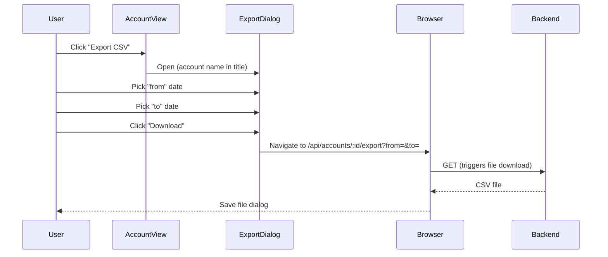

# SID-007 — CSV export

## Summary

From the account view, the user can select a date range and download all transactions in that account as a CSV file. An empty CSV (header row only) is returned when no transactions fall within the range.

## User story

As a user, I want to export transactions for a specific account within a date range to CSV so that I can import them into a spreadsheet for reporting or reconciliation.

## REST API

**GET `/api/accounts/:id/export?from=YYYY-MM-DD&to=YYYY-MM-DD`**

- Both `from` and `to` are required; return 400 if missing or invalid.
- Date range is **inclusive on both ends** (`date >= from AND date <= to`).
- Filters out soft-deleted transactions.
- Returns `Content-Type: text/csv` and `Content-Disposition: attachment; filename="<account-name>-<from>-<to>.csv"`.
- If no transactions match, returns a CSV with the header row only (HTTP 200).
- Transactions ordered by `date ASC, id ASC`.

## CSV schema

```
date,description,type,amount,notes
2026-04-01,Stationery,expense,25.00,"Pens and paper"
2026-04-10,Client reimbursement,income,100.00,
```

- `date`: ISO 8601 (`YYYY-MM-DD`)
- `type`: lowercase `income` or `expense`
- `amount`: always positive, 2 decimal places (e.g. `25.00`)
- `notes`: quoted if it contains commas or newlines; empty string if null
- No byte-order mark; UTF-8 encoding

## Export dialog flow



The download is triggered by setting `window.location.href` or using a temporary `<a download>` link — no fetch required, so the browser handles the file save natively.

## Validation

| Rule | Error |
|------|-------|
| `from` missing | 400 "from date is required" |
| `to` missing | 400 "to date is required" |
| Either not valid ISO date | 400 "invalid date format" |
| `from` > `to` | 400 "from must be on or before to" |
| Account not found / deleted | 404 |

## Implementation tasks

1. **Export endpoint** — `server/src/export/routes.ts`: parse and validate `from`/`to` query params; query transactions with date range filter; generate CSV string (manual template string or `papaparse`); set response headers; stream/send CSV; mount at `/api/accounts/:id/export` in `index.ts`.

2. **CSV generation** — utility `server/src/export/csv.ts`: takes array of transaction rows, returns CSV string with header; formats `amount_cents` as positive decimal; handles null notes as empty string; quotes fields containing commas.

3. **Export dialog component** — `client/src/components/ExportDialog.tsx`: modal with "From" and "To" date inputs (type=`date`); client-side validation (`from <= to`, both filled); "Download" button builds the export URL and triggers download via `<a>` tag; "Cancel" closes modal.

4. **Wire into AccountView** — import `ExportDialog` in `AccountView.tsx` (SID-006 task 6); pass `accountId` and `accountName` as props; toggle visibility with local state.
