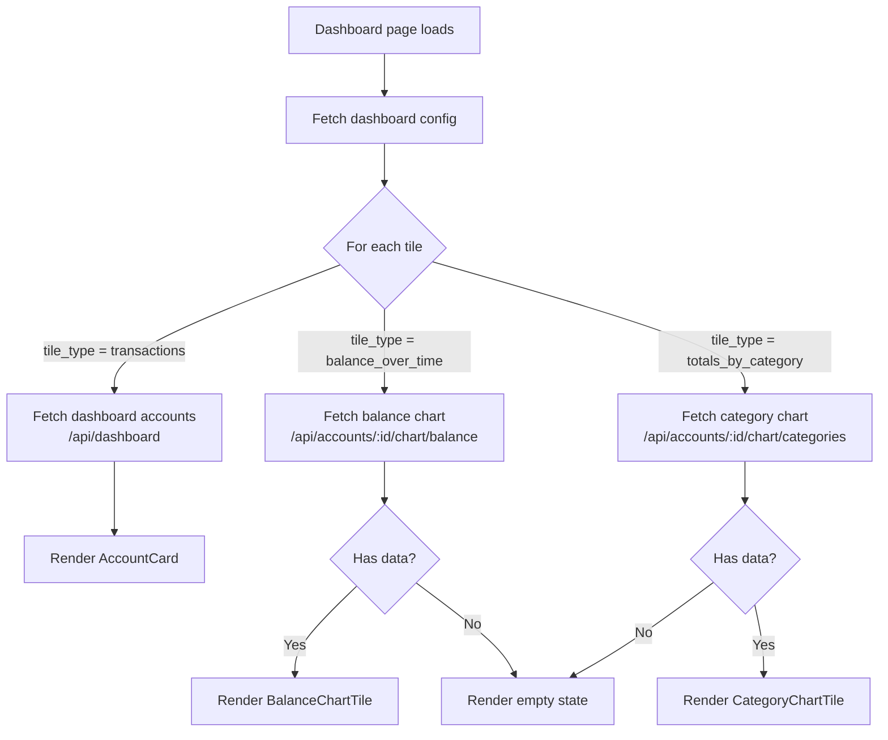
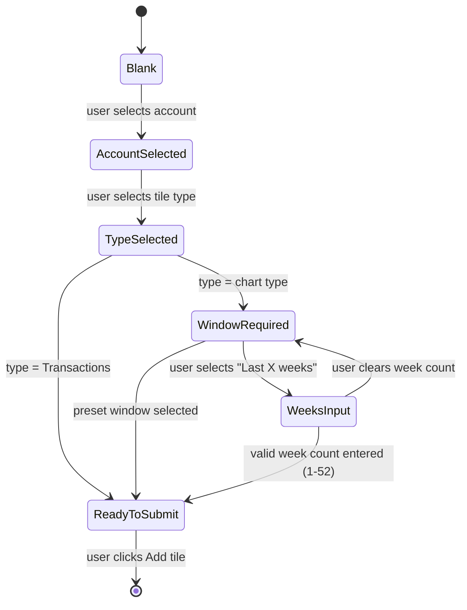
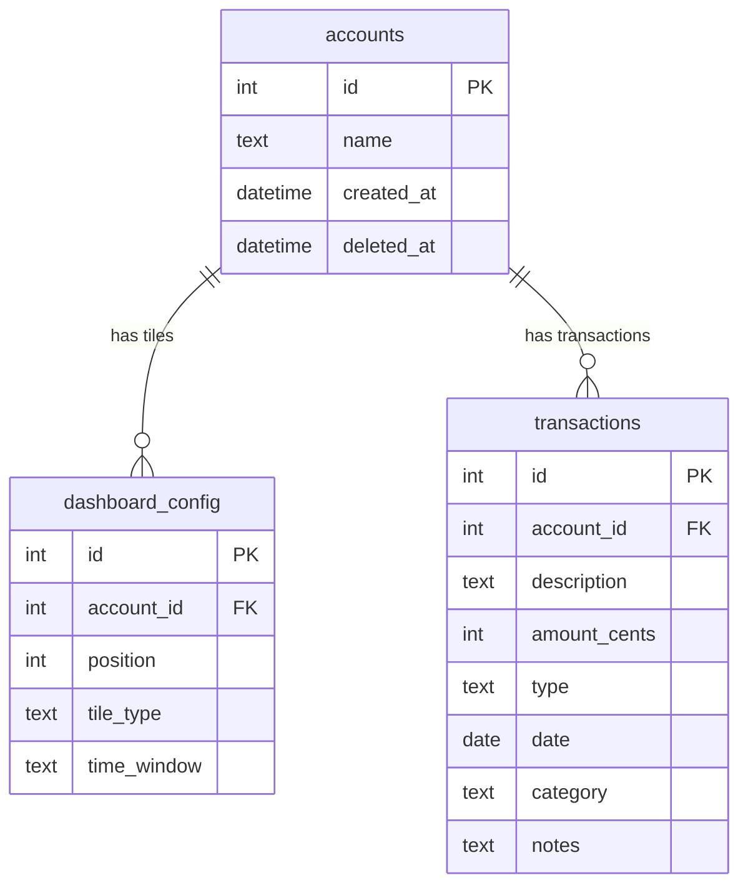

# Add basic chart to dashboard

## Summary

Users can add chart tiles to the dashboard alongside the existing transactions tiles. The dashboard is managed via Settings → Dashboard, which is being remodelled from a list of _accounts_ to a list of _tiles_. Each tile is linked to an account and has one of three types: **Transactions** (the existing account card), **Balance over time** (a line chart), or **Totals by category** (a bar chart). The same account may appear as multiple tiles of different types. Chart tiles have a configurable time window.

---

## Detailed description

### Tile types

| Type | Visual | Description |
|---|---|---|
| Transactions | Card (existing `AccountCard`) | Shows account name, current balance, and 5 most recent transactions. Unchanged from current behaviour. |
| Balance over time | Line chart | Shows the running account balance plotted against date across the selected time window. |
| Totals by category | Bar chart | Shows total expense amount per category within the selected time window. Transactions with no category are excluded. |

### Time windows (chart tiles only)

The following options are available when configuring a chart tile:

| Label | Stored value |
|---|---|
| Last 30 days | `30d` |
| Last 3 months | `3m` |
| Last 12 months | `12m` |
| All time | `all` |
| Last X weeks | `{n}w` (e.g. `6w`), where n is 1–52 |

The "Last X weeks" option reveals a number input for the week count (integer, 1–52).

Transactions tiles do not have a time window — they always show the 5 most recent transactions.

### Dashboard page rendering

Tiles render in the configured order. The grid layout is unchanged (auto-fill, min 310 px columns). Each tile renders the component matching its type:

- **Transactions** → `AccountCard` (current component, no changes)
- **Balance over time** → `BalanceChartTile`: displays account name as a heading, then a line chart. No balance figure, no transaction links.
- **Totals by category** → `CategoryChartTile`: displays account name as a heading, then a horizontal bar chart of expense totals grouped by category.

**Empty state for chart tiles:** If there are no transactions (or no categorised expense transactions) within the selected window, the tile shows the account name and a short message such as "No data for this period."

### Settings → Dashboard section

The section heading and description text are updated to use "tiles" terminology throughout.

The tile list shows one row per tile. Each row displays a label of the form:
- `Account name` for Transactions tiles
- `Account name — Balance over time` for line chart tiles
- `Account name — Totals by category` for bar chart tiles

Reorder (up/down) and remove controls remain per row. Remove now operates on tile ID (not account ID), enabling independent removal of each tile for a given account.

**Add tile form** (single-step, inline, replaces the current simple dropdown):

1. **Account** — dropdown of all accounts (not limited to unconfigured ones, since duplicates are permitted)
2. **Tile type** — radio or select: Transactions | Balance over time | Totals by category
3. **Time window** — shown only when type is Balance over time or Totals by category. Options: Last 30 days | Last 3 months | Last 12 months | All time | Last X weeks. When "Last X weeks" is selected, a number input (1–52) is shown.
4. **Add tile** button — disabled until account and type are selected (and weeks value is valid when applicable)

### Data model changes

The `dashboard_config` table requires two new columns:

| Column | Type | Default | Notes |
|---|---|---|---|
| `tile_type` | `TEXT NOT NULL` | `'transactions'` | One of: `transactions`, `balance_over_time`, `totals_by_category` |
| `time_window` | `TEXT` | `NULL` | Nullable; only set for chart tile types |

The existing unique constraint on `account_id` is removed (if present) — the same account may appear multiple times.

Reorder operations use tile `id` (primary key) instead of `account_id`.

### Server chart endpoints

Two new endpoints, mounted under `/api/accounts/:id/chart/`:

**`GET /api/accounts/:id/chart/balance?window={value}`**
Returns an array of `{ date: string, balance_cents: number }` data points representing the running balance. The first point reflects the balance at the start of the window; subsequent points are computed by applying each transaction in chronological order within the window.

**`GET /api/accounts/:id/chart/categories?window={value}`**
Returns an array of `{ category: string, total_cents: number }` sorted by `total_cents` descending. Only expense transactions with a non-null category within the window are included.

Both endpoints return `400` for an invalid `window` value and `404` for an unknown account.

---

## User stories

- *As a user, I want to add a balance-over-time chart tile to my dashboard, so that I can see at a glance how an account's balance has trended over the past few months.*
- *As a user, I want to add a category totals chart tile, so that I can understand where I am spending the most money.*
- *As a user, I want to display the same account as both a transactions tile and a chart tile, so that I can see both recent activity and a visual trend side by side.*
- *As a user, I want to configure the time window for each chart tile independently, so that each chart shows the period most relevant to that account.*
- *As a user, I want to reorder and remove individual tiles in Settings, so that I can keep my dashboard organised as my needs change.*

---

## Key decisions

| Decision | Outcome |
|---|---|
| Same account multiple times | Permitted. `account_id` is not unique in `dashboard_config`. Each row (tile) has its own `id`. |
| Chart tile chrome | Account name shown as heading. No current balance figure, no "View all" or "Add transaction" links. |
| Transactions tile behaviour | Identical to the existing `AccountCard`. No visual or behavioural changes. |
| Time window options | Last 30 days, last 3 months, last 12 months, all time, or a user-specified number of weeks (1–52). |
| Uncategorised transactions | Excluded from the Totals by category chart. Transactions where `category IS NULL` are not shown. |
| Category chart income vs expense | Expense transactions only. This gives the most useful budget overview; income is typically uncategorised or uniform. |
| Empty chart state | Show account name and "No data for this period." message. No empty chart axes rendered. |
| Reorder/remove by tile ID | Both operations now reference the tile's primary key `id`, not `account_id`, to support multiple tiles per account. |
| Add tile flow | Single inline form revealing controls progressively (type selector, then time window if applicable). One account can be added unlimited times. |
| Chart library | Recharts — declarative React API, TypeScript support, reasonable bundle size, covers both line and bar charts. |

---

## Validation

| Rule | Error / behaviour |
|---|---|
| Account must be selected before submitting | "Add tile" button remains disabled |
| Tile type must be selected before submitting | "Add tile" button remains disabled |
| Weeks value must be an integer 1–52 | "Add tile" button remains disabled; input shows invalid state |
| `window` query param must be a recognised value | Server returns `400 Bad Request` |
| Account ID in chart endpoint must exist | Server returns `404 Not Found` |

---

## Diagrams

### Tile rendering flow



### Add tile form state



### Database schema (updated)



---

## Acceptance criteria

```gherkin
Feature: Dashboard chart tiles

  Background:
    Given I have accounts named "Savings" and "Expenses"
    And "Expenses" has transactions in multiple categories over the past 12 months
    And I am on the Settings → Dashboard page

  # --- Settings: terminology ---

  Scenario: Dashboard section uses tile terminology
    Then I see the heading "Dashboard"
    And I see a description referencing "tiles" not "accounts"
    And the tile list header uses the word "tiles"

  # --- Settings: adding a Transactions tile ---

  Scenario: Adding a Transactions tile
    When I select account "Savings" in the add tile form
    And I select tile type "Transactions"
    Then I do not see a time window selector
    When I click "Add tile"
    Then I see a row labelled "Savings" in the tile list

  # --- Settings: adding a chart tile ---

  Scenario: Adding a Balance over time tile with a preset window
    When I select account "Savings" in the add tile form
    And I select tile type "Balance over time"
    Then I see a time window selector
    When I select "Last 3 months"
    And I click "Add tile"
    Then I see a row labelled "Savings — Balance over time" in the tile list

  Scenario: Adding a Totals by category tile
    When I select account "Expenses" in the add tile form
    And I select tile type "Totals by category"
    And I select "Last 12 months"
    And I click "Add tile"
    Then I see a row labelled "Expenses — Totals by category" in the tile list

  Scenario: Adding a chart tile with a custom week window
    When I select account "Savings" in the add tile form
    And I select tile type "Balance over time"
    And I select "Last X weeks"
    Then I see a number input for weeks
    When I enter "6" in the weeks input
    Then the "Add tile" button is enabled
    When I click "Add tile"
    Then I see a row labelled "Savings — Balance over time" in the tile list

  Scenario: Add tile button disabled until form is complete
    When I select account "Savings" in the add tile form
    Then the "Add tile" button is disabled
    When I select tile type "Balance over time"
    Then the "Add tile" button is disabled
    When I select "Last 30 days"
    Then the "Add tile" button is enabled

  Scenario: Weeks input validation
    When I select account "Savings" in the add tile form
    And I select tile type "Balance over time"
    And I select "Last X weeks"
    And I enter "0" in the weeks input
    Then the "Add tile" button is disabled
    When I enter "53" in the weeks input
    Then the "Add tile" button is disabled
    When I enter "8" in the weeks input
    Then the "Add tile" button is enabled

  # --- Settings: same account multiple times ---

  Scenario: Same account can be added as multiple tile types
    Given "Savings" already has a Transactions tile
    When I select account "Savings" in the add tile form
    Then "Savings" is available in the account dropdown
    When I select tile type "Balance over time"
    And I select "Last 30 days"
    And I click "Add tile"
    Then the tile list contains two rows for "Savings"

  # --- Settings: reorder and remove ---

  Scenario: Removing one tile for an account does not affect other tiles for that account
    Given "Savings" has both a Transactions tile and a Balance over time tile
    When I click remove on the Transactions tile for "Savings"
    Then the Balance over time tile for "Savings" remains in the list

  Scenario: Reordering tiles
    Given the tile list contains "Savings — Balance over time" at position 1 and "Expenses — Totals by category" at position 2
    When I click the down arrow on "Savings — Balance over time"
    Then "Expenses — Totals by category" is at position 1
    And "Savings — Balance over time" is at position 2

  # --- Dashboard: Transactions tile ---

  Scenario: Transactions tile renders unchanged
    Given "Savings" has a Transactions tile on the dashboard
    When I visit the dashboard
    Then I see an account card for "Savings" showing the current balance
    And I see up to 5 recent transactions
    And I see "View all" and "Add transaction" links

  # --- Dashboard: Balance over time tile ---

  Scenario: Balance over time tile renders a line chart
    Given "Savings" has a Balance over time tile with window "Last 3 months"
    And "Savings" has transactions within the last 3 months
    When I visit the dashboard
    Then I see a tile headed "Savings"
    And I see a line chart
    And I do not see a balance figure, "View all" link, or "Add transaction" link

  Scenario: Balance over time tile shows empty state with no data
    Given "Savings" has no transactions within the last 30 days
    And "Savings" has a Balance over time tile with window "Last 30 days"
    When I visit the dashboard
    Then I see a tile headed "Savings"
    And I see "No data for this period." instead of a chart

  # --- Dashboard: Totals by category tile ---

  Scenario: Totals by category tile renders a bar chart
    Given "Expenses" has a Totals by category tile with window "Last 12 months"
    And "Expenses" has categorised expense transactions within the last 12 months
    When I visit the dashboard
    Then I see a tile headed "Expenses"
    And I see a bar chart with categories on one axis and amounts on the other
    And I do not see a balance figure, "View all" link, or "Add transaction" link

  Scenario: Uncategorised transactions are excluded from category chart
    Given "Expenses" has transactions: one categorised as "Groceries" and one with no category
    And "Expenses" has a Totals by category tile
    When I visit the dashboard
    Then I see "Groceries" in the chart
    And I do not see an "Uncategorised" bar

  Scenario: Totals by category tile shows expense transactions only
    Given "Expenses" has an income transaction categorised as "Salary" and an expense transaction categorised as "Rent"
    And "Expenses" has a Totals by category tile
    When I visit the dashboard
    Then I see "Rent" in the chart
    And I do not see "Salary" in the chart

  Scenario: Totals by category tile shows empty state with no categorised expenses
    Given "Savings" has only uncategorised transactions
    And "Savings" has a Totals by category tile
    When I visit the dashboard
    Then I see "No data for this period." instead of a chart

  # --- Dashboard: tile ordering ---

  Scenario: Tiles render in configured order
    Given the tile list in settings is: "Expenses — Totals by category" (pos 1), "Savings" Transactions (pos 2)
    When I visit the dashboard
    Then the first tile is "Expenses" category chart
    And the second tile is "Savings" account card
```

---

## Manual test steps

### Setup
1. Open the application. Ensure at least two accounts exist (e.g. "Savings" and "Expenses"). Add a variety of categorised and uncategorised transactions to both, across a range of dates spanning at least the last 12 months.

### Settings — terminology
2. Navigate to **Settings → Dashboard**.
3. Confirm the section heading and description use the word "tiles" (not "accounts").

### Adding a Transactions tile
4. In the add tile form, select account "Savings" from the account dropdown.
5. Confirm the "Add tile" button is still disabled.
6. Select tile type **Transactions**.
7. Confirm no time window selector appears.
8. Confirm the "Add tile" button is now enabled.
9. Click **Add tile**.
10. Confirm a row labelled "Savings" appears in the tile list.

### Adding a Balance over time tile (preset window)
11. Select account "Savings" and tile type **Balance over time**.
12. Confirm a time window selector appears.
13. Select **Last 3 months**.
14. Click **Add tile**.
15. Confirm a row labelled "Savings — Balance over time" appears in the list.
16. Confirm "Savings" still has its own Transactions row (two rows total for "Savings").

### Adding a Balance over time tile (custom weeks)
17. Select account "Expenses" and tile type **Balance over time**.
18. Select **Last X weeks**.
19. Confirm a weeks number input appears.
20. Enter `0` — confirm the button is disabled.
21. Enter `53` — confirm the button is disabled.
22. Enter `6` — confirm the button is enabled.
23. Click **Add tile**. Confirm the row appears labelled "Expenses — Balance over time".

### Adding a Totals by category tile
24. Select account "Expenses" and tile type **Totals by category**.
25. Select **Last 12 months**.
26. Click **Add tile**. Confirm row "Expenses — Totals by category" appears.

### Reordering tiles
27. Confirm there are at least two tiles in the list.
28. Use the up/down arrows to move a tile. Confirm the order changes immediately in the list.
29. Navigate away and back to Settings → Dashboard. Confirm the new order persists.

### Removing a tile
30. Remove the "Savings — Balance over time" tile using its remove button.
31. Confirm it disappears from the list.
32. Confirm the "Savings" Transactions tile is still present.

### Dashboard — Transactions tile
33. Navigate to the **Dashboard**.
34. Find the Savings account card. Confirm it shows the account name, current balance, up to 5 recent transactions, and "View all" / "Add transaction" links.

### Dashboard — Balance over time tile
35. Find a Balance over time tile on the dashboard.
36. Confirm it shows the account name as a heading.
37. Confirm a line chart is visible with dates on the X-axis and balance on the Y-axis.
38. Confirm there is no balance figure, "View all" link, or "Add transaction" button.

### Dashboard — Totals by category tile
39. Find a Totals by category tile.
40. Confirm it shows the account name as a heading.
41. Confirm a bar chart is visible with categories and expense amounts.
42. Confirm income transactions are not represented.
43. Confirm uncategorised transactions are not represented (check by knowing what data you entered).

### Empty state
44. Add a Balance over time tile for an account that has no transactions in the past 30 days, with window "Last 30 days".
45. On the dashboard, confirm the tile shows "No data for this period." with no chart.

### Dashboard tile order
46. In Settings, arrange tiles in a specific order.
47. Visit the Dashboard and confirm tiles appear in that order left-to-right, top-to-bottom.

---

## Implementation tasks

Tasks are ordered by dependency. File paths reference the current codebase structure.

---

### 1. DB migration — add tile columns to `dashboard_config`
**File:** `server/src/db.ts`

Add two columns to `dashboard_config` via `ALTER TABLE` migration guards (check `PRAGMA table_info` before adding):
- `tile_type TEXT NOT NULL DEFAULT 'transactions'`
- `time_window TEXT` (nullable)

Existing rows will automatically receive `tile_type = 'transactions'` and `time_window = NULL`.

---

### 2. Update server dashboard-config repository
**File:** `server/src/dashboard-config/repository.ts`

- Update `DashboardConfigItem` interface to include `tile_type: string` and `time_window: string | null`.
- Update `add(accountId)` → `add(accountId, tileType, timeWindow?)` — insert with provided type and window.
- Update `remove` to delete by tile `id` (primary key) instead of `account_id`.
- Update `reorder` to accept tile `id`s instead of `account_id`s and update `position` by `id`.
- Remove any unique constraint enforcement on `account_id`.

Follow existing patterns in this file for db.prepare / .run / .get.

---

### 3. Update server dashboard-config routes
**File:** `server/src/dashboard-config/routes.ts`

- `POST /:accountId` — accept `{ tile_type, time_window? }` from request body; validate `tile_type` is one of the three known values; validate `time_window` format if provided; remove the 409 duplicate-account check.
- `DELETE /:id` — change route param from `accountId` to `id` (tile primary key); delete by `id`.
- `PUT /order` — change body field from `account_ids` to `tile_ids`; update repository call accordingly.

---

### 4. Add server chart endpoints
**Files:** `server/src/chart/repository.ts` (new), `server/src/chart/routes.ts` (new), `server/src/index.ts`

**`repository.ts`** — implement:
- `parseWindow(window: string): { from: string } | 'all'` — converts `30d` / `3m` / `12m` / `{n}w` / `all` to a `from` date string or all-time sentinel. Returns `null` for invalid values.
- `getBalanceOverTime(accountId, window)` — computes starting balance before the window, then returns `{ date, balance_cents }[]` by walking transactions in chronological order within the window. One data point per distinct date (aggregate same-day transactions).
- `getCategoryTotals(accountId, window)` — returns `{ category, total_cents }[]` for expense transactions with non-null category within the window, ordered by `total_cents DESC`.

Follow the SQL patterns in `server/src/transactions/repository.ts` (`findByAccount`).

**`routes.ts`** — two GET handlers:
- `GET /balance?window=...` — call `parseWindow`, return 400 if invalid, call `getBalanceOverTime`, return array.
- `GET /categories?window=...` — same pattern, call `getCategoryTotals`.

**`index.ts`** — mount the new router at `/api/accounts/:id/chart`, following how `/api/accounts/:accountId/transactions` is mounted.

---

### 5. Update client dashboard-config API
**File:** `client/src/api/dashboardConfig.ts`

- Update `DashboardConfigItem` to include `tile_type: 'transactions' | 'balance_over_time' | 'totals_by_category'` and `time_window: string | null`.
- Update `addToDashboard(accountId)` → `addToDashboard(accountId, tileType, timeWindow?)`.
- Update `removeFromDashboard(accountId)` → `removeFromDashboard(tileId: number)` — sends `DELETE /api/dashboard-config/{tileId}`.
- Update `reorderDashboard(accountIds)` → `reorderDashboard(tileIds: number[])` — sends `{ tile_ids: tileIds }`.

---

### 6. Add client chart API
**File:** `client/src/api/charts.ts` (new)

```ts
export interface BalancePoint { date: string; balance_cents: number; }
export interface CategoryTotal { category: string; total_cents: number; }

export async function getBalanceChart(accountId: number, window: string): Promise<BalancePoint[]>
export async function getCategoryChart(accountId: number, window: string): Promise<CategoryTotal[]>
```

Follow the axios pattern from `client/src/api/transactions.ts`.

---

### 7. Install Recharts
**File:** `client/package.json`

```
npm install recharts
```

Recharts ships its own TypeScript types; no `@types/` package needed.

---

### 8. Create chart tile components
**Files:** `client/src/components/BalanceChartTile.tsx` (new), `client/src/components/CategoryChartTile.tsx` (new)

Both components receive `accountId: number`, `accountName: string`, `window: string` as props and fetch their own data via React Query (follow the `useQuery` pattern from `AccountCard`/`Dashboard.tsx`).

**`BalanceChartTile`:**
- Query key: `['chart-balance', accountId, window]`
- On load: spinner or skeleton
- Empty (no data points): "No data for this period." message
- Otherwise: Recharts `<LineChart>` with `<XAxis dataKey="date">`, `<YAxis>`, `<Line dataKey="balance_cents">`
- Format Y-axis ticks using `formatCents` from `client/src/utils/format.ts`

**`CategoryChartTile`:**
- Query key: `['chart-categories', accountId, window]`
- Empty: "No data for this period." message
- Otherwise: Recharts `<BarChart layout="vertical">` with `<XAxis type="number">`, `<YAxis type="category" dataKey="category">`, `<Bar dataKey="total_cents">`
- Format X-axis ticks using `formatCents`

Both tiles wrap content in the same card chrome as `AccountCard` (white background, `rounded-[var(--radius-card)]`, `shadow-[var(--shadow-sm)]`, `wood-stripe` header). Show account name as a `font-body font-bold` heading. No balance, no links.

---

### 9. Update `Dashboard.tsx`
**File:** `client/src/pages/Dashboard.tsx`

- Replace the `getDashboard()` query (which returns accounts) with a `getDashboardConfig()` query (which returns the tile list).
- For Transactions tiles, fetch dashboard account data from `getDashboard()` (keep the existing endpoint) and match by `account_id`.
- For chart tiles, render `BalanceChartTile` or `CategoryChartTile` — these fetch their own data.
- Render tiles in the order returned by the config.
- The "no tiles configured" empty state and "add account" link remain, updated to reference "tiles".

---

### 10. Update `DashboardSection.tsx` (Settings)
**File:** `client/src/components/settings/DashboardSection.tsx`

- Update all display text to use "tiles" terminology.
- Tile list rows: show `account name` for Transactions, `account name — Balance over time` or `account name — Totals by category` for chart tiles.
- Remove calls now pass `item.id` (not `item.account_id`) to `removeFromDashboard`.
- Reorder calls now pass `config.map(item => item.id)` to `reorderDashboard`.
- Replace the single account dropdown with the new add tile form (account → type → time window). Manage form state locally with `useState`.
- Account dropdown should list all accounts (not just unconfigured ones).
- "Add tile" button calls `addToDashboard(accountId, tileType, timeWindow)`.

---

### 11. Update `DashboardSection.test.tsx`
**File:** `client/src/components/settings/DashboardSection.test.tsx`

Update existing tests broken by the API signature changes (remove by id, reorder by id, add with tile type). Add new tests:
- Add tile form shows time window selector only for chart tile types
- Add tile button disabled when account or type not selected
- Add tile button disabled when "Last X weeks" selected but no valid week count entered
- Same account can be added twice with different types
- Remove deletes by tile id, not account id
