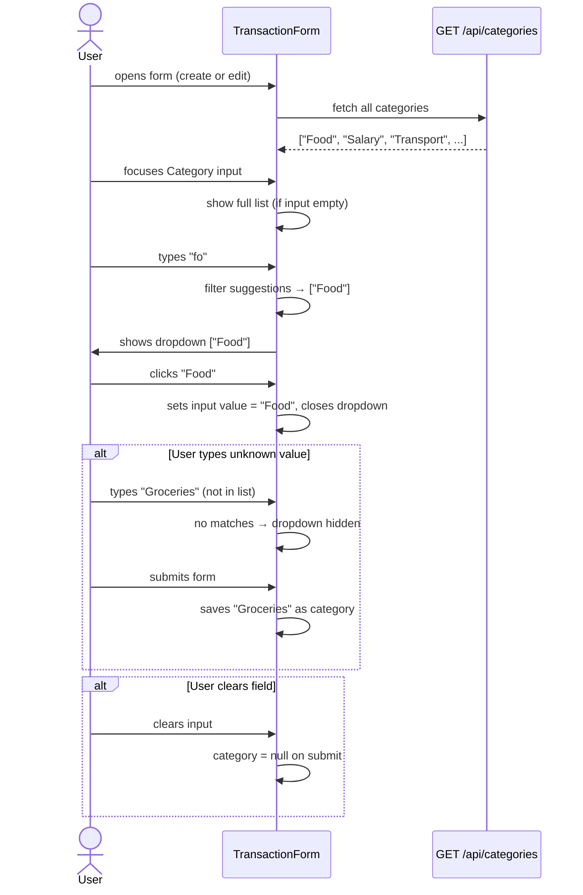
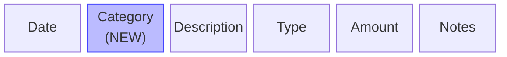

# Add category to transactions

## Summary

Add an optional free-text `Category` field to transactions. It appears in the transaction form (before Description), the account detail transaction table (before Description), and in CSV import/export (before Description). The form field is a text input with a typeahead dropdown that surfaces previously used category values from across all accounts, while still allowing users to type any new value.

---

## Detailed description

### Category field behaviour

- **Optional** — transactions may have no category. Existing transactions will have a null category after the schema migration.
- **Free-text** — no fixed list; any non-empty string is valid.
- **Display** — when a transaction has no category, the Category cell in the table is blank. No placeholder or dash.
- **Storage** — stored as a nullable TEXT column on the `transactions` table. Empty string on input is treated as null (same as Notes).

### Transaction form

A Category field is added immediately before the Description field. It is a text input combined with a suggestion dropdown:

1. When the user focuses or types in the field, a dropdown appears showing existing categories that match the current input (case-insensitive substring match) fetched from across all accounts.
2. The user can click any suggestion to populate the field, or continue typing a brand-new value.
3. Pressing Escape or clicking outside the input closes the dropdown.
4. If no suggestions match, the dropdown is hidden.
5. The field is not required — submitting with an empty Category saves the transaction with no category.

Categories for the suggestions list are fetched once on form mount from `GET /api/categories` and filtered client-side as the user types.

### Account detail transaction table

A **Category** column is added immediately before the **Description** column in both the table header and each `TransactionRow`. Empty for transactions without a category.

### Dashboard

Category does **not** appear in the compact recent-transaction list on the dashboard AccountCard.

### CSV export

The Category column is added before Description:

```
Date,Category,Description,Type,Amount,Notes
2024-01-15,Food,Coffee,expense,4.50,Morning coffee
2024-01-16,,Salary,income,1000.00,March
```

Empty string is exported for transactions with no category.

### CSV import

- `Category` is added to the list of **required headers** — the column must be present in the file.
- The **value** in any row may be blank (treated as no category).
- Existing exported files that pre-date this feature will not have a Category column and will therefore fail import with a clear error message. Users must add the column (values may be left blank).
- The import template is updated to include the Category column.

### New API endpoint

`GET /api/categories` returns a sorted array of all distinct non-empty category strings currently in use across all non-deleted transactions:

```json
["Food", "Salary", "Transport", "Utilities"]
```

---

## Validation

| Rule | Error message |
|---|---|
| Category is optional — no value is fine | *(no error)* |
| If provided, category is trimmed; empty after trim → stored as null | *(silent, no error)* |
| CSV import: `Category` header must be present | `Missing required columns: Category` |
| CSV import: category value may be blank | *(no error — stored as null)* |

---

## Key decisions

| Decision | Outcome |
|---|---|
| Required or optional | Optional — nullable in DB; blank display in table |
| Free-text or managed list | Free-text; suggestions derived from existing transaction data |
| Typeahead scope | All accounts — `GET /api/categories` queries across all transactions |
| Create new categories via form | Yes — user can type any value; it becomes available as a suggestion after saving |
| Dashboard AccountCard | Category not shown in compact recent-transaction list |
| CSV import: Category column | Required header, but value may be blank |
| Backward compatibility | Existing exported CSVs without Category column will fail import; users must add the column |
| DB migration | `ALTER TABLE transactions ADD COLUMN category TEXT` — adds NULL for all existing rows |

---

## User stories

- As a user, I want to assign a category to a transaction so that I can group and identify spending by type.
- As a user, I want the category field to suggest my previously used categories so that I stay consistent without retyping.
- As a user, I want to export my transactions with their categories so that I have a complete record in CSV.
- As a user, I want to import transactions with categories from a CSV so that I can bulk-load categorised data.

---

## Diagrams

### Typeahead interaction



### CSV column positions



---

## Acceptance criteria

```gherkin
Feature: Category field on transactions

  # ── Transaction form ────────────────────────────────────────────

  Scenario: Category field appears before Description in the form
    Given I open the New Transaction form
    Then I see a "Category" field above the "Description" field

  Scenario: Category is optional — form submits without a value
    Given I open the New Transaction form
    And I leave the Category field empty
    And I fill in all required fields
    When I click Save
    Then the transaction is saved with no category

  Scenario: Typeahead shows previously used categories on focus
    Given transactions with categories "Food" and "Transport" exist
    And I open the New Transaction form
    When I focus the Category input
    Then I see a dropdown containing "Food" and "Transport"

  Scenario: Typeahead filters suggestions as user types
    Given transactions with categories "Food", "Fuel", and "Transport" exist
    And I open the New Transaction form
    When I type "fo" in the Category field
    Then the dropdown shows "Food" and "Fuel" but not "Transport"

  Scenario: User can select a suggestion from the dropdown
    Given transactions with category "Food" exist
    And I open the New Transaction form
    When I type "fo" and click "Food" in the dropdown
    Then the Category field is populated with "Food"

  Scenario: User can type a brand-new category
    Given no transactions with category "Groceries" exist
    And I open the New Transaction form
    When I type "Groceries" in the Category field
    And I fill in all required fields and click Save
    Then the transaction is saved with category "Groceries"
    And "Groceries" appears in future typeahead suggestions

  Scenario: Dropdown closes on Escape
    Given I open the New Transaction form and focus the Category field
    And the suggestion dropdown is visible
    When I press Escape
    Then the dropdown closes

  Scenario: Dropdown closes on click outside
    Given the suggestion dropdown is visible
    When I click outside the Category field
    Then the dropdown closes

  Scenario: Dropdown hidden when no suggestions match
    Given no categories containing "xyz" exist
    When I type "xyz" in the Category field
    Then no dropdown is shown

  Scenario: Editing a transaction pre-populates the Category field
    Given a transaction exists with category "Utilities"
    When I open the Edit Transaction form for that transaction
    Then the Category field shows "Utilities"

  # ── Account detail table ─────────────────────────────────────────

  Scenario: Category column appears before Description in the table
    Given I am on an account detail page with transactions
    Then the table has a "Category" column immediately before "Description"

  Scenario: Category is blank for transactions with no category
    Given a transaction with no category exists
    When I view the account detail page
    Then the Category cell for that transaction is blank

  Scenario: Category value is shown for transactions that have one
    Given a transaction with category "Food" exists
    When I view the account detail page
    Then I see "Food" in the Category column for that transaction

  # ── Dashboard ────────────────────────────────────────────────────

  Scenario: Category does not appear on the dashboard AccountCard
    Given an account has transactions with categories
    When I view the dashboard
    Then the recent transaction list on the account card does not show categories

  # ── CSV export ───────────────────────────────────────────────────

  Scenario: Export includes Category column before Description
    Given an account has transactions with and without categories
    When I export to CSV
    Then the header row is "Date,Category,Description,Type,Amount,Notes"
    And rows with a category show the category value
    And rows without a category have an empty Category field

  # ── CSV import ───────────────────────────────────────────────────

  Scenario: Import with Category column and values succeeds
    Given I have a CSV with header "Date,Category,Description,Type,Amount,Notes"
    And a row with Category "Food"
    When I import the file
    Then the transaction is saved with category "Food"

  Scenario: Import with Category column but blank value saves null
    Given I have a CSV with header "Date,Category,Description,Type,Amount,Notes"
    And a row with an empty Category value
    When I import the file
    Then the transaction is saved with no category

  Scenario: Import without Category column is rejected
    Given I have a CSV with header "Date,Description,Type,Amount,Notes" (no Category)
    When I import the file
    Then the import fails
    And I see an error "Missing required columns: Category"

  Scenario: Import template includes Category column
    When I click "Download template"
    Then the downloaded CSV header is "Date,Category,Description,Type,Amount,Notes"
    And the sample row has a value in the Category column

  # ── GET /api/categories ──────────────────────────────────────────

  Scenario: Categories endpoint returns distinct sorted values
    Given transactions across accounts have categories "Utilities", "Food", "Food"
    When I call GET /api/categories
    Then the response is ["Food", "Utilities"]

  Scenario: Categories endpoint excludes blank and deleted transactions
    Given a deleted transaction with category "Ghost" exists
    And a transaction with empty category exists
    When I call GET /api/categories
    Then "Ghost" and empty strings are not in the response
```

---

## Manual test steps

### Setup
1. Open the app and navigate to any account that has at least a few existing transactions.

### Category in the transaction form
2. Click **New transaction**.
3. Confirm a **Category** field appears above the Description field.
4. Leave Category blank, fill in all other fields, and click **Save**.
5. Confirm the transaction is saved and the Category column in the table is blank for this row.

### Typeahead — new category
6. Click **New transaction** again.
7. In the Category field type a value that has never been used (e.g. "Groceries").
8. Confirm no dropdown appears.
9. Complete the form and save.
10. Click **New transaction** again and type "Gr" in Category.
11. Confirm "Groceries" appears as a suggestion in the dropdown.
12. Click the suggestion and confirm the field is populated with "Groceries".

### Typeahead — filtering
13. With multiple categories saved (e.g. "Food", "Fuel", "Transport"), open a new transaction.
14. Type "fu" in Category.
15. Confirm only "Fuel" appears in the dropdown (not "Food" or "Transport").
16. Press Escape — confirm the dropdown closes.
17. Click elsewhere — confirm clicking outside also closes the dropdown.

### Edit form
18. Click the edit button on a transaction that has a category.
19. Confirm the Category field is pre-populated with the correct value.
20. Change the category to something else and save.
21. Confirm the new category appears in the table.

### Account detail table
22. On the account detail page, confirm the table has a **Category** column immediately to the left of **Description**.
23. Confirm rows with a category show the value; rows without are blank.

### Dashboard
24. Navigate to the dashboard.
25. Confirm the recent transaction list on each account card does **not** show categories.

### CSV export
26. Export transactions to CSV.
27. Open the file in a text editor.
28. Confirm the header row reads: `Date,Category,Description,Type,Amount,Notes`
29. Confirm categorised transactions have their category value; uncategorised rows have an empty Category field.

### CSV import — success with category
30. Create a CSV with the header `Date,Category,Description,Type,Amount,Notes` and one valid data row including a category value.
31. Import the file.
32. Confirm a success toast appears and the imported transaction shows the correct category.

### CSV import — blank category value
33. Create a CSV where the Category column exists but the value is empty for a row.
34. Import the file. Confirm it succeeds and the transaction has no category.

### CSV import — missing Category column
35. Create a CSV with header `Date,Description,Type,Amount,Notes` (no Category column).
36. Attempt to import.
37. Confirm the import fails with the error **"Missing required columns: Category"**.

### Import template
38. Click **Download template** on the account detail page.
39. Open the file and confirm the header is `Date,Category,Description,Type,Amount,Notes` with a sample row that includes a category value.

---

## Implementation tasks

> Tasks are ordered by dependency. Each task references the closest existing file to follow as a pattern.

### 1. DB schema migration
**File:** `server/src/db.ts`
- After the existing `CREATE TABLE IF NOT EXISTS` block, add an `ALTER TABLE transactions ADD COLUMN category TEXT` statement.
- Wrap with a column-existence check using `pragma_table_info` to make it idempotent (safe to run on an already-migrated DB).
- Pattern: same file, after the existing schema initialisation block.

### 2. Server — update Transaction interfaces and queries
**File:** `server/src/transactions/repository.ts`
- Add `category: string | null` to `Transaction`.
- Add `category?: string` to `CreateTransactionInput` and `UpdateTransactionInput`.
- Update `create()` INSERT statement to include `category`.
- Update `update()` UPDATE statement to handle `category` (same null-coalescing pattern as `notes`).
- Ensure `findByAccount`, `findById` queries return the new column (they use `SELECT *` so no change needed there).

### 3. Server — transaction routes accept category
**File:** `server/src/transactions/routes.ts`
- Extract `category` from `req.body` in POST and PUT handlers (optional, no server-side format validation needed).
- Pass `category: category?.trim() || undefined` to `repo.create()` and `repo.update()`.
- Pattern: same as `notes` handling in the same file.

### 4. Server — new categories endpoint
**File:** `server/src/categories/routes.ts` (new file)
- `GET /` — query `SELECT DISTINCT category FROM transactions WHERE category IS NOT NULL AND category != '' AND deleted_at IS NULL ORDER BY category ASC`.
- Return `{ categories: string[] }`.
- Pattern: `server/src/export/routes.ts` for a simple read-only router.

### 5. Server — mount categories route
**File:** `server/src/index.ts`
- Add `import categoriesRoutes from './categories/routes'`.
- Mount: `app.use('/api/categories', categoriesRoutes)`.
- Place before the static file handler.

### 6. Server — CSV export adds Category column
**Files:** `server/src/export/csv.ts` and `server/src/export/routes.ts`
- In `csv.ts`: update `ExportRow` interface to include `category: string | null`. Update `toCSV()` header to `Date,Category,Description,Type,Amount,Notes` and include `escapeField(r.category ?? '')` as the second field in each row.
- In `routes.ts`: add `category` to the SELECT column list in the DB query.

### 7. Server — CSV import handles Category column
**File:** `server/src/import/csv.ts`
- Add `'category'` to `REQUIRED_HEADERS` (after `'date'`, before `'description'` to match column order, though header order doesn't matter functionally).
- Add `category: string | null` to `ImportRow`.
- In the row-parsing loop, read `category` from the row and set to `(value.trim() || null)` — no validation needed beyond that.
- Pass `category` through to the inserted transaction.
**File:** `server/src/import/routes.ts`
- Pass `category: row.category ?? undefined` in the `create()` call.

### 8. Client — update import template
**File:** `client/src/utils/importTemplate.ts`
- Update header to `Date,Category,Description,Type,Amount,Notes`.
- Update sample row to include a category value (e.g. `Food`): `2024-01-15,Food,Coffee at the airport,expense,4.50,Morning coffee`.

### 9. Client — update Transaction type
**File:** `client/src/types/transaction.ts`
- Add `category: string | null` to the `Transaction` interface.

### 10. Client — update TransactionPayload
**File:** `client/src/api/transactions.ts`
- Add `category?: string | null` to `TransactionPayload`.

### 11. Client — new categories API function
**File:** `client/src/api/categories.ts` (new file)
- Export `getCategories(): Promise<string[]>`.
- `GET /api/categories`, return `data.categories`.
- Pattern: `client/src/api/accounts.ts`.

### 12. Client — TransactionForm with category typeahead
**File:** `client/src/components/TransactionForm.tsx`
- Add `category` state initialised to `initial?.category ?? ''`.
- Fetch categories with `useQuery({ queryKey: ['categories'], queryFn: getCategories })`.
- Add a Category field before Description with:
  - A text `<input>` bound to `category` state.
  - A `showSuggestions` boolean state; set true on focus/change, false on Escape/blur/selection.
  - Filtered suggestions: `categories.filter(c => c.toLowerCase().includes(category.toLowerCase()))` shown only when `showSuggestions && filtered.length > 0`.
  - Each suggestion is a `<button type="button">` that sets the input value and hides the dropdown.
  - `onBlur` on the wrapper closes the dropdown with a short timeout to allow click events on suggestions to fire first (e.g. `setTimeout(..., 100)`).
- On submit, include `category: category.trim() || null` in the payload.
- No validation error required (optional field).

### 13. Client — TransactionRow displays category
**File:** `client/src/components/TransactionRow.tsx`
- Add a `<td>` before the Description cell displaying `transaction.category ?? ''`.
- Style consistently with adjacent cells (`text-xs text-gray-600`).

### 14. Client — AccountDetail adds Category table header
**File:** `client/src/pages/AccountDetail.tsx`
- Add `<th>` for "Category" immediately before the "Description" `<th>`.
- Pattern: same as existing `<th>` elements in the same file.

### 15. Update server tests
**File:** `server/src/__tests__/import.test.ts`
- Update `VALID_CSV` and all inline CSV strings to include the `Category` column in the header (value can be blank).
- The existing "extra columns ignored" test that used `Category` as an extra column should now be updated — Category is recognised as a required column, not an extra.
- Add a test: import with Category header but blank value → succeeds.
- Add a test: import without Category column → 422 with "Missing required columns: Category".
- Add a test: import with Category value → transaction has correct category.
**File:** `server/src/__tests__/transactions.test.ts`
- Add tests for POST/PUT with category field present and absent.

### 16. Update client tests
**File:** `client/src/components/TransactionForm.test.tsx`
- Update any test that renders `TransactionForm` — the `useQuery` for categories will need to be mocked (or the query stubbed) to avoid network errors in tests.
- Add test: category field renders before description field.
- Add test: submitting with empty category passes null in payload.
**File:** `client/src/components/AccountCard.test.tsx`
- No changes needed (category not shown on dashboard).
