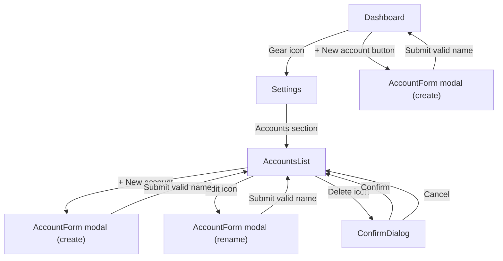
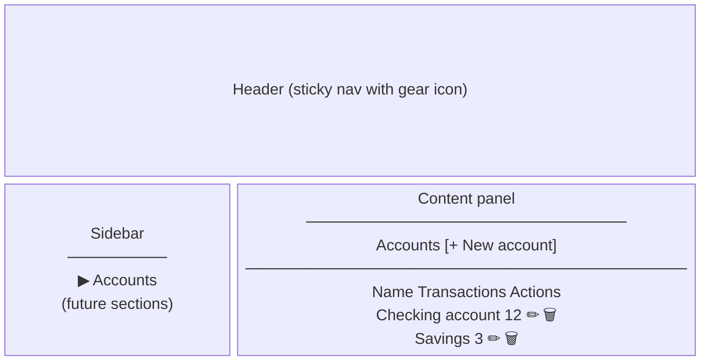
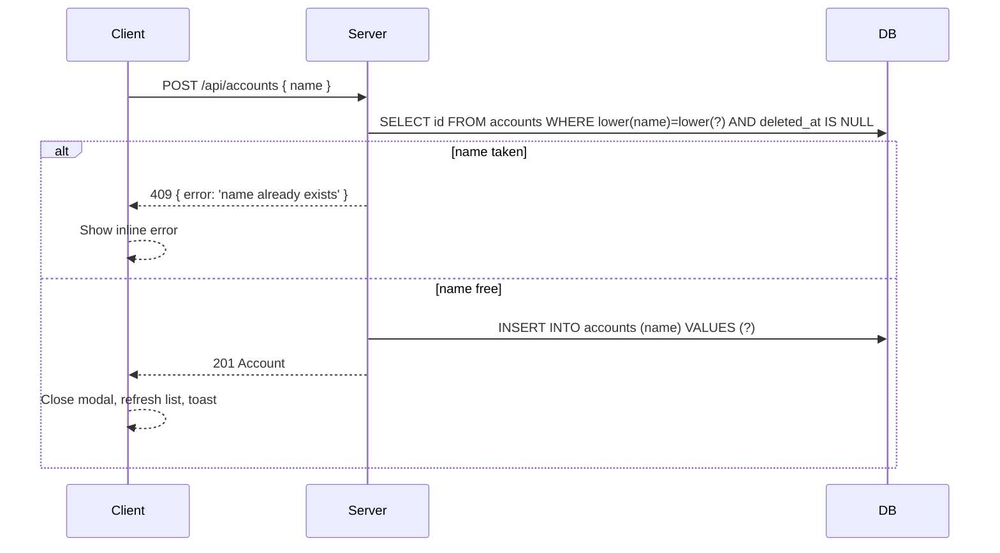

# Application configuration page

## Summary

Create a `/settings` page that serves as the central hub for application-level configuration. The page uses a sidebar-nav + content-panel layout, designed to accommodate future sections. The first section is **Accounts** — providing a dedicated list view with the ability to create, rename, and delete accounts. Edit and delete actions are removed from the dashboard's account cards, keeping the dashboard focused on financial overview. Creating a new account remains possible from the dashboard.

---

## Detailed description

### Navigation

A gear icon is added to the right side of the Dashboard header, linking to `/settings`. A new `/settings` route is registered in the client router.

### Page layout

The settings page follows the same header pattern as the Dashboard (sticky, with the Sid wordmark and stripe). Below the header, the page uses a two-column layout:

- **Sidebar** (left, fixed-width ~200px): vertical list of section links. "Accounts" is the only section initially, shown as active. Additional sections will be added here in future.
- **Content panel** (right, flex-grow): renders the active section's content.

On load, `/settings` defaults to the Accounts section.

### Accounts section

The section heading is "Accounts". A "+ New account" button (primary style) sits in the section header row, right-aligned.

The account list is displayed as a simple table/list with two columns:
- **Account name** (text)
- **Transactions** (integer count of non-deleted transactions)

Each row has two icon buttons on the right: edit (pencil) and delete (trash, danger style), matching the existing `sid-icon-btn` pattern.

The list is sorted alphabetically by name (consistent with the server's `ORDER BY name`).

If there are no accounts, an empty state is shown: *"No accounts yet."* with a "+ New account" button.

### Create account

Clicking "+ New account" (from settings or dashboard) opens the existing `AccountForm` modal ("New account"). On submit:
- If the name is blank → inline validation: *"Name is required."*
- If the name duplicates an existing account (case-insensitive) → inline validation: *"An account with this name already exists."*
- On success → modal closes, list refreshes, toast: *"Account created."*

### Rename account

Clicking the edit icon on a row opens `AccountForm` modal pre-filled with the current name ("Rename account"). On submit:
- If the name is blank → *"Name is required."*
- If the name matches another account (case-insensitive, excluding the current account) → *"An account with this name already exists."*
- If the name is unchanged → the modal submits normally; the server returns the account unchanged (no error).
- On success → modal closes, list refreshes, toast: *"Account renamed."*

### Delete account

Clicking the trash icon opens the existing `ConfirmDialog`:

> Delete "AccountName"? This will also delete all transactions and attachments.

- Confirm → soft-deletes account, transactions, and attachments (existing cascade behaviour); list refreshes; toast: *"Account deleted."*
- Cancel → dialog closes, no changes.

### Dashboard changes

- The edit (pencil) and delete (trash) icon buttons are removed from `AccountCard`.
- The `onEdit` and `onDelete` props are removed from `AccountCard`.
- The corresponding `Modal` union types (`edit`, `delete`), state, and mutations are removed from `Dashboard.tsx`.
- The "+ New account" button in the dashboard header and its modal remain unchanged.
- "Add transaction" and "View all" on each card remain unchanged.

### Uniqueness enforcement

Account name uniqueness is enforced case-insensitively at the server level via a pre-check query before insert/update (not a DB constraint, so that meaningful errors can be returned). The server responds with `409 Conflict` and `{ error: 'name already exists' }`. The client maps this to the inline form error.

---

## Key decisions

| Decision | Outcome |
|---|---|
| Route | `/settings` |
| Navigation entry point | Gear icon in the Dashboard header |
| Page layout | Sidebar-nav + content-panel (extensible for future sections) |
| Accounts list columns | Account name + transaction count |
| Rename UX | Existing `AccountForm` modal (consistent with dashboard create flow) |
| Create from settings UX | Existing `AccountForm` modal |
| Dashboard card changes | Remove edit and delete buttons only; all other card content unchanged |
| Account name uniqueness | Required to be unique (case-insensitive); enforced server-side via pre-check, returning 409 |
| Account name max length | No maximum enforced |

---

## Validation

| Rule | Error message |
|---|---|
| Name is empty or whitespace-only | Name is required. |
| Name matches an existing account (case-insensitive) on create | An account with this name already exists. |
| Name matches a *different* existing account (case-insensitive) on rename | An account with this name already exists. |

---

## User stories

- As a user, I want a dedicated settings page so that I can manage accounts without cluttering the dashboard.
- As a user, I want to see all my accounts with their transaction counts so that I can understand which accounts are active.
- As a user, I want to create a new account from the settings page so that I have a consistent place to manage account configuration.
- As a user, I want to rename an account from the settings page so that I can keep my account names accurate over time.
- As a user, I want to delete an account from the settings page so that I can remove accounts I no longer need.
- As a user, I want account names to be unique so that I can always identify accounts unambiguously.

---

## Diagrams

### Navigation flow



### Settings page layout



### Uniqueness check sequence (create / rename)



---

## Acceptance criteria

```gherkin
Feature: Application configuration page

  # ── Navigation ──────────────────────────────────────────────────

  Scenario: User navigates to settings via gear icon
    Given the user is on the Dashboard
    When the user clicks the gear icon in the header
    Then the user is navigated to /settings
    And the Accounts section is displayed

  Scenario: Settings page shows Accounts in the sidebar
    Given the user is on /settings
    Then the sidebar contains a link labelled "Accounts"
    And "Accounts" is shown as the active section

  # ── Accounts list ───────────────────────────────────────────────

  Scenario: Accounts list shows name and transaction count
    Given one or more accounts exist
    When the user is on the Accounts settings section
    Then each account row shows the account name
    And each account row shows the count of non-deleted transactions for that account

  Scenario: Accounts list is sorted alphabetically
    Given accounts named "Savings", "Checking", and "Petty cash" exist
    When the user views the Accounts settings section
    Then the accounts are displayed in the order: Checking, Petty cash, Savings

  Scenario: Empty state when no accounts exist
    Given no accounts exist
    When the user views the Accounts settings section
    Then the message "No accounts yet." is displayed
    And a "+ New account" button is shown

  # ── Create account ──────────────────────────────────────────────

  Scenario: Successfully create an account from settings
    Given the user is on the Accounts settings section
    When the user clicks "+ New account"
    And enters the name "Holiday fund"
    And submits the form
    Then the modal closes
    And "Holiday fund" appears in the accounts list
    And a success toast "Account created." is shown

  Scenario: Cannot create account with blank name
    Given the user is on the Accounts settings section
    When the user clicks "+ New account"
    And submits the form without entering a name
    Then the error "Name is required." is shown in the form
    And no account is created

  Scenario: Cannot create account with a duplicate name
    Given an account named "Savings" exists
    When the user clicks "+ New account"
    And enters the name "savings"
    And submits the form
    Then the error "An account with this name already exists." is shown
    And no new account is created

  Scenario: Successfully create an account from the dashboard
    Given the user is on the Dashboard
    When the user clicks "+ New account" in the header
    And enters the name "New account"
    And submits the form
    Then the modal closes
    And the new account card appears on the dashboard
    And a success toast "Account created." is shown

  # ── Rename account ──────────────────────────────────────────────

  Scenario: Successfully rename an account
    Given an account named "Old name" exists
    When the user clicks the edit icon for "Old name"
    And clears the name and enters "New name"
    And submits the form
    Then the modal closes
    And the account appears in the list as "New name"
    And a success toast "Account renamed." is shown

  Scenario: Cannot rename account to blank name
    Given an account named "Savings" exists
    When the user clicks the edit icon for "Savings"
    And clears the name field
    And submits the form
    Then the error "Name is required." is shown
    And the account name remains "Savings"

  Scenario: Cannot rename account to the name of another account
    Given accounts named "Savings" and "Checking" exist
    When the user clicks the edit icon for "Savings"
    And changes the name to "checking"
    And submits the form
    Then the error "An account with this name already exists." is shown
    And the account name remains "Savings"

  Scenario: Renaming account to the same name succeeds
    Given an account named "Savings" exists
    When the user clicks the edit icon for "Savings"
    And submits the form without changing the name
    Then the modal closes without error
    And a success toast "Account renamed." is shown

  # ── Delete account ──────────────────────────────────────────────

  Scenario: Successfully delete an account
    Given an account named "Old account" exists
    When the user clicks the delete icon for "Old account"
    Then a confirmation dialog is shown: 'Delete "Old account"? This will also delete all transactions and attachments.'
    When the user confirms
    Then the account is removed from the list
    And a success toast "Account deleted." is shown

  Scenario: Cancel account deletion
    Given an account named "Old account" exists
    When the user clicks the delete icon for "Old account"
    And the user clicks Cancel in the confirmation dialog
    Then the dialog closes
    And "Old account" remains in the list

  # ── Dashboard changes ────────────────────────────────────────────

  Scenario: Dashboard account cards no longer have edit or delete buttons
    Given one or more accounts exist
    When the user is on the Dashboard
    Then no edit (pencil) icon button is visible on any account card
    And no delete (trash) icon button is visible on any account card

  Scenario: Dashboard account cards retain Add transaction and View all
    Given an account exists
    When the user is on the Dashboard
    Then the "+ Add transaction" button is visible on the account card
    And the "View all" link is visible on the account card
```

---

## Manual test steps

### Setup
- Ensure the app is running and accessible in a browser.
- Start with at least two existing accounts (e.g. "Savings" and "Checking"), each with at least one transaction.

### 1. Navigate to Settings
1. From the dashboard, locate the gear icon in the top-right of the header.
2. Click the gear icon.
3. **Verify:** You are taken to `/settings` and the Accounts section is visible.
4. **Verify:** The sidebar shows "Accounts" highlighted as the active section.

### 2. Accounts list
5. **Verify:** Both "Checking" and "Savings" appear in the list, sorted alphabetically.
6. **Verify:** Each row shows the correct transaction count for that account.
7. **Verify:** Each row has an edit (pencil) icon and a delete (trash, red) icon.

### 3. Create account from settings
8. Click "+ New account" in the Accounts section header.
9. **Verify:** The "New account" modal appears.
10. Submit the form without typing a name.
11. **Verify:** Error "Name is required." appears; modal stays open.
12. Type "savings" (lowercase) and submit.
13. **Verify:** Error "An account with this name already exists." appears.
14. Clear the field, type "Holiday fund", and submit.
15. **Verify:** Modal closes; "Holiday fund" appears in the list with 0 transactions; toast "Account created." shown.

### 4. Rename account
16. Click the edit icon for "Savings".
17. **Verify:** The "Rename account" modal appears with "Savings" pre-filled.
18. Clear the field and submit.
19. **Verify:** Error "Name is required." appears.
20. Type "Checking" (matching an existing account) and submit.
21. **Verify:** Error "An account with this name already exists." appears.
22. Clear the field, type "Emergency fund", and submit.
23. **Verify:** Modal closes; "Emergency fund" appears in the list; toast "Account renamed." shown.
24. Click the edit icon for "Emergency fund", keep the name unchanged, and submit.
25. **Verify:** Modal closes without error; toast "Account renamed." shown.

### 5. Delete account
26. Click the delete icon for "Holiday fund" (the account with 0 transactions).
27. **Verify:** Confirmation dialog appears with the correct message.
28. Click Cancel.
29. **Verify:** Dialog closes; "Holiday fund" is still in the list.
30. Click the delete icon for "Holiday fund" again and click Confirm.
31. **Verify:** "Holiday fund" is removed from the list; toast "Account deleted." shown.

### 6. Dashboard — edit/delete removed
32. Navigate back to the Dashboard.
33. **Verify:** Account cards do NOT show a pencil (edit) icon or trash (delete) icon.
34. **Verify:** Each card still shows "+ Add transaction" and "View all".

### 7. Create account from dashboard
35. Click "+ New account" in the dashboard header.
36. **Verify:** The "New account" modal appears.
37. Enter a unique name and submit.
38. **Verify:** A new account card appears on the dashboard; toast "Account created." shown.

---

## Implementation tasks

Tasks are ordered by dependency. Each task notes the primary files to modify and the pattern to follow.

### Server

**Task 1 — Add `transaction_count` to GET /api/accounts**
- File: `server/src/accounts/repository.ts`
- Change `findAll()` to use a subquery: `SELECT a.*, (SELECT COUNT(*) FROM transactions t WHERE t.account_id = a.id AND t.deleted_at IS NULL) AS transaction_count FROM accounts a WHERE a.deleted_at IS NULL ORDER BY a.name`
- Update the `Account` interface in `server/src/accounts/repository.ts` to include `transaction_count: number`.

**Task 2 — Enforce account name uniqueness on create (POST /api/accounts)**
- File: `server/src/accounts/routes.ts` and `server/src/accounts/repository.ts`
- Add `findByName(name: string): Account | undefined` to the repository: `SELECT * FROM accounts WHERE lower(name) = lower(?) AND deleted_at IS NULL`
- In the POST route, call `findByName` before `create`. If a match is found, return `409 { error: 'name already exists' }`.

**Task 3 — Enforce account name uniqueness on rename (PUT /api/accounts/:id)**
- Depends on: Task 2 (`findByName` repo function)
- File: `server/src/accounts/routes.ts`
- In the PUT route, call `findByName(name)`. If a match is found **and** `match.id !== id`, return `409 { error: 'name already exists' }`.

### Client — types & API layer

**Task 4 — Update Account type to include `transaction_count`**
- File: `client/src/types/account.ts`
- Add `transaction_count: number` to the `Account` interface.

**Task 5 — Handle 409 in accounts API functions**
- File: `client/src/api/accounts.ts`
- `createAccount` and `updateAccount` should let the axios error propagate as-is (no change needed if the form layer reads `error.response.status` and `error.response.data.error`). Confirm this is the case or add explicit re-throw.

### Client — Settings page

**Task 6 — Add `/settings` route**
- File: `client/src/App.tsx`
- Add `<Route path="/settings" element={<Settings />} />` following the existing route pattern.

**Task 7 — Create Settings page shell with sidebar layout**
- File: `client/src/pages/Settings.tsx` (new file)
- Follows page structure of `Dashboard.tsx`: sticky header (Sid wordmark + back/home link), then a two-column layout (sidebar ~200px + content panel flex-grow).
- Sidebar renders a nav list; initial item is "Accounts" (always active for now).
- Content panel renders `<AccountsSection />` (Task 8).

**Task 8 — Create AccountsSection component**
- File: `client/src/components/settings/AccountsSection.tsx` (new file)
- Uses `useQuery` to call `listAccounts()` (existing API function, now returns `transaction_count`).
- Renders section heading "Accounts", "+ New account" button, and the account list.
- Each row: account name, transaction count, edit icon button, delete icon button.
- Empty state: "No accounts yet." + "+ New account" button.
- Manages local modal state: `null | { type: 'create' } | { type: 'edit', account: Account } | { type: 'delete', account: Account }`.
- Create mutation: calls `createAccount`, invalidates `['accounts']`, shows toast "Account created."
- Rename mutation: calls `updateAccount`, invalidates `['accounts']`, shows toast "Account renamed."
- Delete mutation: calls `deleteAccount`, invalidates `['accounts']`, shows toast "Account deleted."
- Modals: `AccountForm` (create/rename) and `ConfirmDialog` (delete) — same as current dashboard usage.

**Task 9 — Handle uniqueness error in AccountForm**
- File: `client/src/components/AccountForm.tsx`
- Add an optional `serverError?: string` prop.
- When `serverError` is set, display it below the name input (same style as existing `error` span).
- In `AccountsSection`, catch `error.response?.status === 409` from the mutation and set the server error on the modal state (or via a ref/callback to the form).

**Task 10 — Add gear icon and link to Dashboard header**
- File: `client/src/pages/Dashboard.tsx`
- Add a `GearIcon` SVG component (inline, similar to existing icon components in the file).
- Add a `<Link to="/settings">` wrapping a `sid-icon-btn` with the gear icon, placed in the header's right-side flex container (before the "+ New account" button).

### Client — Dashboard cleanup

**Task 11 — Remove edit/delete from AccountCard**
- Depends on: Task 10 (do dashboard changes together to avoid a broken intermediate state)
- File: `client/src/components/AccountCard.tsx`
- Remove `onEdit` and `onDelete` from the `Props` interface.
- Remove the `EditIcon` and `TrashIcon` SVG components.
- Remove the edit and delete `<button>` elements from the card header.

**Task 12 — Remove edit/delete modal logic from Dashboard**
- File: `client/src/pages/Dashboard.tsx`
- Remove `edit` and `delete` from the `Modal` union type.
- Remove `updateMutation` and `deleteMutation`.
- Remove the `modal?.type === 'edit'` and `modal?.type === 'delete'` JSX blocks.
- Remove `onEdit` and `onDelete` props from the `<AccountCard>` usage.
- Verify the `create` and `add-transaction` modal paths are unaffected.

### Tests

**Task 13 — Update and run tests**
- Run the existing test suite after all changes.
- Update any tests that assert on `AccountCard` props or the `Dashboard` modal state.
- Add tests for the uniqueness pre-check in the server repository/routes if a test file exists for accounts.
