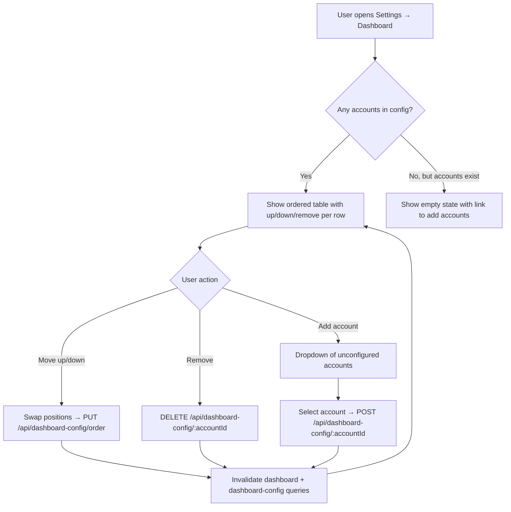
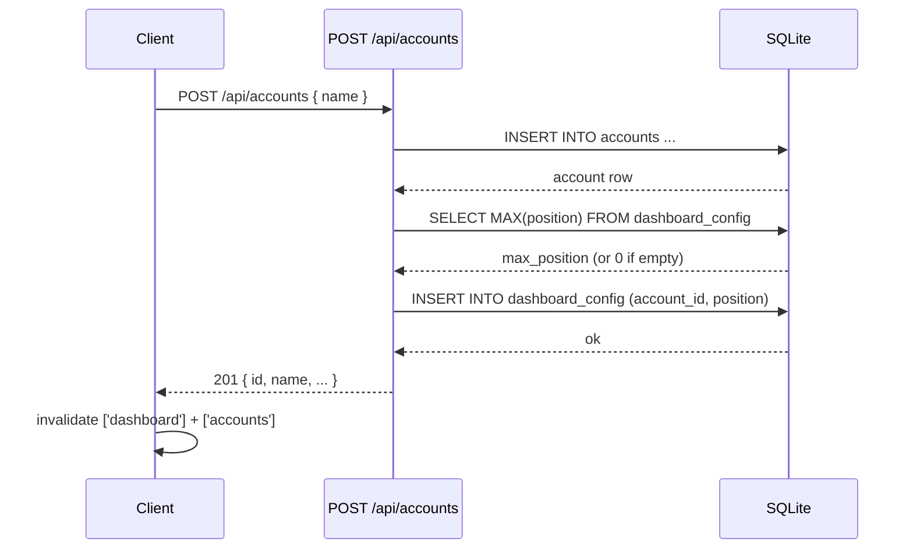
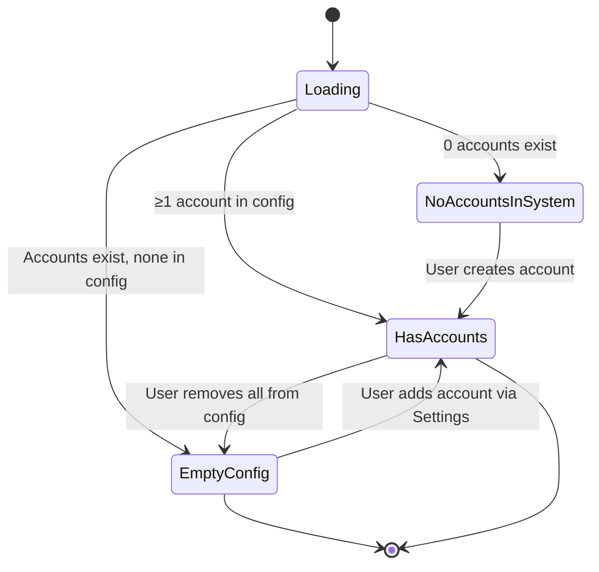

# Configure dashboard

## Summary

Users can configure which accounts appear on the dashboard and in what order, via a new "Dashboard" section in app Settings. Accounts can be added, removed, and reordered using up/down buttons. Configuration is persisted server-side. The dashboard also gains an "All accounts" link above the account grid that opens a new page listing every non-deleted account alphabetically with its current balance.

---

## Detailed description

### Dashboard settings section

A new "Dashboard" tab is added to the Settings page sidebar/tab bar, alongside the existing "Accounts" and "Import / Export" tabs.

The Dashboard section contains:

- A table of accounts currently shown on the dashboard, displayed in their configured order.
- Each row shows the account name and three action controls: **up**, **down**, and **remove**.
  - The up button is disabled for the first row.
  - The down button is disabled for the last row.
  - Clicking up or down immediately swaps the account with its neighbour and persists the new order.
  - Clicking remove removes the account from the dashboard (it still exists in the system).
- An **"+ Add account"** button, shown only when at least one account is not currently on the dashboard. Clicking it opens a dropdown/select listing only accounts not on the dashboard. Selecting an account appends it to the bottom of the dashboard config.
- When all accounts are on the dashboard, the "Add account" button is hidden.
- When no accounts are in the config but accounts exist in the system, the table is replaced with an empty state indicating the dashboard has no accounts configured (see Dashboard empty state below).

### Dashboard display

- Account cards are rendered in the order defined in the dashboard config, replacing the current alphabetical order.
- The net balance total in the header continues to reflect **all accounts** regardless of dashboard visibility, consistent with its current behaviour.
- **Empty state (accounts exist but none are configured):** a message reads *"No accounts are configured for the dashboard."* with a link that navigates directly to Settings → Dashboard. The existing "no accounts yet" empty state (when no accounts exist at all) remains unchanged.
- **Loading state:** unchanged (skeleton cards).

### All accounts page

- New route: `/accounts`
- Lists all non-deleted accounts in **alphabetical order** with their current balances.
- No transaction count column.
- Clicking any row navigates to the existing account detail page (`/accounts/:id`).
- An **"All accounts"** link/button appears **above the account grid** on the dashboard and is always visible when accounts exist. On the Settings page header strip this link is not needed.

### Configuration persistence & data model

Dashboard configuration is stored server-side in a new `dashboard_config` table:

```sql
CREATE TABLE IF NOT EXISTS dashboard_config (
    id          INTEGER PRIMARY KEY AUTOINCREMENT,
    account_id  INTEGER NOT NULL REFERENCES accounts(id),
    position    INTEGER NOT NULL
);
```

`account_id` is not the primary key so that a future widget type (e.g. a chart) can add a second row for the same account without a schema change. For now each account has at most one row; this constraint is enforced at the application layer rather than by a database unique index.

**Seeding / migration:** On first run after this feature is deployed, all existing non-deleted accounts are inserted into `dashboard_config` in alphabetical order (position 1, 2, 3, …). This is handled as a migration in `db.ts` using the same try/catch pattern as existing migrations.

**New account created:** The account creation route appends the new account to `dashboard_config` at `MAX(position) + 1`. This happens in the same server request, so a newly created account is immediately visible at the bottom of the dashboard without any user action — even if the dashboard has been customised.

**Account deleted:** The account soft-delete route removes the account's row from `dashboard_config` in the same operation.

### API changes

| Method | Endpoint | Description |
|--------|----------|-------------|
| `GET` | `/api/dashboard` | Modified: returns only accounts in `dashboard_config`, ordered by `position` |
| `GET` | `/api/dashboard-config` | Returns current config as `{ items: [{account_id, position}] }` ordered by position |
| `POST` | `/api/dashboard-config/:accountId` | Adds account to bottom of config (409 if account already has a config entry, 404 if account not found) |
| `DELETE` | `/api/dashboard-config/:accountId` | Removes account's config entry by `account_id` (404 if not present) |
| `PUT` | `/api/dashboard-config/order` | Accepts `{ account_ids: number[] }` — full replacement of order |
| `GET` | `/api/accounts/balances` | New: returns all non-deleted accounts with balances `[{id, name, balance_cents}]` ordered alphabetically, for the All accounts page |

**Note on `/api/dashboard` response:** The current response shape is `{ accounts: [...] }`. The `accounts` array changes from alphabetical to position-ordered and is filtered to only configured accounts. The shape of each account object is unchanged.

---

## Key decisions

| Decision | Outcome |
|----------|---------|
| Where to persist dashboard config | Server-side (new `dashboard_config` table in SQLite). Keeps all state in one place; survives browser resets. Consistent with the app's single-user, server-first architecture. |
| New accounts and dashboard config | New accounts auto-appear at the bottom of the dashboard. Config stores an **inclusion list with position**, and account creation writes to `dashboard_config`. This is simpler to query and reason about than an exclusion model. |
| Reordering mechanism | Up/down arrow buttons. No new library required; works well on mobile (a stated priority). Drag-and-drop would require adding `dnd-kit` or similar. |
| Net balance scope | All accounts, regardless of visibility. The net balance is a financial summary; hiding accounts for display convenience should not silently change it. |
| "All accounts" link placement | Above the account grid on the dashboard, always visible. Avoids burying it in navigation; easy to reach regardless of scroll position. |
| Empty dashboard state | Show a message with a deep link to Settings → Dashboard. Not prevented — a user may legitimately want a clean dashboard temporarily. Minimum of 1 is not enforced. |
| All accounts page: columns | Name and balance only. Transaction count excluded per requirements. Deleted accounts excluded. |
| `dashboard_config` primary key | Surrogate `id AUTOINCREMENT`, not `account_id`. A future widget type (e.g. a chart card) will need a second row for the same account; using `account_id` as PK would require a schema change at that point. Uniqueness per account is enforced in application code for now. |

---

## User stories

- **As a user, I want to choose which accounts appear on my dashboard**, so that I can focus on the accounts most relevant to my day-to-day finances.
- **As a user, I want to control the order of accounts on my dashboard**, so that my most important accounts are shown first.
- **As a user, I want new accounts to appear on my dashboard automatically**, so that I don't have to manually configure the dashboard after creating an account.
- **As a user, I want to see a list of all my accounts with their balances on a single page**, so that I can quickly review my complete financial picture without navigating to each account individually.

---

## Diagrams

### Dashboard config — settings flow



### New account creation — config side effect



### Dashboard display states



---

## Acceptance criteria

```gherkin
Feature: Dashboard configuration

  Background:
    Given the application is running and the user is on the dashboard

  # ── Settings: Dashboard section ──────────────────────────────────────────

  Scenario: Dashboard tab appears in Settings navigation
    When the user navigates to Settings
    Then a "Dashboard" tab is visible in the settings navigation alongside "Accounts" and "Import / Export"

  Scenario: Dashboard section lists configured accounts in order
    Given accounts "Savings", "Checking", and "Credit Card" are configured on the dashboard in that order
    When the user opens Settings and selects the Dashboard tab
    Then the table shows "Savings", "Checking", "Credit Card" in that exact order

  Scenario: Up button is disabled for the first account
    Given the Dashboard settings section is open with at least two accounts configured
    When the user views the first account in the list
    Then the up button for that account is disabled

  Scenario: Down button is disabled for the last account
    Given the Dashboard settings section is open with at least two accounts configured
    When the user views the last account in the list
    Then the down button for that account is disabled

  Scenario: Moving an account up
    Given the Dashboard settings section shows accounts in order "Savings", "Checking"
    When the user clicks the up button on "Checking"
    Then the table order changes to "Checking", "Savings"
    And the dashboard reflects the new order

  Scenario: Moving an account down
    Given the Dashboard settings section shows accounts in order "Savings", "Checking"
    When the user clicks the down button on "Savings"
    Then the table order changes to "Checking", "Savings"
    And the dashboard reflects the new order

  Scenario: Removing an account from the dashboard
    Given "Credit Card" is configured on the dashboard
    When the user clicks the remove button for "Credit Card" in the Dashboard settings
    Then "Credit Card" is removed from the dashboard settings table
    And "Credit Card" no longer appears as a card on the dashboard

  Scenario: Adding an account to the dashboard
    Given "Credit Card" has been removed from the dashboard config
    When the user clicks "Add account" in Dashboard settings
    And selects "Credit Card" from the dropdown
    Then "Credit Card" appears at the bottom of the dashboard settings table
    And "Credit Card" appears as a card at the bottom of the dashboard

  Scenario: Add account dropdown only shows accounts not already on the dashboard
    Given "Savings" and "Checking" are on the dashboard
    And "Credit Card" is not on the dashboard
    When the user clicks "Add account"
    Then only "Credit Card" is available to select in the dropdown
    And "Savings" and "Checking" are not listed

  Scenario: Add account button is hidden when all accounts are on the dashboard
    Given all existing accounts are configured on the dashboard
    When the user views the Dashboard settings section
    Then the "Add account" button is not visible

  Scenario: Empty Dashboard settings when all accounts have been removed
    Given all accounts have been removed from the dashboard config
    And at least one account exists in the system
    When the user views the Dashboard settings section
    Then an empty state is shown indicating no accounts are configured

  # ── Dashboard display ─────────────────────────────────────────────────────

  Scenario: Dashboard respects configured order
    Given accounts are configured in order "Credit Card", "Savings", "Checking"
    When the user visits the dashboard
    Then account cards appear in the order "Credit Card", "Savings", "Checking"

  Scenario: Removed account does not appear on dashboard
    Given "Credit Card" has been removed from the dashboard config
    When the user visits the dashboard
    Then no card for "Credit Card" is shown

  Scenario: Net balance includes all accounts regardless of visibility
    Given "Savings" has a balance of $1,000.00 and is on the dashboard
    And "Credit Card" has a balance of -$200.00 and is NOT on the dashboard
    When the user visits the dashboard
    Then the net balance shown in the header is $800.00

  Scenario: Empty dashboard state when accounts exist but none are configured
    Given all accounts have been removed from the dashboard config
    And at least one account exists in the system
    When the user visits the dashboard
    Then an empty state message is shown stating no accounts are configured for the dashboard
    And a link to Settings → Dashboard is displayed

  Scenario: Empty state link navigates to Dashboard settings
    Given the dashboard empty state is shown
    When the user clicks the link in the empty state
    Then they are taken to the Settings page with the Dashboard tab active

  # ── New account auto-appears ──────────────────────────────────────────────

  Scenario: Newly created account appears at the bottom of the dashboard
    Given the user has a customised dashboard with "Savings" and "Checking" configured
    When the user creates a new account "Holiday Fund"
    And navigates to the dashboard
    Then "Holiday Fund" appears as a card at the bottom of the dashboard after "Savings" and "Checking"

  Scenario: Newly created account appears at the bottom of dashboard settings
    Given the user has a customised dashboard
    When the user creates a new account "Holiday Fund" from the Accounts settings
    And navigates to Settings → Dashboard
    Then "Holiday Fund" is listed at the bottom of the dashboard config table

  # ── All accounts page ─────────────────────────────────────────────────────

  Scenario: All accounts link is visible above the account grid
    Given at least one account exists
    When the user visits the dashboard
    Then a link to "All accounts" is visible above the account grid

  Scenario: All accounts page lists accounts alphabetically
    Given accounts "Savings", "Checking", and "Credit Card" exist and are not deleted
    When the user navigates to the All accounts page
    Then accounts are listed in alphabetical order: "Checking", "Credit Card", "Savings"

  Scenario: All accounts page shows current balances
    Given "Savings" has a balance of $2,500.00
    When the user navigates to the All accounts page
    Then "Savings" shows a balance of $2,500.00

  Scenario: All accounts page excludes deleted accounts
    Given account "Old Account" has been soft-deleted
    When the user navigates to the All accounts page
    Then "Old Account" is not listed

  Scenario: Clicking an account on the All accounts page opens the account detail
    Given the user is on the All accounts page
    When the user clicks on "Savings"
    Then they are navigated to the Savings account detail page

  Scenario: All accounts page is reachable via the dashboard link
    When the user clicks the "All accounts" link on the dashboard
    Then the All accounts page is displayed

  # ── Migration / seeding ───────────────────────────────────────────────────

  Scenario: All existing accounts appear on the dashboard after deployment
    Given the app has existing accounts before this feature is deployed
    When the feature is deployed and the server restarts
    Then all existing non-deleted accounts appear on the dashboard in alphabetical order
```

---

## Manual test steps

### Setup
1. Ensure the app is running. You should have at least three accounts created (e.g. "Savings", "Checking", "Credit Card"). If not, go to Settings → Accounts and create them.

### Test: Dashboard settings section
2. Click the gear icon in the top-right to open Settings.
3. Verify there is a "Dashboard" tab in the left sidebar (or top tab bar on mobile) alongside "Accounts" and "Import / Export".
4. Click "Dashboard".
5. Verify all three accounts appear in the table. Note their order.
6. Click the **up arrow** on the second account in the list. Verify it moves above the first account.
7. Verify the **up arrow** on the new first account is now greyed out / disabled.
8. Click the **down arrow** on the last account in the list. Verify it cannot move (button should be disabled).
9. Navigate to the dashboard and verify the account cards appear in the new order you set.

### Test: Removing an account from the dashboard
10. Return to Settings → Dashboard.
11. Click the **remove** (×) button on one of the accounts (e.g. "Credit Card").
12. Verify "Credit Card" disappears from the settings table.
13. Navigate to the dashboard. Verify no card for "Credit Card" is shown.
14. Verify the net balance in the header has **not** changed (it should still include Credit Card's balance).

### Test: Adding an account back
15. Return to Settings → Dashboard.
16. Verify an **"+ Add account"** button is visible.
17. Click it. Verify the dropdown only shows "Credit Card" (the removed account) and not "Savings" or "Checking".
18. Select "Credit Card". Verify it reappears at the bottom of the settings table.
19. Navigate to the dashboard. Verify "Credit Card" now appears as a card at the bottom.

### Test: Empty dashboard state
20. Return to Settings → Dashboard. Remove all accounts.
21. Navigate to the dashboard. Verify an empty state message appears (not the "no accounts yet" message) with a link to configure the dashboard.
22. Click the link. Verify you are taken to Settings with the Dashboard tab active.

### Test: New account auto-appears
23. Go to Settings → Accounts and create a new account named "Holiday Fund".
24. Navigate to the dashboard. Verify "Holiday Fund" appears at the bottom of the account cards.
25. Go to Settings → Dashboard. Verify "Holiday Fund" appears at the bottom of the config table.

### Test: All accounts link and page
26. Return to the dashboard.
27. Verify an "All accounts" link is visible above the account cards.
28. Click it. Verify you arrive at a new page listing all non-deleted accounts.
29. Verify accounts are listed in alphabetical order (not the dashboard order).
30. Verify each account shows a balance.
31. Click one account. Verify you are taken to that account's detail page (showing its transactions).
32. Use the browser back button to return to the All accounts page.
33. Go to Settings → Accounts, delete one account. Return to the All accounts page and verify the deleted account no longer appears.

---

## Implementation tasks

Dependencies are noted where task B cannot begin until task A is complete.

### Backend

**Task 1 — Add `dashboard_config` table and seed migration** (`server/src/db.ts`)
- Add `CREATE TABLE IF NOT EXISTS dashboard_config (id INTEGER PRIMARY KEY AUTOINCREMENT, account_id INTEGER NOT NULL REFERENCES accounts(id), position INTEGER NOT NULL)` using the existing `db.exec(...)` pattern.
- Add a seeding migration (inside a try/catch block like the existing column migrations): `INSERT OR IGNORE INTO dashboard_config (account_id, position) SELECT id, ROW_NUMBER() OVER (ORDER BY name) FROM accounts WHERE deleted_at IS NULL`.
- No dependencies.

**Task 2 — Create dashboard-config repository** (`server/src/dashboard-config/repository.ts`)
- Depends on: Task 1.
- Functions: `getAll()`, `add(accountId)` (inserts at MAX(position)+1; checks for existing `account_id` row and returns 409 if found — uniqueness is enforced here, not by DB constraint), `remove(accountId)` (deletes by `account_id`), `reorder(accountIds: number[])` (replaces all positions in a transaction), `removeByAccountId(accountId)` (used by account deletion).
- Follow the pattern in `server/src/accounts/repository.ts`.

**Task 3 — Modify account creation to append to dashboard config** (`server/src/accounts/routes.ts`)
- Depends on: Task 2.
- After `repo.create(name)`, call `dashboardConfigRepo.add(account.id)`.

**Task 4 — Modify account soft-delete to remove from dashboard config** (`server/src/accounts/repository.ts`)
- Depends on: Task 2.
- Inside the existing `softDelete` transaction, call `dashboardConfigRepo.removeByAccountId(id)` (or inline the DELETE statement in the transaction).

**Task 5 — Create dashboard-config API routes** (`server/src/dashboard-config/routes.ts`)
- Depends on: Task 2.
- `GET /` → `repo.getAll()`
- `POST /:accountId` → `repo.add(accountId)` — 409 if already present, 404 if account doesn't exist
- `DELETE /:accountId` → `repo.remove(accountId)` — 404 if not present
- `PUT /order` → `repo.reorder(body.account_ids)` — validates all IDs exist in config before replacing
- Follow pattern in `server/src/accounts/routes.ts`.

**Task 6 — Modify dashboard route to filter/order by config** (`server/src/dashboard/routes.ts`)
- Depends on: Task 1.
- Replace `FROM accounts a ... ORDER BY a.name` with an `INNER JOIN dashboard_config dc ON dc.account_id = a.id ... ORDER BY dc.position` so only configured accounts are returned in position order.
- The response shape (`{ accounts: [...] }`) is unchanged.

**Task 7 — Add accounts-with-balances endpoint** (`server/src/accounts/routes.ts` or new `server/src/accounts/balancesRoute.ts`)
- Depends on: nothing new (uses existing `db` and accounts table).
- `GET /api/accounts/balances` returns `[{id, name, balance_cents}]` for all non-deleted accounts ordered by name.
- Uses the same balance CTE pattern from `server/src/dashboard/routes.ts`.
- **Important:** register this route before `/:id` in the router to avoid Express matching "balances" as an ID.

**Task 8 — Register new routes in Express app** (`server/src/index.ts`)
- Depends on: Tasks 5, 7.
- Mount `dashboardConfigRoutes` at `/api/dashboard-config`.
- Verify `/api/accounts/balances` is accessible (may already be registered if added to existing accounts router).

**Task 9 — Server tests for dashboard-config** (`server/src/__tests__/dashboard-config.test.ts`)
- Depends on: Tasks 5, 6.
- Follow pattern in `server/src/__tests__/accounts.test.ts`.
- Cover: GET order, POST add, DELETE remove, PUT reorder, 404/409 cases, new account auto-appears, deleted account removed from config.

### Frontend

**Task 10 — Dashboard-config API client** (`client/src/api/dashboardConfig.ts`)
- Depends on: Task 5 (backend).
- Functions: `getDashboardConfig()`, `addToDashboard(accountId)`, `removeFromDashboard(accountId)`, `reorderDashboard(accountIds: number[])`.
- Follow pattern in `client/src/api/accounts.ts`.

**Task 11 — Accounts balances API client** (`client/src/api/accounts.ts`)
- Depends on: Task 7 (backend).
- Add `listAccountsWithBalances(): Promise<AccountWithBalance[]>`.
- Add `AccountWithBalance` type to `client/src/types/account.ts`.

**Task 12 — DashboardSection settings component** (`client/src/components/settings/DashboardSection.tsx`)
- Depends on: Task 10.
- Query key: `['dashboard-config']`.
- Table with up/down/remove per row (up disabled on first, down disabled on last).
- Up/down: locally recompute order array, call `reorderDashboard(ids)`, invalidate `['dashboard-config']` and `['dashboard']`.
- Remove: call `removeFromDashboard(id)`, same invalidation.
- Add account button + dropdown: query `['accounts']` (existing `listAccounts`), filter out IDs already in config. On select, call `addToDashboard(id)`.
- Follow patterns in `client/src/components/settings/AccountsSection.tsx`.

**Task 13 — Add Dashboard tab to Settings page** (`client/src/pages/Settings.tsx`)
- Depends on: Task 12.
- Add `{ label: 'Dashboard', key: 'dashboard' }` to `navItems`.
- Add `{section === 'dashboard' && <DashboardSection />}` to content panel.

**Task 14 — All accounts page** (`client/src/pages/AllAccounts.tsx`)
- Depends on: Task 11.
- Query key: `['accounts-balances']`.
- Table: Name (link to `/accounts/:id`) | Balance (right-aligned, colour-coded via `balanceColor()`).
- Alphabetical order (from API).
- Follow layout/header pattern from `client/src/pages/Settings.tsx`.

**Task 15 — Add `/accounts` route** (`client/src/App.tsx`)
- Depends on: Task 14.
- Add `<Route path="/accounts" element={<AllAccounts />} />`.
- Must be defined before (or separate from) `/accounts/:id` — React Router handles exact vs param matching correctly, but verify.

**Task 16 — Update Dashboard page** (`client/src/pages/Dashboard.tsx`)
- Depends on: Tasks 14, 15 (for the link), Task 6 (backend, for correct ordering).
- Add "All accounts" link above the account grid (render it whenever `!isLoading`, regardless of account count): `<Link to="/accounts">All accounts →</Link>` or similar styled link.
- Replace the current `accounts.length === 0` empty state check with two cases:
  1. No accounts in system: existing "No accounts yet" with create button (when `/api/accounts` returns empty — may need a separate `listAccounts` query or pass a flag from the API).
  2. Accounts exist but none in config: new empty state with link to Settings → Dashboard. The `GET /api/dashboard` response returning an empty `accounts` array while the system still has accounts is the signal — detect this by checking `accounts.length === 0` from dashboard query combined with a secondary check, **or** have the dashboard API include a flag. Simplest: add a separate `useQuery` for `listAccounts` on the Dashboard page; if `dashboardAccounts.length === 0 && allAccounts.length > 0`, show the config empty state.

**Task 17 — Client tests for DashboardSection** (`client/src/components/settings/DashboardSection.test.tsx`)
- Depends on: Task 12.
- Follow pattern in `client/src/components/TransactionRow.test.tsx`.
- Cover: renders accounts in order, up/down disabled states, remove calls correct API, add account shows only unconfigured accounts.
