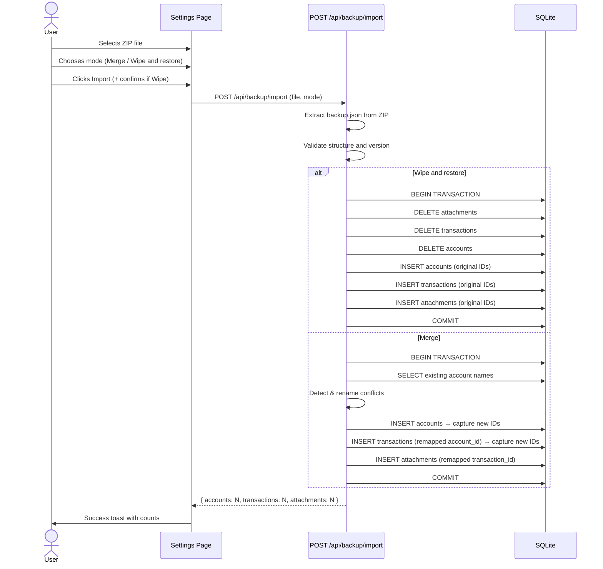
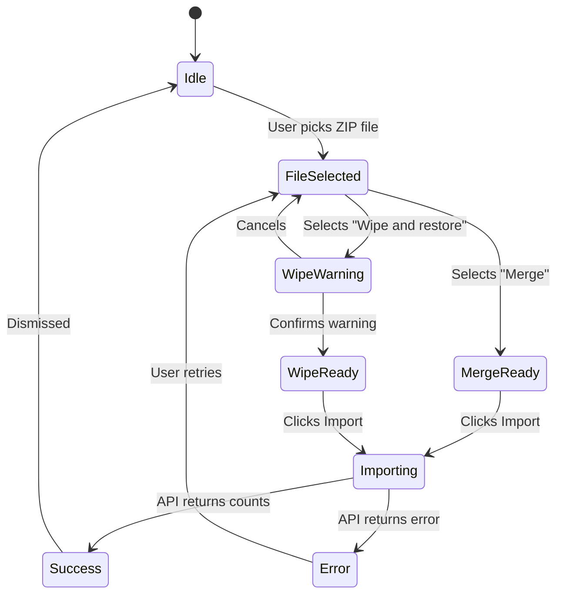

# Import/export entire database

## Summary

To support easy backups and migration between Sid instances, users can export the entire database as a zipped JSON file (including attachments encoded as Base64 strings) and import that file into any Sid instance. Import supports two modes: **merge** (additive, new IDs generated) and **wipe and restore** (destructive, original IDs preserved). Account name conflicts during merge are resolved by appending a timestamp to the imported account name.

---

## Detailed description

### Export

A single button in the Settings page triggers a full database export. The server reads all records from the `accounts`, `transactions`, and `attachments` tables — including soft-deleted records — serialises them as JSON, encodes attachment binary data as Base64, and packages the result into a ZIP file. The file is streamed back to the browser as a download.

**Export filename:** `sid-backup-yyyyMMddHHmmss.zip`

**ZIP contents:** a single file `backup.json` with the following structure:

```json
{
  "version": 1,
  "exported_at": "2026-04-19T14:30:22.000Z",
  "accounts": [ { "id": 1, "name": "Savings", "created_at": "...", "deleted_at": null } ],
  "transactions": [ { "id": 1, "account_id": 1, "category": "...", "description": "...", "amount_cents": -4500, "type": "expense", "date": "2026-01-15", "notes": null, "created_at": "...", "updated_at": "...", "deleted_at": null } ],
  "attachments": [ { "id": 1, "transaction_id": 1, "filename": "receipt.jpg", "mime_type": "image/jpeg", "size_bytes": 12345, "data": "<base64>", "created_at": "...", "deleted_at": null } ]
}
```

The export button shows a loading spinner while the server prepares the file. On error a toast notification is shown.

---

### Import

A file picker in the same Settings section accepts `.zip` files. Before confirming, the user selects one of two import modes via radio buttons:

| Mode | Behaviour |
|------|-----------|
| **Merge** | Imported data is added to existing data. New IDs are generated; foreign key references are re-mapped. Account name conflicts are resolved by appending a timestamp. |
| **Wipe and restore** | All existing data is deleted (hard delete, ordered attachments → transactions → accounts), then the backup is inserted with original IDs preserved. |

A warning message is shown when "Wipe and restore" is selected. The user must click a confirmation button to proceed.

The import is executed inside a single SQLite database transaction. If any step fails, everything rolls back and an informative error message is shown. On success, a summary toast shows the count of imported accounts, transactions, and attachments.

---

### Merge — ID re-mapping

1. For each account in the backup, check whether an active (non-deleted) account with the same name exists in the destination.
   - If a conflict exists, rename the imported account: `<name> yyyyMMddHHmmss` (using the current timestamp at the time of import, 24-hour clock).
2. Insert each account and record the mapping `oldId → newId`.
3. Insert each transaction with `account_id` replaced using the account ID map, recording `oldId → newId`.
4. Insert each attachment with `transaction_id` replaced using the transaction ID map.
5. All `deleted_at` timestamps are preserved exactly as exported.

---

### Wipe and restore — ID preservation

1. Hard-delete all attachments, transactions, then accounts (in that order to respect foreign keys).
2. Insert accounts with original IDs.
3. Insert transactions with original IDs and original `account_id` values.
4. Insert attachments with original IDs and original `transaction_id` values.
5. All `deleted_at` timestamps are preserved exactly as exported.

---

### Validation

| Rule | Error |
|------|-------|
| Uploaded file is not a `.zip` | `File must be a ZIP archive (.zip)` |
| ZIP does not contain `backup.json` | `Invalid backup: missing backup.json` |
| `backup.json` is not valid JSON | `Invalid backup: could not parse backup.json` |
| `backup.json` version field is missing or unrecognised | `Invalid backup: unsupported version` |
| `accounts`, `transactions`, or `attachments` arrays are missing | `Invalid backup: missing required data` |
| Any attachment `data` field fails Base64 decode | `Invalid backup: attachment data is corrupt (attachment id: N)` |
| Database error during import | `Import failed: <db error message>` |

---

## Key decisions

| Decision | Outcome |
|----------|---------|
| Import mode | User chooses: "Merge" (additive, new IDs) or "Wipe and restore" (destructive, original IDs). A dialog step surfaces both options with a warning for the destructive mode. |
| ID handling | Merge: new IDs generated, FK references re-mapped in memory before insert. Wipe and restore: original IDs preserved; all tables hard-deleted before re-insert. |
| Soft-deleted records | Included in export; `deleted_at` timestamps preserved on import (records arrive soft-deleted). |
| UI location | New "Import / Export" nav item within the existing Settings page sidebar, following the existing `AccountsSection` pattern. |
| Import atomicity | All inserts executed inside a single `db.transaction()`. Any failure rolls back the entire import. |
| Account name conflict resolution | Conflicts detected against active (non-deleted) accounts only. Conflicting imported account renamed: `<name> yyyyMMddHHmmss` (24-hour, current timestamp). |
| Attachment storage in backup | Stored as Base64 strings inside `backup.json` (not as separate files in the ZIP), matching the summary requirement and keeping the format self-contained. |
| ZIP library | `adm-zip` on the server (synchronous API, consistent with better-sqlite3's synchronous model; handles both create and parse). |
| Export loading UX | Export button shows a spinner during server processing. Spinner dismissed on download start or error. |
| Timestamp format | `yyyyMMddHHmmss` (24-hour) for conflict-rename suffix and export filename. |

---

## User stories

- As a Sid user, I want to export my entire database as a ZIP file so that I can keep an offline backup of all my accounts, transactions, and attachments.
- As a Sid user, I want to import a backup ZIP into a new Sid instance so that I can migrate my data without manually re-entering anything.
- As a Sid user, I want to choose between merging imported data with my existing data or wiping and fully restoring from a backup, so that I can handle both migration and recovery scenarios.
- As a Sid user, I want conflicting account names to be automatically renamed during a merge import so that I don't lose any data from either instance.

---

## Diagrams

### Export flow

```mermaid
sequenceDiagram
    actor User
    participant Settings as Settings Page
    participant API as GET /api/backup
    participant DB as SQLite

    User->>Settings: Clicks "Export"
    Settings->>Settings: Show spinner on button
    Settings->>API: GET /api/backup
    API->>DB: SELECT all accounts (incl. deleted)
    API->>DB: SELECT all transactions (incl. deleted)
    API->>DB: SELECT all attachments (incl. deleted, with data)
    DB-->>API: All records
    API->>API: Encode attachment data as Base64
    API->>API: Serialise to backup.json
    API->>API: Package into ZIP
    API-->>Settings: ZIP binary (attachment; filename=sid-backup-*.zip)
    Settings->>Settings: Trigger browser download
    Settings->>Settings: Hide spinner
```

### Import flow



### Import mode selection state



---

## Acceptance criteria

```gherkin
Feature: Export database

  Scenario: Successful export
    Given I am on the Settings page
    When I click "Export" in the Import / Export section
    Then the export button shows a loading spinner
    And a ZIP file named "sid-backup-<timestamp>.zip" is downloaded
    And the ZIP contains a file named "backup.json"
    And backup.json includes all accounts, including soft-deleted ones
    And backup.json includes all transactions, including soft-deleted ones
    And backup.json includes all attachments with data encoded as Base64, including soft-deleted ones

  Scenario: Export with no data
    Given the database has no accounts, transactions, or attachments
    When I click "Export"
    Then a ZIP is downloaded with empty arrays for accounts, transactions, and attachments

Feature: Import database — merge

  Scenario: Successful merge import
    Given I am on the Settings page
    And I have selected a valid Sid backup ZIP
    And I have selected "Merge"
    When I click "Import"
    Then all accounts from the backup are added to the existing accounts
    And all transactions are added with correct account associations
    And all attachments are added with correct transaction associations
    And a success toast shows the count of imported accounts, transactions, and attachments
    And existing data is unchanged

  Scenario: Account name conflict during merge
    Given an account named "Savings" already exists in the destination
    And the backup also contains an account named "Savings"
    When I import with mode "Merge"
    Then the imported account is renamed "Savings <yyyyMMddHHmmss>"
    And the original "Savings" account is unchanged
    And all transactions from the imported "Savings" are linked to the renamed account

  Scenario: Soft-deleted records preserved on merge
    Given the backup contains a soft-deleted account
    When I import with mode "Merge"
    Then the imported account exists in the destination with deleted_at set

Feature: Import database — wipe and restore

  Scenario: Successful wipe and restore
    Given I am on the Settings page
    And I have selected a valid Sid backup ZIP
    And I have selected "Wipe and restore"
    When I confirm the warning and click "Import"
    Then all existing accounts, transactions, and attachments are removed
    And all records from the backup are inserted with their original IDs
    And a success toast shows the count of restored accounts, transactions, and attachments

  Scenario: Wipe and restore requires confirmation
    Given I have selected "Wipe and restore"
    Then a warning message is shown before I can import

Feature: Import validation

  Scenario: Invalid file type
    Given I try to upload a file that is not a ZIP
    When I click "Import"
    Then I see the error "File must be a ZIP archive (.zip)"

  Scenario: ZIP missing backup.json
    Given I upload a ZIP that does not contain backup.json
    When I click "Import"
    Then I see the error "Invalid backup: missing backup.json"

  Scenario: Corrupt backup.json
    Given I upload a ZIP with an invalid JSON file
    When I click "Import"
    Then I see the error "Invalid backup: could not parse backup.json"

  Scenario: Failed import rolls back
    Given I upload a valid backup ZIP
    And the database encounters an error mid-import
    Then no data is changed in the destination database
    And an informative error message is shown
```

---

## Manual test steps

### Export

1. Open Sid in a browser and navigate to **Settings** using the gear icon.
2. In the left sidebar, click **Import / Export**.
3. Click the **Export** button.
4. Confirm the button shows a spinner while the download prepares.
5. Confirm a file named `sid-backup-<timestamp>.zip` downloads to your computer.
6. Open the ZIP and verify it contains a file named `backup.json`.
7. Open `backup.json` and verify it contains `accounts`, `transactions`, and `attachments` arrays matching the data in Sid.
8. For an account with attachments, find the attachment entry in the JSON and confirm the `data` field is a non-empty Base64 string.
9. Confirm any soft-deleted accounts or transactions appear in the JSON with a non-null `deleted_at`.

### Import — merge

1. Have a destination Sid instance (can be a freshly started one).
2. Note the current accounts in the destination.
3. Navigate to **Settings → Import / Export**.
4. Click **Choose file** and select a valid Sid backup ZIP.
5. Select **Merge**.
6. Click **Import**.
7. Confirm a success toast appears showing the number of imported accounts, transactions, and attachments.
8. Navigate to the Dashboard and confirm the imported accounts appear alongside any pre-existing ones.
9. Open an imported account and verify its transactions and attachments are present and correct.
10. **Account name conflict test:** Import a backup containing an account whose name already exists in the destination. Confirm the imported account is renamed `<original name> <timestamp>` and the existing account is unchanged.

### Import — wipe and restore

1. Navigate to **Settings → Import / Export** on a Sid instance that has existing data.
2. Click **Choose file** and select a valid Sid backup ZIP.
3. Select **Wipe and restore**.
4. Confirm a warning message is displayed.
5. Click the confirmation/import button.
6. Confirm a success toast appears.
7. Navigate to the Dashboard and confirm only the data from the backup is present (pre-existing data is gone).
8. Check that record IDs match those in `backup.json`.

### Validation

1. Try uploading a `.csv` file — confirm the error "File must be a ZIP archive (.zip)".
2. Create a ZIP containing a file named `other.json` (no `backup.json`) — confirm "Invalid backup: missing backup.json".
3. Create a ZIP containing `backup.json` with content `{not json` — confirm "Invalid backup: could not parse backup.json".
4. Create a valid ZIP but set `version` to `99` — confirm "Invalid backup: unsupported version".

---

## Implementation tasks

> Tasks are ordered by dependency. Each builds on the previous.

### 1. Add `adm-zip` server dependency

**File:** `server/package.json`

Add `adm-zip` and its types (`@types/adm-zip`) as dependencies. Follow the existing dependency pattern in that file.

---

### 2. Create backup export repository function

**New file:** `server/src/backup/repository.ts`

Add a single function `exportAll()` that reads all rows from `accounts`, `transactions`, and `attachments` (no `WHERE deleted_at IS NULL` filter), converts attachment `data` BLOB buffers to Base64 strings, and returns the object shaped as `BackupPayload` (version, exported_at, accounts, transactions, attachments).

Follow the query style in `server/src/export/routes.ts` (direct `db.prepare(...).all()`).

---

### 3. Create backup export route

**New file:** `server/src/backup/exportRoutes.ts`

`GET /` — calls `exportAll()`, serialises to JSON, packages into a ZIP using `adm-zip`, sets headers `Content-Type: application/zip` and `Content-Disposition: attachment; filename="sid-backup-<timestamp>.zip"`, sends the ZIP buffer. Timestamp format: `yyyyMMddHHmmss`.

Follow the response pattern in `server/src/export/routes.ts`.

---

### 4. Create backup import repository function

**New file:** `server/src/backup/importRepository.ts` (or add to `repository.ts`)

Two functions:

- `importMerge(payload: BackupPayload)` — runs inside `db.transaction()`: detects account name conflicts against active accounts, renames conflicting imports, inserts accounts collecting `oldId → newId` map, inserts transactions with remapped `account_id` collecting `oldId → newId` map, inserts attachments with remapped `transaction_id`. Returns `{ accounts, transactions, attachments }` counts.

- `importWipe(payload: BackupPayload)` — runs inside `db.transaction()`: hard-deletes all attachments, transactions, accounts (in that order); inserts all records from payload with original IDs. Returns counts.

Both functions must propagate any DB errors (let them throw so the transaction rolls back).

Reference the transaction pattern in `server/src/import/routes.ts` (`db.transaction(...)`).

---

### 5. Create backup import route

**New file:** `server/src/backup/importRoutes.ts`

`POST /import` — uses `multer` memory storage (same as `server/src/import/routes.ts`), accepts a single file field named `file` and a body field `mode` (`"merge"` | `"wipe"`).

Validation steps (return 400/422 with JSON `{ error: "..." }` on failure):
1. File provided and has `.zip` extension or `application/zip` mime type.
2. Extract `backup.json` from ZIP using `adm-zip`.
3. Parse JSON; check `version === 1`; check arrays present.

On validation pass, call `importMerge` or `importWipe` based on `mode`. On DB error, catch and return 500 with `{ error: "Import failed: <message>" }`. On success, return `{ accounts: N, transactions: N, attachments: N }`.

---

### 6. Register backup routes in Express app

**File:** `server/src/index.ts`

Mount the export router at `/api/backup` and the import router at `/api/backup` (or combine into one router). Follow the pattern of existing route registrations (e.g. `app.use('/api/accounts/:id/export', exportRoutes)`).

---

### 7. Add backup TypeScript types

**New file:** `server/src/backup/types.ts`

Define `BackupPayload`, `BackupAccount`, `BackupTransaction`, `BackupAttachment` interfaces matching the JSON structure. Import and use these in both the repository and route files.

---

### 8. Add client API module

**New file:** `client/src/api/backup.ts`

Two functions following the patterns in `client/src/api/transactions.ts`:

- `exportBackup()` — `GET /api/backup`, receives a blob response (`responseType: 'blob'`), creates an object URL, triggers browser download via a temporary `<a>` element (same pattern as `ExportDialog.tsx`), revokes the URL after click.
- `importBackup(file: File, mode: 'merge' | 'wipe')` — `POST /api/backup/import` with `FormData` containing the file and mode. Returns `{ accounts: number, transactions: number, attachments: number }`.

---

### 9. Create `ImportExportSection` component

**New file:** `client/src/components/settings/ImportExportSection.tsx`

Follow the structure of `client/src/components/settings/AccountsSection.tsx`.

**Export sub-section:**
- Heading and brief description.
- "Export" button. On click: sets loading state, calls `exportBackup()`, clears loading on completion or error.
- On error: `toast.error(...)` using Sonner (same as other components).

**Import sub-section:**
- File input (`accept=".zip"`).
- Radio group: "Merge" / "Wipe and restore".
- When "Wipe and restore" is selected: show an inline warning (e.g. "This will permanently delete all existing data.").
- "Import" button (disabled until a file is selected).
- On submit: call `importBackup(file, mode)`.
  - On success: `toast.success(`Imported ${accounts} accounts, ${transactions} transactions, ${attachments} attachments.`)`. Reset form.
  - On error: `toast.error(errorMessage)`.

Use React Query mutations (`useMutation`) consistent with the rest of the codebase, and invalidate `['dashboard']` on import success.

---

### 10. Add "Import / Export" to Settings page

**File:** `client/src/pages/Settings.tsx`

1. Add `{ label: 'Import / Export', key: 'import-export' }` to `navItems`.
2. Update the `Section` type (inferred automatically from `as const`).
3. Import `ImportExportSection` and add `{section === 'import-export' && <ImportExportSection />}` to the content panel, following the `AccountsSection` conditional render.

---

### 11. Write server tests for export route

**New file:** `server/src/backup/exportRoutes.test.ts`

Follow the pattern of existing server tests (Tap + Supertest). Test:
- `GET /api/backup` returns 200 with `Content-Type: application/zip`.
- Response is a valid ZIP containing `backup.json`.
- `backup.json` contains correct structure with version, exported_at, and data arrays.
- Soft-deleted records appear in the export.

---

### 12. Write server tests for import route

**New file:** `server/src/backup/importRoutes.test.ts`

Test:
- Non-ZIP file returns 400.
- ZIP missing `backup.json` returns 422.
- Invalid JSON returns 422.
- Unknown version returns 422.
- Valid merge import returns 200 with correct counts and does not remove existing data.
- Account name conflict during merge renames the imported account.
- Soft-deleted records arrive soft-deleted.
- Valid wipe import returns 200 with correct counts and removes pre-existing data.
- Failed merge (e.g. constraint violation injected via mock) rolls back and returns 500.
