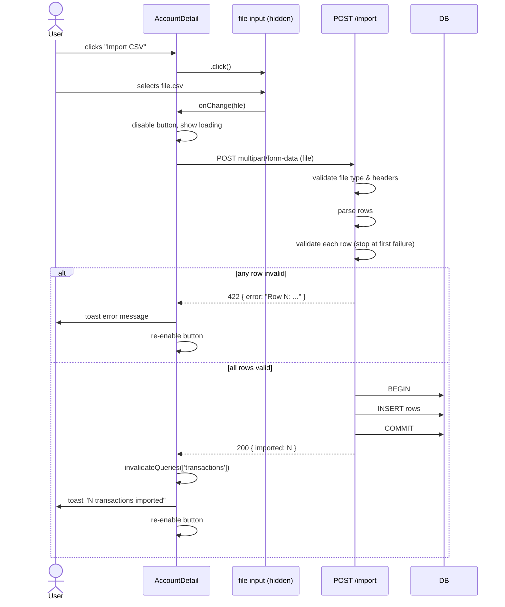
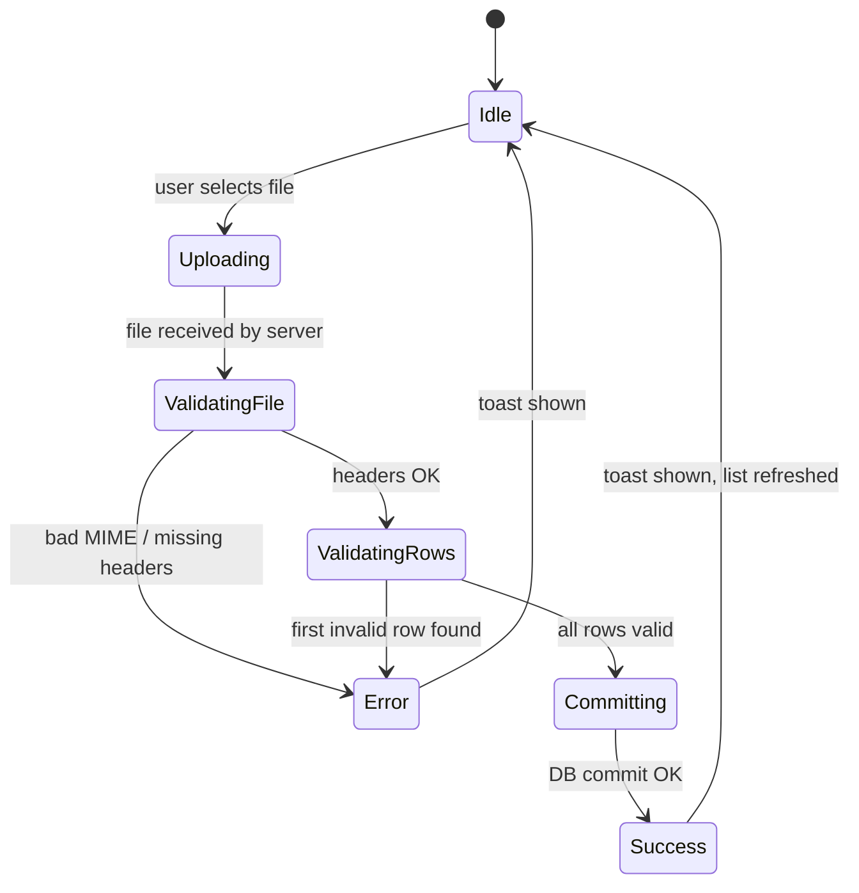

# Import transactions

## Summary

Users can import transactions into an account from a CSV file using the same format produced by the existing CSV export. The import is atomic — either all rows succeed or none are committed. A template CSV (with headers and a sample row) is available to download. Both controls live in the account page header toolbar.

---

## Detailed description

### Entry points (account page toolbar)

Two new controls sit alongside the existing Export button in the account detail header:

- **"Download template"** — generates and immediately downloads a CSV file client-side with the correct headers and one sample data row. No server round-trip required.
- **"Import CSV"** — clicking it triggers a hidden `<input type="file" accept=".csv">`. When the user selects a file, the upload begins immediately with no intermediate dialog.

### Upload flow

1. User clicks "Import CSV" → native file picker opens.
2. User selects a `.csv` file.
3. File is POSTed to `POST /api/accounts/:accountId/transactions/import` as `multipart/form-data`.
4. While the request is in flight, the Import button is disabled and shows a loading state.
5. The server parses the CSV, validates every row, then either:
   - **Commits all rows** atomically and returns `{ imported: N }`, or
   - **Rejects the entire file** at the first invalid row and returns an error.
6. On success: toast "N transactions imported", transaction list refreshes.
7. On error: toast with the specific failure reason (see Validation).

### CSV format

Identical to the export format produced by the existing export feature:

```
Date,Description,Type,Amount,Notes
2024-01-15,Coffee at the airport,expense,4.50,Morning coffee
```

| Column | Type | Required | Notes |
|---|---|---|---|
| Date | string | Yes | `YYYY-MM-DD` format |
| Description | string | Yes | Non-empty after trim |
| Type | string | Yes | `income` or `expense` (case-insensitive) |
| Amount | decimal | Yes | Positive number, e.g. `12.50`. Negative values are rejected. |
| Notes | string | No | Empty string treated as no notes |

Extra columns beyond these five are silently ignored.

### Atomicity

All row inserts are wrapped in a single SQLite transaction. If any row fails validation the entire import is aborted and no rows are written.

### Error behaviour

Errors are reported at the first failing row. The server returns the row number (1-based, excluding the header) and a human-readable reason. This is displayed as a toast error on the client.

### Empty file behaviour

A CSV with valid headers but no data rows is treated as a successful import of zero transactions: "0 transactions imported."

---

## Validation

### File-level (checked before row parsing)

| Rule | Error message |
|---|---|
| File must have `.csv` extension or `text/csv` MIME type | `File must be a CSV (.csv)` |
| File must contain the required headers (order-independent) | `Missing required columns: {comma-separated list}` |

### Row-level (first failure returned, 1-based row index excludes header)

| Rule | Error message |
|---|---|
| Date is non-empty | `Row N: date is required` |
| Date matches `YYYY-MM-DD` format and is a valid calendar date | `Row N: invalid date, expected YYYY-MM-DD` |
| Description is non-empty after trim | `Row N: description is required` |
| Type is `income` or `expense` (case-insensitive) | `Row N: type must be 'income' or 'expense'` |
| Amount is present | `Row N: amount is required` |
| Amount parses as a number | `Row N: amount must be a positive number` |
| Amount is greater than zero (zero and negatives rejected) | `Row N: amount must be a positive number` |

---

## Key decisions

| Decision | Outcome |
|---|---|
| UI pattern | Button in account header toolbar opens native file picker directly — no intermediate dialog |
| Error granularity | First failing row only, with row number and specific reason |
| Template content | Header row + one sample data row |
| Empty CSV (headers only) | Success: "0 transactions imported" |
| Negative amounts | Rejected as invalid — amount must be > 0 |
| Extra CSV columns | Silently ignored |
| Import size limit | None |
| Atomicity | All-or-nothing: single SQLite transaction wrapping all inserts |
| Template generation | Client-side (no server round-trip) — format is fixed |
| Type casing | Case-insensitive on import (`Income`, `EXPENSE`, etc. accepted); stored lowercase |

---

## User stories

- As a user, I want to download a template CSV so that I know exactly what format to use when preparing an import file.
- As a user, I want to import a CSV of transactions into an account so that I can bulk-load historical data without entering each transaction manually.
- As a user, I want the import to tell me exactly which row failed and why so that I can fix my file and retry.
- As a user, I want a failed import to leave my account data unchanged so that I never end up with a partial import.

---

## Diagrams

### Import flow



### Validation state machine



---

## Acceptance criteria

```gherkin
Feature: Import transactions from CSV

  Background:
    Given I am on the detail page for an account

  # ── Template download ───────────────────────────────────────────

  Scenario: Download template CSV
    When I click "Download template"
    Then a file named "transactions-template.csv" is downloaded
    And the file's first line is "Date,Description,Type,Amount,Notes"
    And the file contains exactly one sample data row

  # ── Successful imports ──────────────────────────────────────────

  Scenario: Import a valid CSV with multiple rows
    Given I have a CSV file with 3 valid transaction rows
    When I click "Import CSV" and select the file
    Then all 3 transactions are added to the account
    And I see a success toast "3 transactions imported"
    And the transaction list updates to show the new transactions

  Scenario: Import a CSV with headers only (no data rows)
    Given I have a CSV file containing only the header row
    When I click "Import CSV" and select the file
    Then no transactions are added
    And I see a success toast "0 transactions imported"

  Scenario: Import a CSV with extra columns
    Given I have a valid CSV file that also contains a "Category" column
    When I click "Import CSV" and select the file
    Then the extra column is ignored
    And the transactions are imported successfully

  Scenario: Import a CSV where Type values are mixed case
    Given I have a valid CSV file where Type is "Expense" and "Income"
    When I click "Import CSV" and select the file
    Then the transactions are imported successfully

  Scenario: Import a single transaction with no Notes value
    Given I have a CSV row with an empty Notes field
    When I click "Import CSV" and select the file
    Then the transaction is imported with no notes

  # ── Loading state ───────────────────────────────────────────────

  Scenario: Button is disabled during upload
    Given I have selected a valid CSV file
    When the upload is in progress
    Then the "Import CSV" button is disabled
    And the button shows a loading indicator

  # ── File-level errors ───────────────────────────────────────────

  Scenario: Upload a non-CSV file
    Given I select a file with a .xlsx extension
    When I click "Import CSV" and select the file
    Then no transactions are imported
    And I see an error toast "File must be a CSV (.csv)"

  Scenario: Upload a CSV missing required columns
    Given I have a CSV file that is missing the "Type" and "Amount" columns
    When I click "Import CSV" and select the file
    Then no transactions are imported
    And I see an error toast containing "Missing required columns: Amount, Type"

  # ── Row-level validation errors ─────────────────────────────────

  Scenario: Row with invalid date format
    Given I have a CSV file where row 2 has Date "15/01/2024"
    When I click "Import CSV" and select the file
    Then no transactions are imported
    And I see an error toast "Row 2: invalid date, expected YYYY-MM-DD"

  Scenario: Row with missing date
    Given I have a CSV file where row 1 has an empty Date field
    When I click "Import CSV" and select the file
    Then no transactions are imported
    And I see an error toast "Row 1: date is required"

  Scenario: Row with empty description
    Given I have a CSV file where row 3 has an empty Description field
    When I click "Import CSV" and select the file
    Then no transactions are imported
    And I see an error toast "Row 3: description is required"

  Scenario: Row with invalid type
    Given I have a CSV file where row 1 has Type "debit"
    When I click "Import CSV" and select the file
    Then no transactions are imported
    And I see an error toast "Row 1: type must be 'income' or 'expense'"

  Scenario: Row with negative amount
    Given I have a CSV file where row 2 has Amount "-10.00"
    When I click "Import CSV" and select the file
    Then no transactions are imported
    And I see an error toast "Row 2: amount must be a positive number"

  Scenario: Row with zero amount
    Given I have a CSV file where row 1 has Amount "0"
    When I click "Import CSV" and select the file
    Then no transactions are imported
    And I see an error toast "Row 1: amount must be a positive number"

  Scenario: Row with non-numeric amount
    Given I have a CSV file where row 4 has Amount "ten dollars"
    When I click "Import CSV" and select the file
    Then no transactions are imported
    And I see an error toast "Row 4: amount must be a positive number"

  Scenario: Only the first failing row is reported
    Given I have a CSV file where rows 2 and 4 both have invalid data
    When I click "Import CSV" and select the file
    Then no transactions are imported
    And I see an error toast referencing row 2 only

  # ── Atomicity ───────────────────────────────────────────────────

  Scenario: Failed import leaves account unchanged
    Given I have a CSV file where the last row has an invalid date
    And the account currently has 5 transactions
    When I click "Import CSV" and select the file
    Then I see a row-level error toast
    And the account still has exactly 5 transactions
```

---

## Manual test steps

### Setup
1. Open the app and navigate to any account that has at least a few existing transactions.

### Template download
2. Locate the **"Download template"** button in the account header toolbar.
3. Click it. Confirm a file named `transactions-template.csv` downloads.
4. Open the file in a spreadsheet app or text editor.
5. Verify the first line reads exactly: `Date,Description,Type,Amount,Notes`
6. Verify there is one sample data row below the header.

### Successful import
7. Copy the downloaded template and add 3 new rows with valid data, e.g.:
   ```
   2024-03-01,Groceries,expense,87.40,
   2024-03-02,Salary,income,3200.00,March salary
   2024-03-03,Coffee,expense,5.00,
   ```
8. Save as a `.csv` file.
9. Click **"Import CSV"** in the account header toolbar.
10. Select the file you just saved.
11. Confirm the button shows a loading state while the upload is in progress.
12. Confirm a green toast appears: **"3 transactions imported"**.
13. Confirm the 3 transactions appear in the transaction list.

### Empty CSV (headers only)
14. Create a CSV file containing only the header row (no data rows).
15. Click **"Import CSV"** and select it.
16. Confirm a green toast appears: **"0 transactions imported"**.
17. Confirm the transaction list is unchanged.

### Extra columns ignored
18. Add a `Category` column to a valid CSV and populate it.
19. Import the file and confirm it succeeds without error.

### Non-CSV file
20. Click **"Import CSV"** and select any `.xlsx` or `.pdf` file.
21. Confirm an error toast: **"File must be a CSV (.csv)"**.
22. Confirm no transactions were added.

### Missing required column
23. Create a CSV that has `Date,Description,Amount,Notes` (missing `Type`).
24. Import it. Confirm an error toast containing **"Missing required columns: Type"**.

### Invalid date format
25. Create a CSV where one row has date `15/03/2024` (wrong format).
26. Import it. Confirm an error toast: **"Row N: invalid date, expected YYYY-MM-DD"**.

### Negative amount
27. Create a CSV where one row has amount `-20.00`.
28. Import it. Confirm an error toast: **"Row N: amount must be a positive number"**.

### Atomicity check
29. Create a CSV with 2 valid rows followed by 1 invalid row (e.g. negative amount).
30. Note the current transaction count on the account.
31. Import the file. Confirm an error toast is shown.
32. Confirm the transaction count is unchanged (the 2 valid rows were NOT saved).

---

## Implementation tasks

> Tasks are ordered by dependency. Each task references the closest existing file to follow as a pattern.

### 1. Server — CSV parser/validator
**File:** `server/src/import/csv.ts` (new file)
- Install `csv-parse` as a server dependency (`npm install csv-parse` in `server/`).
- Export a function `parseImportCSV(buffer: Buffer): { rows: ImportRow[] } | { error: string }`.
- Validate file-level: required headers present (case-insensitive, order-independent), extra columns ignored.
- Validate each row in order; return the error string for the first failing row.
- On success return typed rows: `{ date: string, description: string, type: 'income' | 'expense', amount: number, notes: string | null }[]`.
- Follow the structure in `server/src/export/csv.ts` for file organisation.

### 2. Server — import route
**File:** `server/src/import/routes.ts` (new file)
- `POST /` — accepts `multipart/form-data` with a single field `file` using `multer({ storage: multer.memoryStorage() })`.
- Validate file MIME type / extension; return 400 if not CSV.
- Call `parseImportCSV`; return 422 with `{ error }` on failure.
- On success, open a SQLite transaction and call `repo.create()` for each row using the existing `createTransaction` logic in `server/src/transactions/repository.ts`.
- Return `200 { imported: N }`.
- Follow the pattern in `server/src/attachments/routes.ts` for multer usage.

### 3. Server — mount the route
**File:** `server/src/index.ts`
- Mount the import router under `accountRouter` at `/:accountId/transactions/import`.
- Follow the existing mounting pattern for `exportRouter`.

### 4. Client — API function
**File:** `client/src/api/transactions.ts`
- Add `importTransactions(accountId: number, file: File): Promise<{ imported: number }>`.
- Use `FormData`, append the file under the key `file`, POST to `/api/accounts/${accountId}/transactions/import`.
- Follow the pattern in `client/src/api/attachments.ts` (`uploadAttachments`).

### 5. Client — template download utility
**File:** `client/src/utils/importTemplate.ts` (new file)
- Export `downloadImportTemplate()`.
- Builds the CSV string: header row + one sample row.
- Creates a `Blob`, generates an object URL, triggers download as `transactions-template.csv`, then revokes the URL.
- No server call needed.

### 6. Client — import button and file input wiring
**File:** `client/src/pages/AccountDetail.tsx`
- Add a `useRef<HTMLInputElement>` for the hidden file input.
- Add a boolean state `isImporting` for the loading state.
- Add a hidden `<input type="file" accept=".csv">` with an `onChange` handler.
- Add **"Download template"** button that calls `downloadImportTemplate()`.
- Add **"Import CSV"** button (disabled + loading text when `isImporting`) that calls `inputRef.current?.click()`.
- `onChange` handler: set `isImporting = true`, call `importTransactions`, then on success invalidate `['transactions', accountId]` and show a `toast.success(\`${result.imported} transactions imported\`)`, on error show `toast.error(error.message)`, finally `isImporting = false` and reset the input value.
- Place both buttons in the existing toolbar `div` alongside the Export button (see lines 124–135 of `AccountDetail.tsx`).
