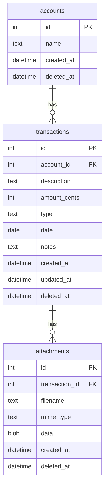
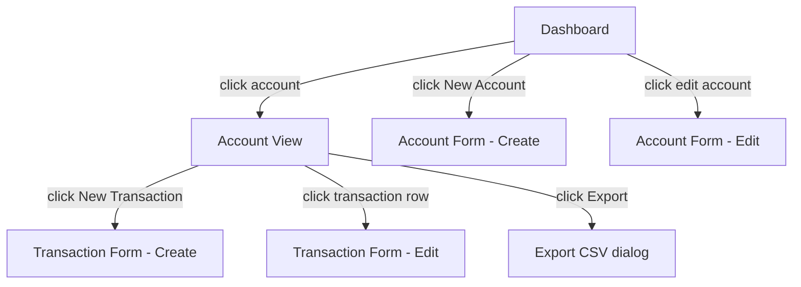

# MVP implementation

## Epic summary

Build **Sid**, a self-hosted, single-user budget tracker. Users manage named accounts (e.g. "Office expenses"), record income and expense transactions against those accounts, and view balances and transaction history. The app is a TypeScript monorepo with a React/TailwindCSS frontend and a Node/Express REST backend backed by SQLite.

---

## Detailed description

### Accounts

An account is a named bucket for tracking money. Users can create, rename, and delete accounts. Deleting an account hard-cascades all its transactions and their attachments (soft-delete flag set on account, transactions, and attachments simultaneously). Accounts are never permanently purged — soft-deleted records are simply excluded from all queries.

### Transactions

Each transaction belongs to one account and carries:

| Field | Type | Notes |
|-------|------|-------|
| description | string | required |
| amount | integer (cents) | always positive in the UI |
| type | `income` \| `expense` | determines sign |
| date | date | user-supplied |
| notes | string | optional |
| attachments | blob list | zero or more files |

**Sign convention:** stored amount is signed — income is positive, expense is negative (e.g. a $50 expense is stored as `-5000` cents). The UI always accepts a positive number and applies the sign based on type. Transaction lists display the sign (e.g. `+$50.00` / `−$50.00`).

Any field on a transaction, including the account it belongs to, can be edited after creation.

Transactions are soft-deleted (a `deleted_at` timestamp is set). Attachments are also soft-deleted when their parent transaction is deleted, or individually.

### Account balance

The balance of an account is the sum of all non-deleted transactions since inception (no date window). Displayed on the dashboard and account view header.

### Dashboard

The dashboard is the app's home screen. It lists all non-deleted accounts as cards, each showing:
- Account name
- Current balance
- Last 5 transactions (date, description, signed amount)
- Link to the full account view

### Account view

Navigating into an account shows all non-deleted transactions in reverse-chronological order. Each row shows date, description, type indicator, and signed amount. The account balance is shown in the header.

### Attachments

Multiple files can be attached to a transaction. Files are stored as blobs in SQLite alongside their original filename and MIME type. Users can download or delete individual attachments.

### CSV export

From the account view, the user can export transactions to CSV within an inclusive date range. The CSV contains: `date`, `description`, `type`, `amount`, `notes`. If no transactions fall in the range, an empty CSV (header row only) is returned.

---

## Key decisions

| # | Decision | Rationale |
|---|----------|-----------|
| 1 | Income/expense type field, amount stored signed in cents | Avoids ambiguity; integer cents eliminates floating-point rounding |
| 2 | Balance = sum since inception, no date window | Simplest correct definition for a budget tracker |
| 3 | Any transaction field is editable including account | Maximum flexibility; no special-case logic needed |
| 4 | Attachments stored as SQLite blobs | Keeps the app truly self-contained; no filesystem management |
| 5 | Soft delete throughout (accounts, transactions, attachments cascade) | Prevents accidental data loss; no recovery UI in MVP |
| 6 | Account delete cascades to transactions and attachments | Simpler than reassignment UI; cascade is immediate and clear |
| 7 | Single currency, no auth | MVP scope; both can be added later |
| 8 | Monorepo: `/client` (Vite + React + Tailwind) and `/server` (Express + better-sqlite3) | Single repo, shared TypeScript types possible |
| 9 | REST API | Straightforward, easy to test with curl/Postman |
| 10 | CSV: empty file (header only) when no results | Predictable, non-error behaviour |

---

## Diagrams

### Data model

### Navigation flow

---

## Individual features

| Feature code | Filename | Title | Summary |
|--------------|----------|-------|---------|
| SID-001 | [SID-001-dev-environment.md](SID-001-dev-environment.md) | Dev environment setup | Monorepo scaffold, tooling, DB init, dev server |
| SID-002 | [SID-002-account-management.md](SID-002-account-management.md) | Account management | Create, edit, soft-delete accounts with cascade |
| SID-003 | [SID-003-transaction-management.md](SID-003-transaction-management.md) | Transaction management | Create, edit, soft-delete income/expense transactions |
| SID-004 | [SID-004-attachments.md](SID-004-attachments.md) | Attachments | Upload, download, delete file blobs on transactions |
| SID-005 | [SID-005-dashboard.md](SID-005-dashboard.md) | Dashboard | Home screen with account balances and recent transactions |
| SID-006 | [SID-006-account-view.md](SID-006-account-view.md) | Account view | Full transaction list for a single account |
| SID-007 | [SID-007-csv-export.md](SID-007-csv-export.md) | CSV export | Download transactions as CSV within a date range |
