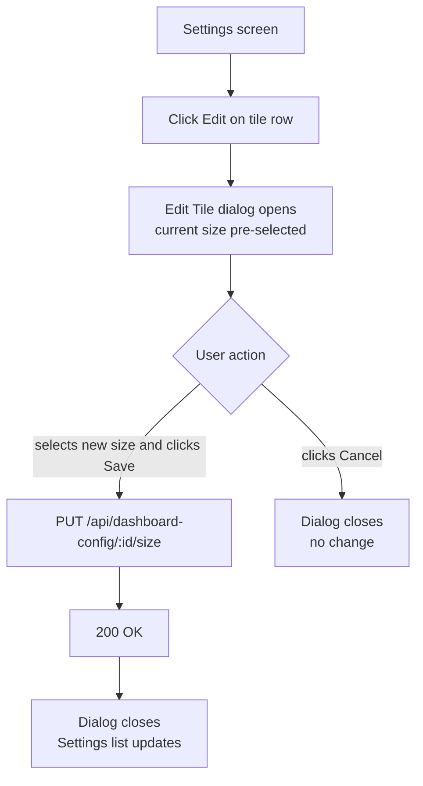
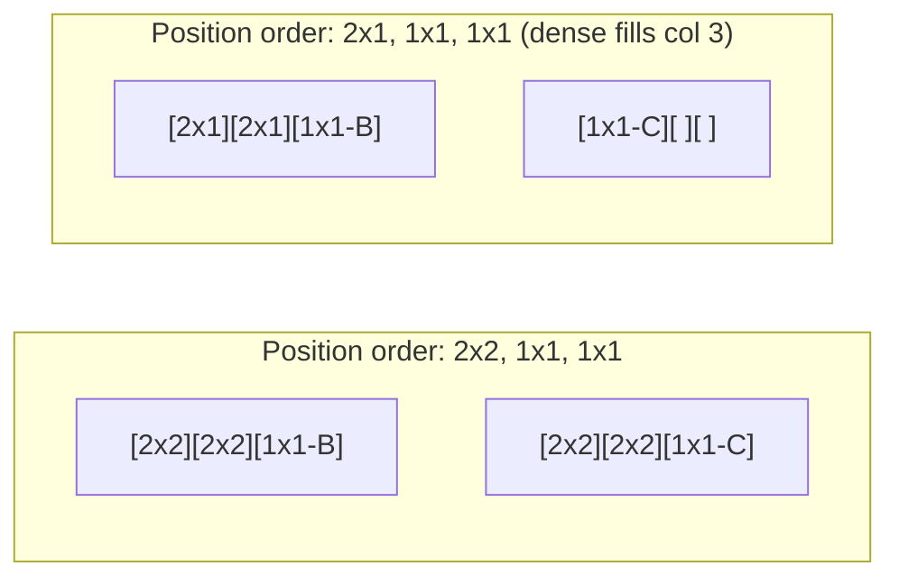
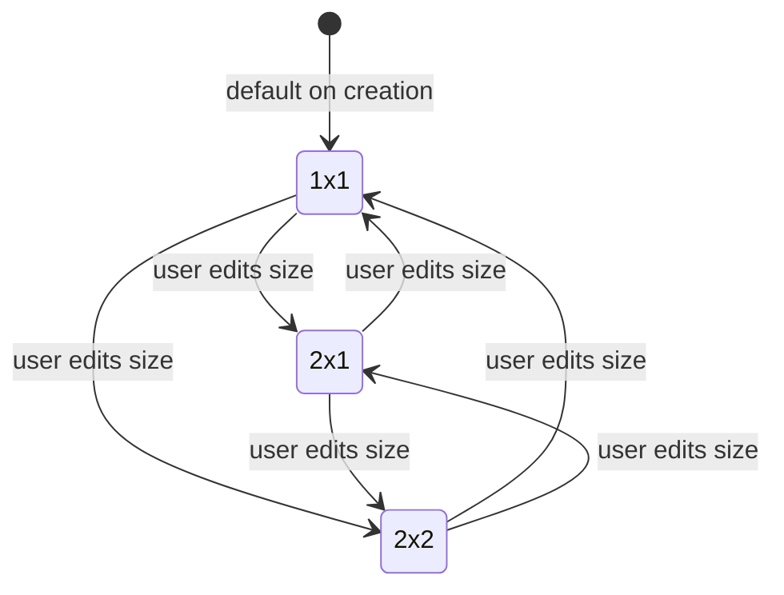

# Dashboard tile sizes - 2x1 or 2x2

## Summary

Dashboard tiles are currently fixed at 1×1. This feature allows each tile to be individually sized as 1×1 (default), 2×1 (two columns wide, one row tall), or 2×2 (two columns wide, two rows tall). Size is configured per tile via an edit dialog in the dashboard settings screen. The dashboard grid is fixed at 3 columns above the mobile breakpoint and uses dense auto-placement to fill gaps created by spanning tiles. Transactions tiles show additional data (category column, increased row limit) at larger sizes.

## Detailed description

### Grid layout

The dashboard grid is fixed at **3 columns** on `sm` breakpoints and above (replacing the current auto-fill layout). Below `sm`, the grid remains a single column and all tile sizes render full-width, visually identical to each other.

Dense auto-placement (`grid-auto-flow: dense`) is enabled so that smaller tiles backfill gaps left by spanning tiles, regardless of their position order.

Tile sizing maps to CSS grid spans:

| Size | `col-span` | `row-span` | Notes |
|------|-----------|-----------|-------|
| 1×1  | 1         | 1         | Default |
| 2×1  | 2         | 1         | Two columns wide, one row tall |
| 2×2  | 2         | 2         | Two columns wide, two rows tall |

Example layout — tile A is 2×2, tiles B and C are 1×1, tile D is 2×1:

```
[ A ][ A ][ B ]
[ A ][ A ][ C ]
[ D ][ D ][   ]
```

With dense packing, if tile ordering places a 1×1 after a 2×1, the 1×1 backfills the remaining column on the same row:

```
Position order: A(2x1), B(1x1), C(1x1)

[ A ][ A ][ B ]
[ C ][   ][   ]
```

### Tile size configuration

In the dashboard settings screen, each tile row gains an **Edit** button. Clicking it opens a modal dialog containing:

- A size selector (radio group or dropdown) with options: **1×1**, **2×1**, **2×2**
- The current size pre-selected
- **Save** and **Cancel** actions

On save, the new size is persisted and the dialog closes. The settings list reflects the updated size immediately. No page reload is required.

### Transactions tile adaptations

When the tile type is `transactions`, the displayed data scales with tile size:

| Size | Transaction limit | Category column |
|------|------------------|----------------|
| 1×1  | 5                | No             |
| 2×1  | 5                | Yes            |
| 2×2  | 10               | Yes            |

All other tile types (charts, totals) are responsible for filling their available space; their content is not specifically defined here beyond receiving the correct CSS span classes.

### Data model

A new `tile_size` column is added to the `dashboard_config` table:

```sql
ALTER TABLE dashboard_config ADD COLUMN tile_size TEXT NOT NULL DEFAULT '1x1';
```

Valid values: `'1x1'`, `'2x1'`, `'2x2'`. Existing rows receive `'1x1'` via the default.

### API

A new endpoint updates the size of a single tile:

```
PUT /api/dashboard-config/:id/size
Body: { "tile_size": "2x1" }
Returns: 200 with updated DashboardConfigItem, 400 for invalid size, 404 if not found
```

`DashboardConfigItem` gains a `tile_size` field on both client and server.

## Key decisions

| Decision | Outcome |
|----------|---------|
| Grid column count | Fixed at 3 columns (sm+). Ensures `col-span-2` behaves predictably across viewports. |
| Gap handling | `grid-auto-flow: dense` — smaller tiles backfill gaps. Visual order may differ from position order when gaps exist, which is acceptable. |
| Size configuration UI | Edit button per tile row opening a modal dialog. Consistent with potential future tile-level settings. |
| Mobile tile sizing | All sizes render full-width on mobile; no size-specific visual distinction below `sm`. |
| Tile type × size restrictions | None — all tile types support all sizes. Content adapts to available space. |
| Transactions tile content scaling | Category column added at 2×1 and 2×2; row limit increased to 10 at 2×2 only. |

## User stories

- As a user, I want to make a dashboard tile wider or taller so that I can see more information from a single tile at a glance.
- As a user, I want a transactions tile at 2×1 to show the category alongside each transaction so that I can understand spending patterns without navigating away.
- As a user, I want a transactions tile at 2×2 to show up to 10 transactions so that I can review recent activity without opening the full account view.
- As a user, I want the dashboard to fill layout gaps automatically so that the grid always looks dense and intentional regardless of my tile size choices.

## Diagrams

### Settings — edit tile size flow



### Grid placement — dense auto-flow example



### Tile size states



## Acceptance criteria

```gherkin
Feature: Dashboard tile sizes

  Background:
    Given I am logged in
    And I have at least one tile configured on my dashboard

  # --- Grid layout ---

  Scenario: 1x1 tile occupies a single grid cell
    Given a tile is set to size 1x1
    When I view the dashboard
    Then the tile spans 1 column and 1 row

  Scenario: 2x1 tile spans two columns
    Given a tile is set to size 2x1
    When I view the dashboard on a screen wider than the sm breakpoint
    Then the tile spans 2 columns and 1 row

  Scenario: 2x2 tile spans two columns and two rows
    Given a tile is set to size 2x2
    When I view the dashboard on a screen wider than the sm breakpoint
    Then the tile spans 2 columns and 2 rows

  Scenario: Dense packing fills gaps left by spanning tiles
    Given tile A (position 1) is set to 2x1
    And tile B (position 2) is set to 1x1
    And tile C (position 3) is set to 1x1
    When I view the dashboard
    Then tile B appears in column 3 of row 1 (backfilling the gap)
    And tile C appears in row 2

  Scenario: 2x2 + two 1x1 tiles form a compact layout
    Given tile A (position 1) is set to 2x2
    And tile B (position 2) is set to 1x1
    And tile C (position 3) is set to 1x1
    When I view the dashboard
    Then the layout is:
      | A | A | B |
      | A | A | C |

  Scenario: All tile sizes render full width on mobile
    Given a tile is set to size 2x1
    When I view the dashboard on a screen narrower than the sm breakpoint
    Then the tile occupies the full single-column width
    And it appears visually identical in width to a 1x1 tile

  # --- Settings: edit tile size ---

  Scenario: Edit button is present for each configured tile
    When I navigate to the dashboard settings screen
    Then each tile row has an Edit button

  Scenario: Edit dialog opens with current size pre-selected
    Given a tile is currently set to size 1x1
    When I click the Edit button for that tile
    Then a dialog opens
    And the 1x1 option is pre-selected

  Scenario: Saving a new size updates the tile
    Given a tile is set to size 1x1
    When I click Edit for that tile
    And I select size 2x1
    And I click Save
    Then the dialog closes
    And the settings list shows size 2x1 for that tile
    And the dashboard grid reflects the new size

  Scenario: Cancelling the dialog makes no change
    Given a tile is set to size 1x1
    When I click Edit for that tile
    And I select size 2x2
    And I click Cancel
    Then the tile remains size 1x1

  # --- Transactions tile content scaling ---

  Scenario: Transactions tile at 1x1 shows 5 transactions without category
    Given a transactions tile is set to size 1x1
    When I view the dashboard
    Then the tile shows at most 5 transactions
    And no category column is visible

  Scenario: Transactions tile at 2x1 shows 5 transactions with category
    Given a transactions tile is set to size 2x1
    When I view the dashboard
    Then the tile shows at most 5 transactions
    And a category column is visible for each transaction

  Scenario: Transactions tile at 2x2 shows 10 transactions with category
    Given a transactions tile is set to size 2x2
    When I view the dashboard
    Then the tile shows at most 10 transactions
    And a category column is visible for each transaction

  # --- Default and migration ---

  Scenario: Existing tiles default to 1x1
    Given tiles were configured before this feature was deployed
    When I view the dashboard
    Then all pre-existing tiles render as 1x1

  Scenario: Newly added tiles default to 1x1
    When I add a new tile from the settings screen
    Then its initial size is 1x1
```

## Manual test steps

### Setup
1. Open the application and navigate to **Settings → Dashboard**.
2. Ensure at least three tiles are configured (add tiles for different accounts if needed).

### Test: Edit dialog and size persistence
3. Locate any tile row and click **Edit**.
4. Confirm a dialog appears with size options **1×1**, **2×1**, and **2×2**, and that the current size is pre-selected (1×1 for a new tile).
5. Click **Cancel**. Confirm the dialog closes and the tile size is unchanged.
6. Click **Edit** again, select **2×1**, and click **Save**.
7. Confirm the dialog closes and the settings list reflects **2×1** for that tile.
8. Navigate to the **Dashboard** page and confirm the tile is visually wider than adjacent 1×1 tiles.
9. Return to Settings, click **Edit** for the same tile, select **2×2**, and save.
10. On the dashboard, confirm the tile now occupies a 2×2 area.

### Test: Grid layout and dense packing
11. In settings, set tile A (position 1) to **2×1**, tile B (position 2) to **1×1**, tile C (position 3) to **1×1**.
12. On the dashboard, confirm tile B appears in the third column of the first row (not on a new row), and tile C appears in the first column of the second row.
13. Set tile A to **2×2**.
14. Confirm tile A occupies columns 1–2 and rows 1–2, tile B occupies column 3 row 1, and tile C occupies column 3 row 2.

### Test: Transactions tile content scaling
15. Ensure at least one tile is of type **Transactions** and has an account with 10+ transactions.
16. Set the tile to **1×1** and view the dashboard. Confirm: at most 5 transactions shown; no Category column.
17. Set the tile to **2×1**. Confirm: at most 5 transactions shown; Category column is now present.
18. Set the tile to **2×2**. Confirm: up to 10 transactions shown; Category column is present.

### Test: Mobile behaviour
19. Resize the browser to a narrow viewport (< 640 px).
20. Confirm all tiles (1×1, 2×1, 2×2) render at full width and are visually identical in width.

## Implementation tasks

Dependencies are noted where a task must follow another.

| # | Task | File(s) | Notes |
|---|------|---------|-------|
| 1 | Add `tile_size` DB column via migration | `server/src/db.ts` | `ALTER TABLE dashboard_config ADD COLUMN tile_size TEXT NOT NULL DEFAULT '1x1'` — add alongside existing migrations |
| 2 | Add `TileSize` type and `tile_size` field to server types | `server/src/dashboard-config/repository.ts` | `TileSize = '1x1' \| '2x1' \| '2x2'`; add to `DashboardConfigItem`; update `getAll` query to select new column | Depends on 1 |
| 3 | Add `updateSize` repository function | `server/src/dashboard-config/repository.ts` | `UPDATE dashboard_config SET tile_size = ? WHERE id = ?`; return updated item or null | Depends on 2 |
| 4 | Add `PUT /:id/size` route | `server/src/dashboard-config/routes.ts` | Validate `tile_size` against allowed values; 400 for invalid, 404 if not found, 200 with updated item | Depends on 3 |
| 5 | Add `TileSize` type and `tile_size` field to client types | `client/src/api/dashboardConfig.ts` | Mirror server type; add to `DashboardConfigItem`; add `updateTileSize(tileId, size)` API function calling `PUT /api/dashboard-config/:id/size` | Depends on 4 |
| 6 | Switch dashboard grid to fixed 3-column + dense | `client/src/pages/Dashboard.tsx` | Replace `grid-cols-[repeat(auto-fill,minmax(310px,1fr))]` with `sm:grid-cols-3`; add `grid-flow-dense` | No external deps |
| 7 | Apply col-span / row-span classes to each tile | `client/src/pages/Dashboard.tsx` (or tile wrapper) | Map `tile_size` → Tailwind span classes: `2x1` → `sm:col-span-2`, `2x2` → `sm:col-span-2 sm:row-span-2` | Depends on 5, 6 |
| 8 | Update Transactions tile to scale with size | Transactions tile component | Accept `tile_size` prop; at 2×1/2×2 add Category column; at 2×2 increase query limit to 10 (pass limit through dashboard data fetch or derive client-side) | Depends on 7 |
| 9 | Add Edit button and size dialog to settings | `client/src/components/settings/DashboardSection.tsx` | Edit button per row; modal with size radio/select pre-populated from `tile_size`; on save call `updateTileSize` and invalidate dashboard config query | Depends on 5 |
