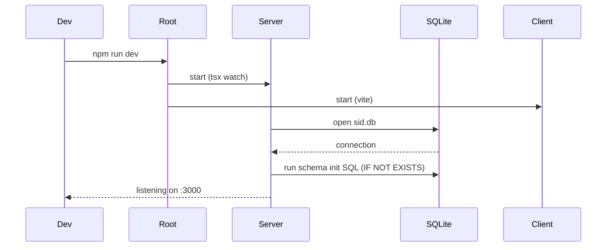

# SID-001 — Dev environment setup

## Summary

Scaffold the monorepo with `/client` (Vite + React + TypeScript + TailwindCSS) and `/server` (Node + Express + TypeScript + better-sqlite3). Wire up a single dev command that runs both concurrently, and initialise the SQLite schema on server start.

## User story

As a developer, I want a single command that starts the full stack in development mode so that I can build features without manual setup steps.

## Architecture overview

```
/
├── client/          # Vite React app (port 5173)
│   ├── src/
│   └── vite.config.ts   # proxies /api → localhost:3000
├── server/          # Express API (port 3000)
│   ├── src/
│   │   ├── db.ts        # DB connection + schema init
│   │   └── index.ts     # Express entry point
│   └── tsconfig.json
├── package.json     # root: concurrently dev script
└── .gitignore
```

## Sequence: server startup and DB init



## Implementation tasks

1. **Root package.json** — add `concurrently` dev dependency; add `dev` script: `concurrently "npm run dev -w server" "npm run dev -w client"`. Configure npm workspaces for `client` and `server`.

2. **Server scaffold** — `npm init` in `/server`; install `express`, `better-sqlite3`, `cors`; install dev deps `typescript`, `tsx`, `@types/express`, `@types/better-sqlite3`, `@types/cors`, `@types/node`; add `tsconfig.json`; add `dev` script using `tsx watch src/index.ts`.

3. **DB init** — create `server/src/db.ts` that opens `sid.db` (path configurable via `DATABASE_PATH` env var) and runs `CREATE TABLE IF NOT EXISTS` statements for `accounts`, `transactions`, and `attachments` (see data model in [index.md](index.md)).

4. **Express entry point** — create `server/src/index.ts` with `cors()` middleware, JSON body parser, placeholder `/api/health` route, and import of `db.ts` to trigger init on start.

5. **Client scaffold** — `npm create vite@latest client -- --template react-ts`; install `tailwindcss`, `@tailwindcss/vite`; configure `vite.config.ts` with `/api` proxy to `http://localhost:3000`; add basic `App.tsx` placeholder.

6. **`.gitignore`** — ensure `node_modules/`, `dist/`, `*.db`, `.env` are ignored at root level.

7. **Smoke test** — confirm `npm run dev` from root starts both processes, `GET /api/health` returns 200, and Vite loads in the browser.
